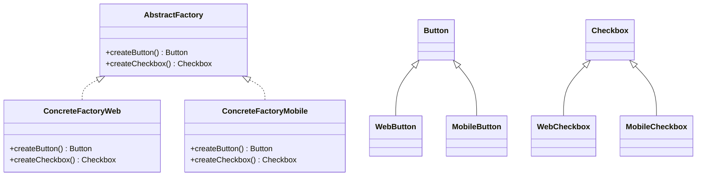
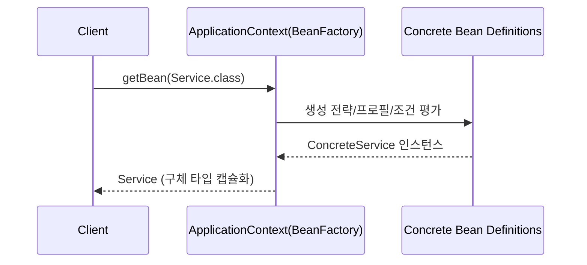
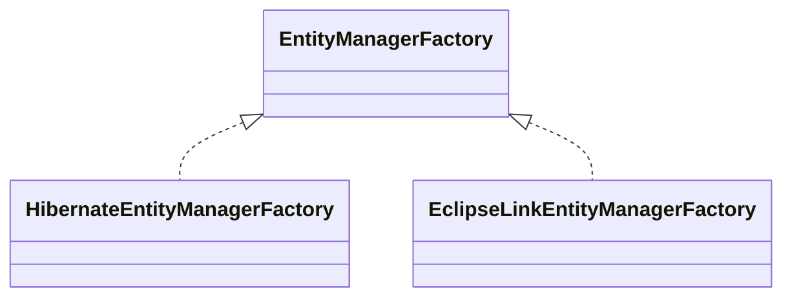

# 01-1. 추상 팩토리 (Abstract Factory)

## 01-1-1. 개념과 쓰임새

### 개요
추상 팩토리(Abstract Factory)는 관련 있거나 의존적인 객체의 "가족"을 생성하는 인터페이스를 제공하지만, 구체적인 클래스는 노출하지 않는 생성 패턴입니다. 즉, 클라이언트는 팩토리의 인터페이스만 알고, 구체 제품군의 생성과 선택은 팩토리에 위임합니다. 이를 통해 제품군 간 일관성(consistency)을 보장하고, 구체 타입에 대한 결합도를 낮출 수 있습니다.

학습 목표
- 추상 팩토리의 의도와 구조를 이해한다.
- 스프링 프레임워크에서 팩토리/컨테이너가 추상 팩토리의 역할을 수행하는 사례를 파악한다.
- 웹 애플리케이션에서 런타임 환경(프로필/설정)에 따라 제품군을 바꾸는 방법을 익힌다.

### 핵심 구조 (Mermaid Class Diagram)
다음은 전형적인 추상 팩토리 구조입니다.



클라이언트는 AbstractFactory를 의존하며, 실제 어떤 제품군(웹/모바일)을 사용할지는 팩토리 구현체가 캡슐화합니다.


## 01-1-2. 스프링에서의 적용 사례

### 개요
스프링은 컨테이너/팩토리 추상화를 통해 다양한 환경에서 객체 그래프를 일관되게 구성합니다. 이는 추상 팩토리의 정신과 맞닿아 있습니다.

### ApplicationContext/BeanFactory는 추상 팩토리처럼 동작한다
- BeanFactory는 객체 생명주기를 관리하고, 설정에 따라 구체 구현체를 생성합니다.
- ApplicationContext는 BeanFactory를 확장하여 국제화, 이벤트, AOP 등 부가 기능을 제공합니다.
- 클라이언트는 빈의 타입(인터페이스)만 의존하고, 실제 어떤 구현체가 주입되는지는 컨테이너 설정(프로필, 조건부 빈, 설정 파일)에 의해 결정됩니다.



### JPA와 트랜잭션 추상화
- EntityManagerFactory는 이름 그대로 엔티티 매니저를 생성하는 팩토리입니다. 구현은 Hibernate, EclipseLink 등으로 바뀔 수 있지만, 클라이언트는 JPA 표준 인터페이스만 의존합니다.
- PlatformTransactionManager는 데이터 접근 기술(JPA, JDBC, JTA 등)에 따라 다른 구현이 주입됩니다. 구성에 따라 적절한 "제품군"을 선택하는 추상 팩토리 맥락과 유사합니다.



### Spring Data Repository 팩토리
- Spring Data는 RepositoryFactorySupport를 통해 리포지토리 구현을 프록시로 생성합니다.
- 데이터 저장소(Mongo, JPA, JDBC 등)에 따라 다른 팩토리가 동작하며, 인터페이스 기반의 일관된 제품군(Repository 구현)을 제공합니다.

## 01-1-3. 웹 애플리케이션에서의 실전 적용

### 개요
환경(로컬/스테이징/프로덕션), UI 플랫폼(웹/모바일), 테넌트별 테마 등 런타임 변이에 따라 제품군을 바꿔야 할 때 추상 팩토리가 유용합니다.

### 스프링 프로필로 제품군 전환하기 (간략 코드)

```java
public interface PaymentClient { String pay(int amount); }

public class KakaoPayClient implements PaymentClient { public String pay(int amount){ return "KAKAO:"+amount; } }
public class TossPayClient implements PaymentClient { public String pay(int amount){ return "TOSS:"+amount; } }

public interface PaymentFactory { PaymentClient createClient(); }

@Profile("kakao")
@Component
class KakaoPaymentFactory implements PaymentFactory {
    public PaymentClient createClient() { return new KakaoPayClient(); }
}

@Profile("toss")
@Component
class TossPaymentFactory implements PaymentFactory {
    public PaymentClient createClient() { return new TossPayClient(); }
}

// 클라이언트 서비스는 팩토리 추상화에만 의존
@Service
class PayService {
    private final PaymentFactory factory;
    PayService(PaymentFactory factory) { this.factory = factory; }
    public String doPay(int amount) { return factory.createClient().pay(amount); }
}
```

- 활성 프로필에 따라 서로 다른 결제 제품군이 주입됩니다.
- 테스트 환경에서는 별도의 테스트용 팩토리를 구성하여 동일한 인터페이스로 교체 가능합니다.

### 테마/브랜딩이 다른 UI 컴포넌트 구성
- 다국어와 테마(라이트/다크, 브랜드 A/B)에 따라 버튼/아이콘/레이아웃 등 UI 컴포넌트 제품군을 교체할 수 있습니다.
- 서버 측 템플릿(Thymeleaf) 렌더링에서도 테마별 컴포넌트 팩토리를 사용해 일관성을 유지합니다.

## 01-1-4. 장단점과 사용 시점

### 장점
- 제품군 간 일관성 유지: 버튼-체크박스처럼 함께 써야 하는 조합을 강제.
- 구체 타입 분리: 클라이언트는 인터페이스만 의존.
- 변경 용이성: 새로운 제품군 추가 시 기존 클라이언트 수정 최소화.

### 단점
- 클래스 수 증가: 제품/팩토리 조합이 늘어남.
- 단일 제품만 필요한 경우에는 과할 수 있음.

### 사용 시점
- 서로 호환되는 제품군을 함께 생성해야 할 때.
- 런타임 환경/플랫폼에 따라 일관된 세트를 바꿔 끼우고 싶을 때.
- 컨테이너/설정으로 교체 가능성을 열어 두고 싶을 때.

## 01-1-5. 좀 더 알아보기
- 스프링의 FactoryBean은 복잡한 객체 생성을 캡슐화하여 컨테이너에 "공장"을 등록하는 방식입니다. 특정 리소스 클라이언트나 프록시를 생성할 때 유용합니다.
- 조건부 구성(@Conditional, @Profile)과 함께 사용하면 동일한 추상 인터페이스로 다양한 제품군을 유연하게 교체할 수 있습니다.

## 01-1-6. 5가지 키워드로 정리하는 핵심 포인트
1. 일관된 제품군: 함께 쓰이는 객체 세트를 한 번에 생성한다.
2. 의존성 역전: 클라이언트는 추상 팩토리에 의존하고 구체 타입을 모른다.
3. 교체 가능성: 환경/플랫폼에 따라 제품군 전환이 쉽다.
4. 스프링 컨테이너: BeanFactory/ApplicationContext가 사실상 추상 팩토리 역할을 한다.
5. 과도한 적용 주의: 필요 이상으로 구조를 복잡하게 만들지 않는다.

## 확인 문제
1. 추상 팩토리 패턴의 주된 목적은 무엇인가?
    - [ ] 객체 생명주기 전체(생성-사용-소멸)를 강제한다.
    - [ ] 관련 객체들의 일관된 세트를 생성하되, 구체 클래스를 감춘다.
    - [ ] 객체의 내부 상태를 캡슐화하고 복구한다.
    - [ ] 요청을 캡슐화하여 서로 다른 큐에 전달한다.

2. 다음 중 스프링에서 추상 팩토리와 가장 밀접한 구성요소는 무엇인가?
    - [ ] HandlerInterceptor
    - [ ] ApplicationContext/BeanFactory
    - [ ] RestTemplate
    - [ ] ViewResolver만 단독으로 사용

3. [복수 응답] 다음 중 추상 팩토리 패턴을 적용하기 좋은 경우를 모두 고르시오.
    - [ ] 플랫폼(웹/모바일)에 따라 UI 컴포넌트 세트가 달라지는 경우
    - [ ] 데이터 접근 기술(JPA/JDBC)에 따라 리포지토리 구현군이 달라지는 경우
    - [ ] 단일 클래스 인스턴스 하나만 필요하고 변형이 없는 경우
    - [ ] 멀티 테넌트 환경에서 테넌트별 브랜드/테마 컴포넌트 세트가 다른 경우
    - [ ] 동일한 구현체를 영구적으로 고정해야 하는 경우

> [정답 및 해설 보기](../answers_and_explanations.md#01-1-추상-팩토리-abstract-factory)
