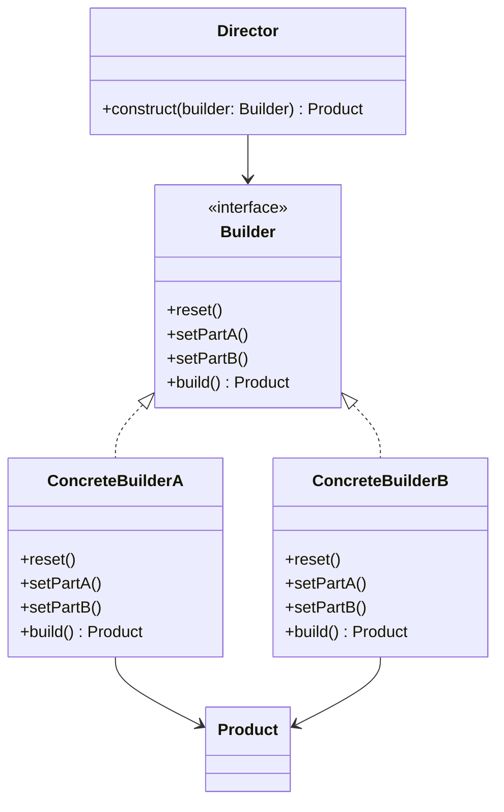
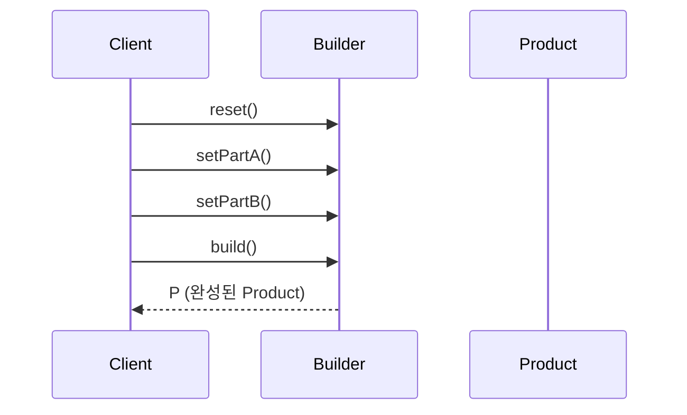
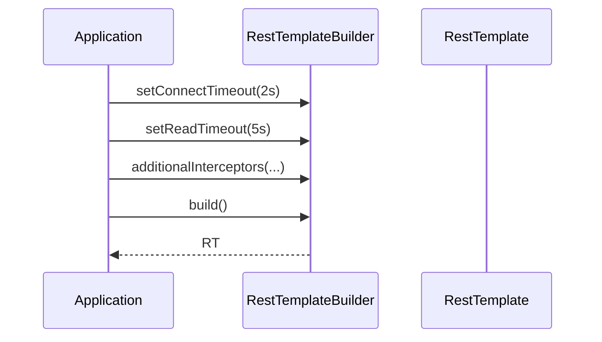
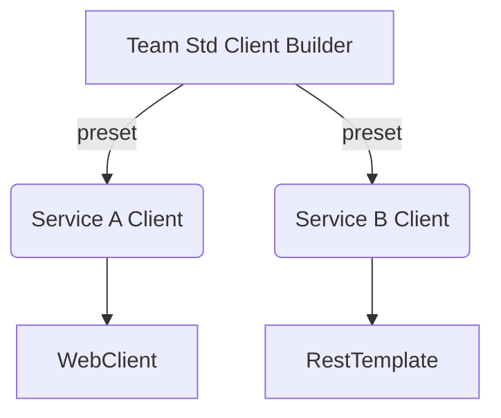

# 01-2. 빌더 (Builder)

## 01-2-1. 개념과 쓰임새

### 개요
빌더(Builder)는 복잡한 객체의 생성 과정을 단계별로 분리하여, 동일한 생성 절차로 서로 다른 표현을 만들 수 있게 하는 생성 패턴입니다. 생성자에 파라미터가 많거나(특히 선택적 인자 다수), 생성 절차가 조건/순서에 민감한 경우에 유용합니다.

학습 목표
- 빌더 패턴의 핵심 구조와 참여자(Director/Builder/Product)를 이해한다.
- 스프링 및 웹 애플리케이션에서 사용되는 빌더 스타일 API의 실제 사례를 파악한다.
- 불변 객체 구성, 복잡한 클라이언트 구성(RestTemplate/WebClient 등)에 빌더를 적용하는 방법을 익힌다.

### 핵심 구조 (Mermaid Class Diagram)

- Director는 생성 절차를 알고, 구체 생성은 Builder(구현체)가 담당합니다.
- 클라이언트는 Builder를 통해 단계별 설정을 수행한 뒤 최종 Product를 획득합니다.

### 메서드 체이닝을 통한 유창한 API (Sequence)

## 01-2-2. 스프링과 웹 애플리케이션에서의 적용 사례

### 개요
스프링 생태계는 다양한 빌더 스타일 API를 제공합니다. 복잡한 구성 요소(HTTP 클라이언트, URI, 보안 필터 체인, 빈 정의 등)를 단계적으로 설정하고 최종 객체를 생성합니다.

### Spring Boot의 RestTemplateBuilder
- RestTemplateBuilder는 타임아웃, 메시지 컨버터, 인터셉터, 기본 헤더 등 다양한 설정을 체이닝으로 모아서 RestTemplate을 생성합니다.
- 환경/프로파일에 따라 공통 옵션을 프리셋하고, 일부만 덮어쓰는 식의 유연한 구성이 가능합니다.

### Spring WebFlux의 WebClient.Builder
- WebClient.builder()를 통해 커넥션 풀, 코덱, 기본 헤더/쿠키, 리트라이 전략 등을 설정해 WebClient를 빌드합니다.
- 비동기/리액티브 환경에서 복잡한 HTTP 클라이언트 구성을 간결한 체인으로 표현합니다.

### UriComponentsBuilder
- 스킴/호스트/경로/쿼리 파라미터를 단계적으로 구성해 안전하게 URI를 생성합니다.
- 수동 문자열 연결 대비 실수를 줄이고, 인코딩을 일관되게 적용할 수 있습니다.

### Spring Security의 DSL(HttpSecurity)
- HttpSecurity는 빌더/DSL 스타일로 보안 필터 체인을 구성하고 마지막에 SecurityFilterChain을 생성합니다.
- 메서드 체인이 길어지지만 관심사별 블록으로 가독성이 좋아집니다.

### BeanDefinitionBuilder
- 프로그래매틱하게 스프링 빈 정의(스코프, 의존성, 프로퍼티)를 구성할 수 있는 빌더입니다.
- 자동 구성으로 표현하기 어려운 동적 빈 등록 시 유용합니다.

## 01-2-3. 웹 애플리케이션에서의 실전 적용

### 개요
실무에서는 다양한 "복잡한 생성" 요구가 존재합니다. 빌더는 여러 선택적 속성을 명시적으로 노출해 설정 누락과 순서 오류를 줄여줍니다.

### 예시 1: HTTP 클라이언트 공통 설정 빌더화
- 목적: 사내 게이트웨이 호출을 위한 공통 HTTP 클라이언트(WebClient/RestTemplate) 구성을 팀 표준으로 제공
- 접근: 공통 타임아웃/리트라이/기본 헤더를 캡슐화한 커스텀 빌더 컴포넌트를 제공하고, 서비스별로 베이스 URL/인터셉터만 덧붙여 빌드
- 효과: 중복 제거, 규약 준수, 문제 발생 시 중앙에서 설정 변경 가능

### 예시 2: 불변 DTO/설정 객체 구성
- 생성자 파라미터가 8개 이상인 불변 객체를 빌더로 전환하면, 선택적 속성을 명시적으로 표기하면서 가독성과 안전성을 높일 수 있습니다.
- Lombok의 @Builder는 편의 도구로 자주 쓰이며, 스프링 애플리케이션에서도 DTO/Command 객체 등에 널리 활용됩니다.

## 01-2-4. 장단점과 사용 시점

### 장점
- 복잡한 생성 절차를 단계별로 분리하여 가독성과 재사용성을 높인다.
- 필수/선택 인자를 명확히 구분하고, 합리적 기본값을 제공하기 쉽다.
- 동일한 절차로 다양한 표현(구현/프리셋)을 만들 수 있다.

### 단점
- 간단한 객체에는 오히려 보일러플레이트가 늘 수 있다.
- Director/Builder/Product로 나뉘며 구조가 커질 수 있다.

### 사용 시점
- 생성자/정적 팩토리의 파라미터가 많거나 선택적 인자가 많은 경우.
- 단계적 설정이 필요하거나, 설정 순서를 검증/강제하고 싶은 경우.
- 동일한 생성 절차로 다른 구성을 손쉽게 만들고 싶은 경우(프로파일별 프리셋 등).

## 01-2-5. 5가지 키워드로 정리하는 핵심 포인트
1. 단계적 생성: 복잡한 객체를 단계별로 조립한다.
2. 유창한 API: 메서드 체이닝으로 가독성과 발견 가능성을 높인다.
3. 선택적 인자 처리: 필수/선택 속성을 명확히 구분한다.
4. 스프링 빌더 생태계: RestTemplateBuilder/WebClient.Builder/UriComponentsBuilder/HttpSecurity/BeanDefinitionBuilder.
5. 과용 주의: 단순한 객체에는 생성자/정적 팩토리로 충분하다.

## 확인 문제
1. 빌더 패턴의 핵심 아이디어로 가장 적절한 것은?
    - [ ] 구체 팩토리별로 일관된 제품군을 생성한다.
    - [ ] 객체의 내부 상태를 스냅샷으로 저장하고 복구한다.
    - [ ] 복잡한 객체 생성을 단계별로 분리하고 최종 단계에서 완성한다.
    - [ ] 알고리즘의 골격을 정의하고 하위 클래스가 일부 단계를 재정의한다.

2. 다음 중 스프링에서 "빌더" 스타일 API로 분류되기 어려운 것은?
    - [ ] RestTemplateBuilder
    - [ ] WebClient.Builder
    - [ ] UriComponentsBuilder
    - [ ] JdbcTemplate 자체(쿼리 실행 도우미)

3. [복수 응답] 빌더 패턴을 적용하기 좋은 경우를 모두 고르시오.
    - [ ] 선택적 인자가 많은 불변 설정 객체를 만들 때
    - [ ] HTTP 클라이언트 구성 옵션(타임아웃/헤더/리트라이 등)을 단계적으로 설정할 때
    - [ ] 단일 생성자에 인자가 1~2개뿐인 단순 값 객체를 만들 때
    - [ ] 동일 절차로 프로파일별 다른 프리셋을 손쉽게 만들고 싶을 때
    - [ ] 런타임에 객체 제품군의 일관성을 강제하고 싶을 때

> [정답 및 해설 보기](../answers_and_explanations.md#01-2-빌더-builder)
