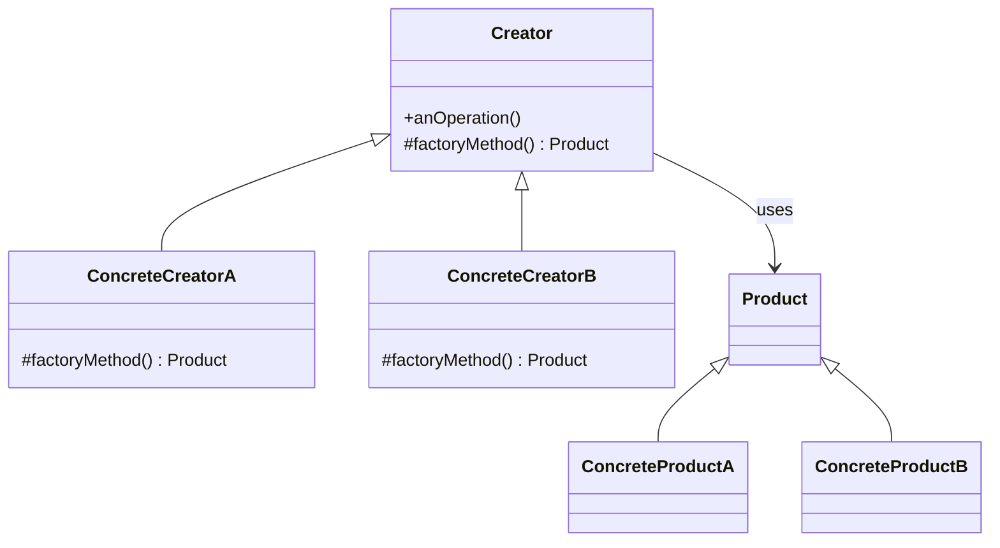
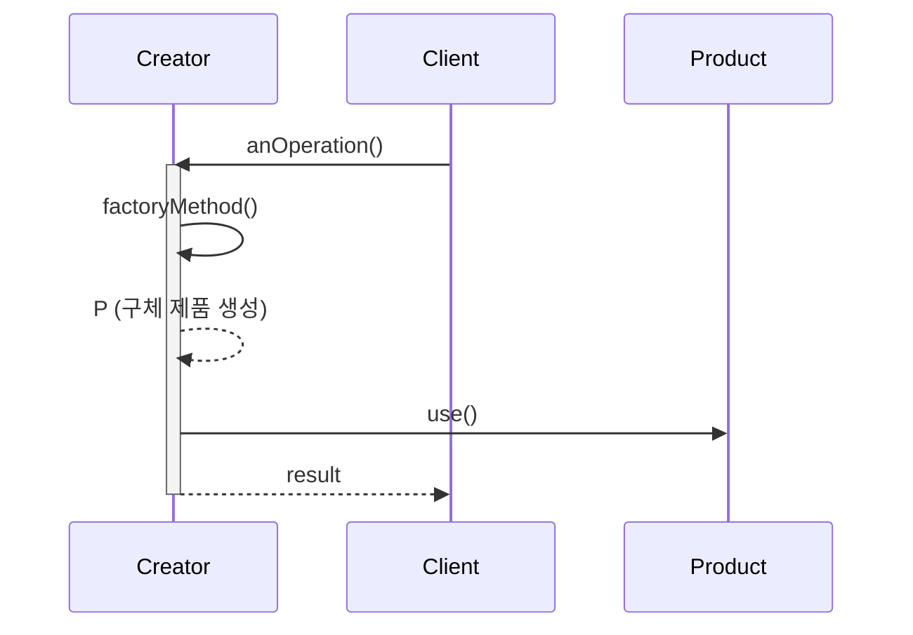
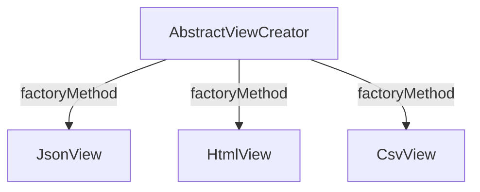

# 01-3. 팩토리 메서드 (Factory Method)

## 01-3-1. 개념과 쓰임새

### 개요
팩토리 메서드(Factory Method)는 객체 생성을 하위 클래스에 위임하기 위해, 상위 클래스(Creator)가 “제품(Product)을 생성하는 메서드”의 골격만 정의하고 구체 생성은 하위 클래스에서 결정하도록 하는 생성 패턴입니다. 즉, “무엇을 만들지”는 하위 클래스가 선택하고, “언제/어떻게 사용할지”는 상위 클래스의 알고리즘 흐름 속에서 일관되게 관리됩니다.

학습 목표
- 팩토리 메서드의 의도와 구조(Creator/Product)를 이해한다.
- 스프링 프레임워크에서 널리 쓰이는 ‘팩토리 메서드’의 실제 사례(@Bean, 추상 템플릿 내부 생성 훅 등)를 파악한다.
- 웹 애플리케이션에서 확장 가능한 생성 훅을 설계하는 방법을 익힌다.

### 핵심 구조 (Mermaid Class Diagram)

- Creator는 알고리즘(anOperation) 안에서 제품이 필요할 때 factoryMethod()를 호출합니다.
- 어떤 제품(ConcreteProductA/B)을 만들지는 하위 클래스가 오버라이드한 factoryMethod()가 결정합니다.

### 알고리즘 흐름 속의 생성 훅 (Sequence)

## 01-3-2. 스프링에서의 적용 사례

### 개요
스프링은 ‘객체 생성 시점을 템플릿/프레임워크가 제어하고, 구체 생성은 사용자 확장 지점에서 결정’되는 구조를 자주 사용합니다. 이는 팩토리 메서드의 의도와 맞닿아 있습니다.

### @Bean 메서드는 “팩토리 메서드”다
- @Configuration 클래스의 @Bean 메서드는 컨테이너가 호출하는 명시적 팩토리 메서드입니다. 스프링이 라이프사이클과 의존성 주입을 담당하고, 개발자는 생성 방식을 @Bean 메서드로 결정합니다.
- 정적 팩토리 메서드 형태(@Bean(method)에서 외부 정적 팩토리 호출)도 흔하게 사용되며, 생성 로직을 한곳으로 모아 테스트 및 교체가 용이합니다.

### 추상 템플릿 클래스의 생성 훅
- 스프링 내부 추상 클래스들은 템플릿 메서드 패턴과 함께 ‘생성 훅’을 노출합니다. 하위 클래스가 특정 객체를 만들도록 오버라이드하는 방식은 전형적인 팩토리 메서드입니다.
  - 예: AbstractViewResolver(스프링 MVC) 계층에서 View를 로딩/생성하는 보호 메서드들
  - 예: RepositoryFactorySupport(Spring Data) 내부에서 리포지토리 구현/프록시를 만들기 위해 하위 클래스가 구현하는 팩토리 메서드들

### FactoryBean과의 구분
- FactoryBean은 “빈을 만들어 주는 빈”으로, 컨테이너 레벨의 ‘추상 팩토리’에 가깝습니다.
- 팩토리 메서드는 주로 클래스 계층(알고리즘 흐름) 내에서 생성 시점을 캡슐화하는 메서드 오버라이드에 초점이 있습니다.

## 01-3-3. 웹 애플리케이션에서의 실전 적용

### 개요
확장 가능한 웹 계층을 설계할 때, 상위 흐름은 고정하고(템플릿) 구체 객체의 생성은 하위에서 결정하게 하는 구조가 유용합니다.

### 예시 1: 콘텐츠 협상 기반 View 생성 훅
- 상위 컨트롤 흐름은 요청을 분석해 View를 필요로 하는 시점에 도달합니다.
- View를 만드는 과정은 하위 클래스(예: JSON/HTML용 리졸버)가 factoryMethod를 통해 결정합니다.
- 새로운 표현(예: CSV/Excel View)이 필요할 때, 기존 흐름을 바꾸지 않고 하위 클래스만 추가하여 확장할 수 있습니다.

### 예시 2: 플러그인형 통지 채널 생성
- 주문 이벤트 처리 흐름은 고정(로그/트랜잭션/재시도 등)하되, 실제 통지 채널(SMS, Email, Slack 등) 객체 생성은 하위 클래스가 선택합니다.
- B2B 고객사별로 커스텀 채널을 추가해도 상위 흐름은 변경 없이 재사용됩니다.

## 01-3-4. 장단점과 사용 시점

### 장점
- 개방-폐쇄 원칙(OCP): 상위 알고리즘을 건드리지 않고, 하위 클래스 추가로 제품을 확장할 수 있습니다.
- 결합도 감소: 클라이언트가 구체 클래스를 직접 new 하지 않아 생성 책임이 분리됩니다.
- 테스트 용이: 대체 구현을 하위 클래스로 손쉽게 주입/치환할 수 있습니다.

### 단점
- 클래스 수 증가: 제품/크리에이터 변형이 늘어날수록 하위 클래스가 많아질 수 있습니다.
- 간단한 생성에는 과도: 단순한 경우에는 정적 팩토리 메서드나 DI만으로도 충분합니다.

### 사용 시점
- 알고리즘(처리 흐름)은 고정하되, 생성되는 객체 타입만 자주 바뀌거나 확장될 때.
- 프레임워크/템플릿 코드가 생성 시점을 제어하고, 사용자 확장 포인트에서 구체 생성을 결정하고자 할 때.

## 01-3-5. 5가지 키워드로 정리하는 핵심 포인트
1. 생성 훅: 상위 알고리즘 속 factoryMethod()에서 제품 생성을 캡슐화한다.
2. 하위 결정: 어떤 제품을 만들지는 하위 클래스가 결정한다.
3. OCP: 확장에는 열려 있고 변경에는 닫힌 구조를 만든다.
4. 스프링 사례: @Bean 팩토리 메서드, 추상 리졸버/리포지토리 팩토리의 생성 훅.
5. 과용 주의: 단순 생성은 정적 팩토리/DI로 충분할 때가 많다.

## 확인 문제
1. 팩토리 메서드 패턴의 핵심 아이디어로 가장 적절한 것은?
    - [ ] 관련 객체들의 일관된 세트를 한 번에 생성한다.
    - [ ] 상위 알고리즘 속 생성 훅(factoryMethod)을 두고, 구체 생성은 하위 클래스에서 결정한다.
    - [ ] 복잡한 객체 생성을 단계별로 분해하여 최종 build()에서 완성한다.
    - [ ] 객체의 내부 상태를 스냅샷으로 저장하고 복구한다.

2. 다음 중 스프링에서 ‘팩토리 메서드’로 보기 어려운 것은?
    - [ ] @Configuration 클래스의 @Bean 메서드
    - [ ] RepositoryFactorySupport가 하위 클래스에 위임하는 생성 훅
    - [ ] AbstractViewResolver 계층의 View 생성 보호 메서드
    - [ ] RestTemplateBuilder.build()의 빌더 완성 메서드

3. [복수 응답] 팩토리 메서드 패턴을 적용하기 좋은 경우를 모두 고르시오.
    - [ ] 상위 흐름은 고정이나, 생성되는 타입만 바뀌는 확장 요구가 많을 때
    - [ ] 표현(HTML/JSON/CSV 등)별로 다른 View를 같은 흐름에서 선택해야 할 때
    - [ ] 선택적 속성이 많은 불변 설정 객체를 단계적으로 조립할 때
    - [ ] 프레임워크가 생성 시점을 제어하고 사용자는 확장 포인트에서 구체 생성을 결정할 때
    - [ ] 단일 구현만 영구적으로 고정해야 하는 경우

> [정답 및 해설 보기](../answers_and_explanations.md#01-3-팩토리-메서드-factory-method)
