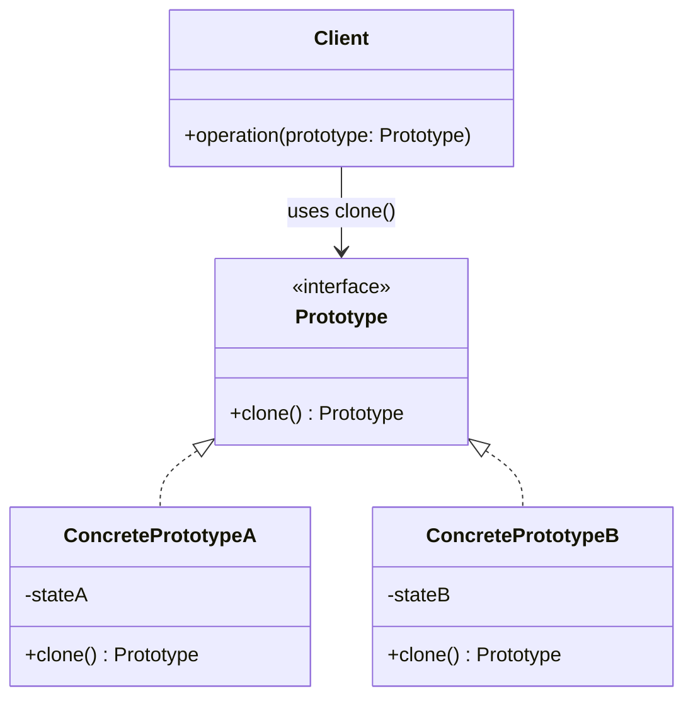
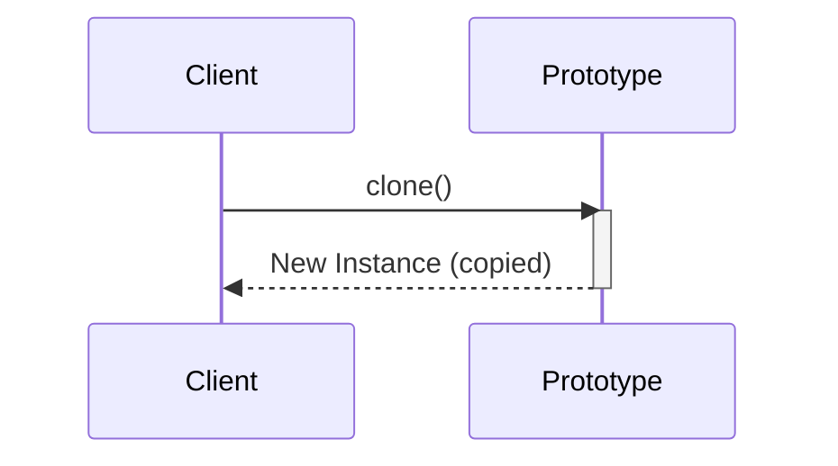
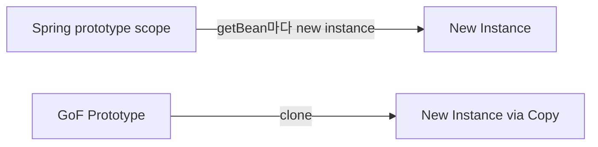
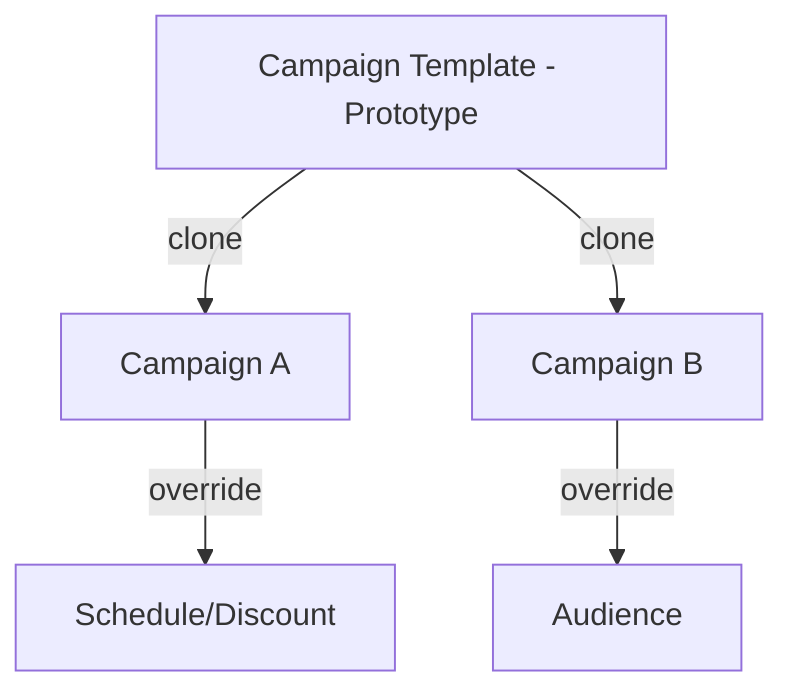

# 01-4. 프로토타입 (Prototype)

## 01-4-1. 개념과 쓰임새

### 개요
프로토타입(Prototype)은 “복제(clone)”를 통해 새로운 객체를 생성하는 패턴입니다. 즉, 직접 new로 생성하는 대신, 이미 존재하는 원형(Prototype)을 복사하여 새로운 인스턴스를 얻습니다. 이때 복사의 깊이(얕은 복사 vs 깊은 복사), 식별자 초기화, 가변 상태의 공유 여부가 핵심 설계 포인트입니다.

학습 목표
- 프로토타입 패턴의 의도와 구조, 얕은/깊은 복사의 차이를 이해한다.
- 스프링에서의 prototype 스코프와 GoF 프로토타입의 차이점을 구분한다.
- 웹 애플리케이션에서 복제 기반 생성이 유용한 상황을 파악한다.

### 핵심 구조 (Mermaid Class Diagram)

- Client는 Prototype 인터페이스를 통해 복제만 요청합니다.
- ConcretePrototype은 자신의 복제 방식을 캡슐화합니다(얕은/깊은 복사, 아이디 재설정 등).

### 복제 시퀀스 (Mermaid Sequence)

## 01-4-2. 스프링과 자바에서의 적용 포인트

### 개요
자바/스프링 환경에서 “복제”는 여러 층위에서 등장합니다. 자바의 Cloneable/clone(), 복사 생성자/정적 팩토리, 직렬화 기반 복제, 매핑 라이브러리(BeanUtils/ModelMapper/Jackson) 등입니다. 또한 스프링의 prototype 스코프는 “컨테이너가 매번 새 인스턴스를 만들어 주는 것”이지, GoF의 ‘원형 복제’와 동일 개념은 아님을 유의해야 합니다.

### 자바에서의 복제 전략 비교
- Cloneable/clone(): 얕은 복제가 기본이며, 가변 참조 필드는 별도 처리 필요. 불변/캡슐화 관점에서 권장되지 않는 경우도 많음.
- 복사 생성자/정적 팩토리(of, copyOf 등): 타입 안전성과 가독성이 좋고, 깊은 복사를 명시적으로 구현하기 용이.
- 직렬화 기반 복제: 간편하지만 비용이 크며, 직렬화 가능 타입에 제한.
- 매핑/복사 유틸: BeanUtils.copyProperties, ModelMapper, MapStruct, Jackson(ObjectMapper.convertValue) 등. 얕은 복사 또는 매핑 규칙에 따라 동작. 성능/정확성/명시성 간 트레이드오프 존재.

### 스프링의 prototype 스코프 vs GoF Prototype
- 스프링 prototype: getBean 호출마다 새 인스턴스를 반환. 컨테이너가 “생성”을 담당하며 복제는 관여하지 않음.
- GoF Prototype: “원형 인스턴스”를 복제하여 생성. 객체가 스스로 복제 방식을 캡슐화.
- 결론: 이름은 같아도 관점이 다름. 헷갈리지 않도록 구분해서 사용해야 합니다.

### 영속 식별자/감사 필드 다루기
- 데이터 복제 시 식별자(id), 생성/수정 일시 등은 새 인스턴스에서 초기화/제거해야 합니다.
- JPA 엔티티 복제 시 연관관계(컬렉션)의 깊은 복사 범위를 명확히 정의하고, 영속성 전이(cascade)와 orphanRemoval에 유의합니다.

## 01-4-3. 웹 애플리케이션에서의 실전 적용

### 개요
복제는 “템플릿-변형” 작업에서 실전 효율이 높습니다. 자주 쓰는 기본 틀을 원형으로 보관하고, 요청/테넌트/캠페인별로 일부만 바꿔서 빠르게 생성합니다.

### 예시 1: 캠페인 템플릿 복제
- 마케팅 캠페인 템플릿(기본 타이틀/카피/세그먼트)을 원형 객체로 유지.
- 새로운 캠페인을 만들 때 템플릿을 복제하고, 기간/할인율/세그먼트만 수정.
- 주의: 템플릿의 컬렉션(혜택 리스트 등)은 깊은 복사로 분리하여 원형과의 공유 부작용을 차단.

### 예시 2: 요청당 기본 응답 모델 복제
- 공통 메타/로깅 필드가 포함된 응답 DTO를 원형으로 두고, 요청마다 복제 후 결과 데이터만 채워 반환.
- 필드 공유 없이 빠르게 일관된 응답 구조를 확보할 수 있습니다.

### 예시 3: 스프링에서 Provider와 결합한 원형-복제
- ObjectProvider/Provider로 원형 빈(또는 팩토리)을 주입받아, 매 요청 시 새 인스턴스를 획득하거나 커스텀 복제를 수행.
- 스프링 prototype 스코프와 혼합하여 “매번 새 객체”를 안정적으로 공급하되, 도메인 레벨 복제 규칙은 별도 컴포넌트에서 캡슐화.

## 01-4-4. 장단점과 사용 시점

### 장점
- 복잡한 초기화 비용을 재사용: 원형 준비 후 복제만 수행하여 성능/생산성 향상.
- 클라이언트 단순화: 생성 로직을 숨기고 clone/copy만 요청.
- 런타임에 객체의 구체 타입을 몰라도 인스턴스 생성 가능.

### 단점
- 얕은/깊은 복사 경계 설정이 어렵고, 실수 시 사이드 이펙트 발생.
- 순환 참조, 지연 로딩 프록시(JPA) 등 복제 난도가 높은 구조가 존재.
- 식별자/감사 필드 처리 규칙을 일관되게 강제하기 어렵다면 유지보수 비용 증가.

### 사용 시점
- 템플릿을 기반으로 변형 객체를 대량/반복 생성할 때.
- 초기화 비용이 큰 복합 객체를 빠르게 재생산해야 할 때.
- 팩토리/빌더보다 “원형 상태의 복사”가 자연스러운 도메인일 때.

## 01-4-5. 5가지 키워드로 정리하는 핵심 포인트
1. 원형 복제: new 대신 clone/copy로 생성한다.
2. 깊은 복사 경계: 가변 참조의 공유를 차단한다.
3. 스프링 스코프 구분: Spring prototype ≠ GoF Prototype.
4. 식별자/감사 필드: 복제 시 초기화/제거 전략을 가진다.
5. 템플릿-변형: 반복 생성 문제에 효과적이다.

## 확인 문제
1. 프로토타입 패턴의 핵심 아이디어로 가장 적절한 것은?
    - [ ] 상위 알고리즘 속 생성 훅을 두고 하위 클래스에서 구체 생성을 결정한다.
    - [ ] 복잡한 객체 생성을 단계별로 분리하여 최종 단계에서 완성한다.
    - [ ] 원형 인스턴스를 복제하여 새 객체를 만든다.
    - [ ] 관련 객체들의 일관된 세트를 한 번에 생성한다.

2. 스프링의 prototype 스코프에 대한 설명으로 가장 올바른 것은?
    - [ ] GoF Prototype처럼 원형 객체의 clone을 호출한다.
    - [ ] getBean 호출마다 컨테이너가 새 인스턴스를 만들어 준다.
    - [ ] 싱글톤 빈과 동일하게 1개 인스턴스만 유지한다.
    - [ ] 동일 빈 이름에 대해 항상 깊은 복사를 보장한다.

3. [복수 응답] 다음 중 “깊은 복사”가 필요한 상황을 모두 고르시오.
    - [ ] 원형과 복제본이 동일한 컬렉션 인스턴스를 공유하면 안 될 때
    - [ ] 불변 값 객체만으로 구성되어 공유 안전할 때
    - [ ] JPA 엔티티를 복제하며 연관 컬렉션을 독립적으로 편집해야 할 때
    - [ ] 식별자/감사 필드를 그대로 유지해야 할 때
    - [ ] 템플릿 DTO를 복제하되 내부 리스트를 새로 만들어야 할 때

> [정답 및 해설 보기](../answers_and_explanations.md#01-4-프로토타입-prototype)
