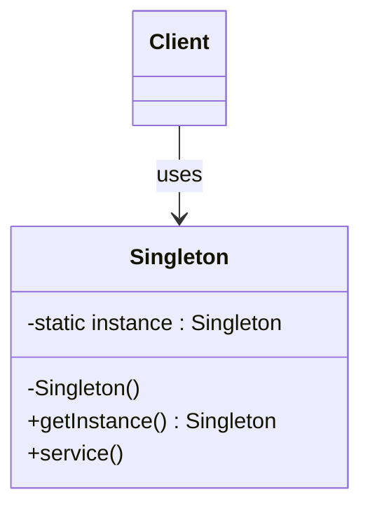
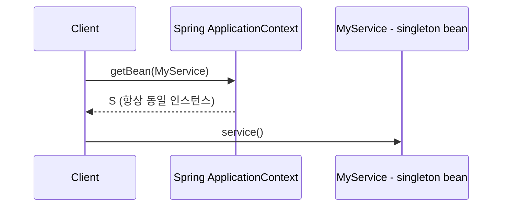
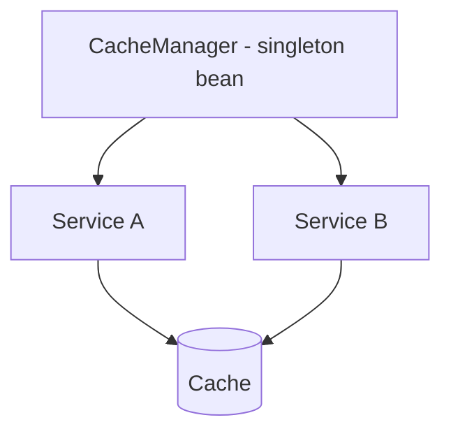

# 01-5. 싱글톤 (Singleton)

## 01-5-1. 개념과 쓰임새

### 개요
싱글톤(Singleton)은 애플리케이션 전역에서 단 하나의 인스턴스만 존재하도록 보장하고, 어디서든 동일한 인스턴스에 접근할 수 있게 하는 생성 패턴입니다. 주로 비용이 큰 리소스(설정, 캐시, 연결 풀의 관리자 등)를 하나만 유지하고 공유해야 할 때 사용됩니다.

학습 목표
- GoF 싱글톤의 의도와 핵심 제약(유일성, 전역 접근)을 이해한다.
- 스프링의 싱글톤 스코프와 GoF 싱글톤의 차이를 구분한다.
- 웹 애플리케이션에서 싱글톤 빈 사용 시 상태 공유/동시성 이슈를 식별하고 회피한다.

### 핵심 구조 (Mermaid Class Diagram)

- 핵심은 "오직 하나"의 인스턴스와 전역 접근 지점을 제공하는 것입니다.
- 구현 방식(지연 초기화, 이른 초기화, enum 등)과 스레드 안전성 보장이 중요합니다.

### 컨테이너 기반 싱글톤과의 비교 (Sequence)

- 스프링의 디폴트 스코프는 싱글톤이므로, 같은 컨테이너 내에서는 같은 빈 이름/타입의 인스턴스가 1개만 존재합니다.
- GoF 싱글톤과 달리, 스프링은 "전역 정적 접근" 대신 DI(의존성 주입)로 싱글톤을 사용하도록 권장합니다.

## 01-5-2. 스프링에서의 적용 사례

### 개요
스프링 컨테이너는 기본적으로 빈을 싱글톤 스코프로 관리합니다. 애플리케이션 서비스, 리포지토리, 전략 객체 등 대부분의 빈이 싱글톤으로 등록되며, 프레임워크가 생명주기를 책임집니다.

### 스프링 싱글톤 스코프 vs GoF 싱글톤
- 접근 방식
  - GoF: 클래스 내부에 전역 접근 지점(getInstance) 제공이 일반적
  - 스프링: ApplicationContext가 생성/관리하고, 의존성 주입으로 참조를 공급
- 테스트 용이성
  - GoF: 전역 정적 접근은 테스트/치환이 어렵다
  - 스프링: DI를 통해 대체 빈 주입이 쉬워 테스트와 환경별 교체가 용이
- 확장성/교체 가능성
  - GoF: 단일 구현 고착 위험
  - 스프링: 같은 인터페이스로 다른 구현을 손쉽게 바꿔 낄 수 있음(@Profile, @Conditional 등)

### 싱글톤 빈의 상태 관리 주의
- 싱글톤 빈은 다수 스레드(요청)가 동시에 공유하므로, 내부에 요청별 가변 상태를 보관하면 경합/오염이 발생합니다.
- 권장 사항
  - 빈은 가능하면 무상태(stateless)로 설계한다.
  - 반드시 상태가 필요하면 동시성 제어(불변 객체, 지역 변수, ThreadLocal 신중 사용)를 고려한다.
  - 설정/구성은 불변 값 객체로 캡슐화(@ConfigurationProperties + immutable POJO 등).

### 스프링의 관련 구성요소
- DataSource, EntityManagerFactory, CacheManager, ObjectMapper 등은 보통 싱글톤 빈으로 관리된다.
- BeanFactory/ApplicationContext 자체도 사실상 싱글톤에 준하는 컨테이너 전역 객체다.

## 01-5-3. 웹 애플리케이션에서의 실전 적용

### 개요
웹 애플리케이션에서 싱글톤은 "공유되는 리소스 관리자"로서 자주 등장합니다. 다만 요청 컨텍스트와 섞이는 가변 상태를 내부에 두지 않는 것이 핵심입니다.

### 예시 1: 캐시 관리자/전략의 싱글톤화
- 서비스 레이어는 CacheManager/CacheResolver를 주입받아 캐싱 전략을 공유한다.
- 트래픽이 높아도 캐시 구성은 중앙에서 일관되게 관리할 수 있다.

### 예시 2: HTTP 클라이언트 공용 리소스
- 커넥션 풀(ClientHttpConnector/ConnectionProvider), ObjectMapper, Validator 등을 싱글톤으로 두고 여러 컴포넌트에서 공유한다.
- 리소스 소모가 큰 객체를 매 요청마다 생성하지 않아 성능/안정성이 향상된다.

### 예시 3: 멀티 테넌트 공통 컴포넌트
- 테넌트마다 전략은 다르지만, 전략 선택자/팩토리 자체는 싱글톤으로 유지하여 일관된 선택 로직과 메트릭 수집을 제공한다.

## 01-5-4. 장단점과 사용 시점

### 장점
- 인스턴스 1개 유지로 메모리/초기화 비용 절감.
- 전역적으로 일관된 정책/설정/캐시를 공유.
- 스프링 컨테이너와 결합하면 테스트/교체 용이성이 높다.

### 단점
- 전역 상태 남용 시 결합도 증가, 테스트 어려움.
- 동시성 이슈: 내부 가변 상태가 경쟁 조건을 유발할 수 있음.
- 생명주기/해제 시점이 고정되어 유연성 저하 가능.

### 사용 시점
- 비용이 큰 리소스나 정책 객체를 전역 공유해야 할 때.
- 무상태 서비스/전략/유틸리티 성격의 컴포넌트를 컨테이너 관리 하에 둘 때.
- 요청별/세션별 상태가 필요하다면 싱글톤이 아닌 다른 스코프(prototype/request/session)를 고려.

## 01-5-5. 5가지 키워드로 정리하는 핵심 포인트
1. 전역 단일 인스턴스: 유일성과 전역 접근/공유가 핵심.
2. DI 우선: 전역 정적 접근 대신 스프링 DI로 사용하라.
3. 무상태 설계: 공유 가변 상태는 동시성 문제를 낳는다.
4. 교체 가능성: 인터페이스 + 프로필/조건으로 구현을 바꿔 낄 수 있다.
5. 과용 주의: 요청/세션 상태 보관에는 부적합, 적절한 스코프를 선택하라.

## 확인 문제
1. 싱글톤 패턴의 핵심 의도로 가장 적절한 것은?
    - [ ] 복잡한 객체 생성을 단계별로 분리한다.
    - [ ] 애플리케이션 전역에서 단 하나의 인스턴스만 존재하도록 보장한다.
    - [ ] 관련 객체들의 일관된 세트를 한 번에 생성한다.
    - [ ] 상위 알고리즘의 생성 훅을 하위 클래스가 결정한다.

2. 다음 중 "스프링의 싱글톤 스코프"에 대한 설명으로 가장 올바른 것은?
    - [ ] getBean 호출마다 새 인스턴스를 만든다.
    - [ ] 같은 컨테이너 내에서 동일 빈은 하나의 인스턴스로 관리된다.
    - [ ] 전역 정적 getInstance로만 접근해야 한다.
    - [ ] 항상 상태를 보관해도 안전하다.

3. [복수 응답] 싱글톤을 적용하거나 설계할 때의 올바른 접근을 모두 고르시오.
    - [ ] 빈은 가능하면 무상태로 유지하고, 요청별 데이터는 지역 변수로 처리한다.
    - [ ] 전역 정적 접근을 선호하고 DI는 피한다.
    - [ ] 비용이 큰 리소스(ObjectMapper, 커넥션 풀 등)는 싱글톤 빈으로 공유한다.
    - [ ] 상태 공유가 필요하면 ThreadLocal을 무조건 사용한다.
    - [ ] 환경/프로필별로 다른 구현을 인터페이스 뒤에서 교체할 수 있게 설계한다.

> [정답 및 해설 보기](../answers_and_explanations.md#01-5-싱글톤-singleton)
