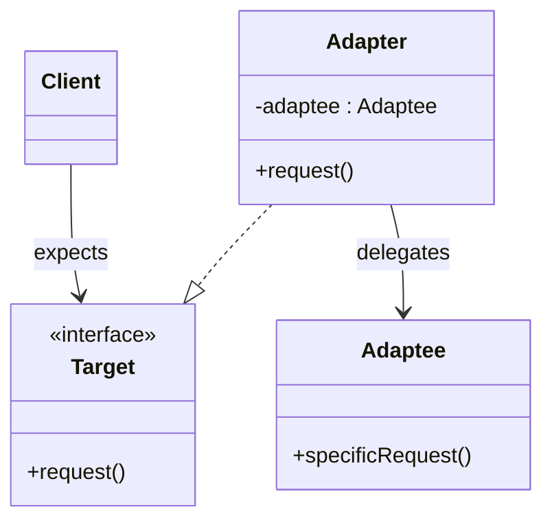
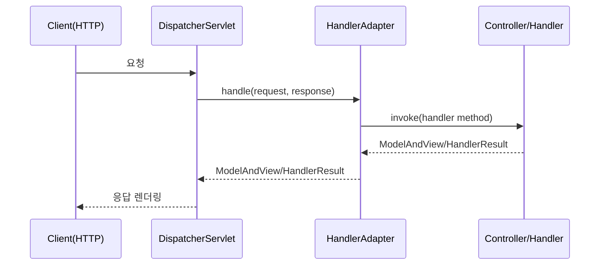
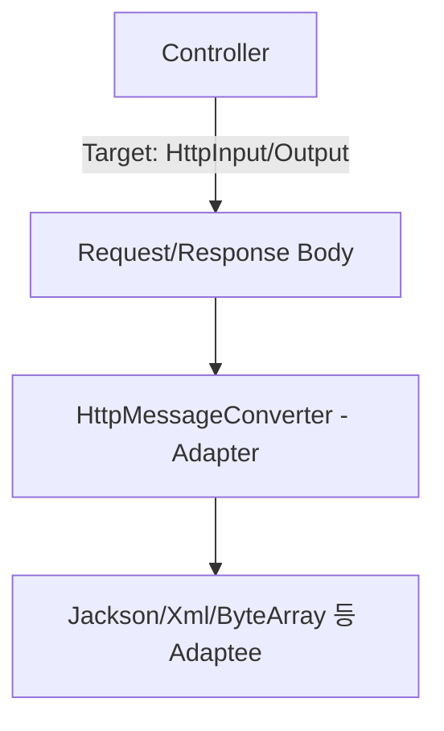
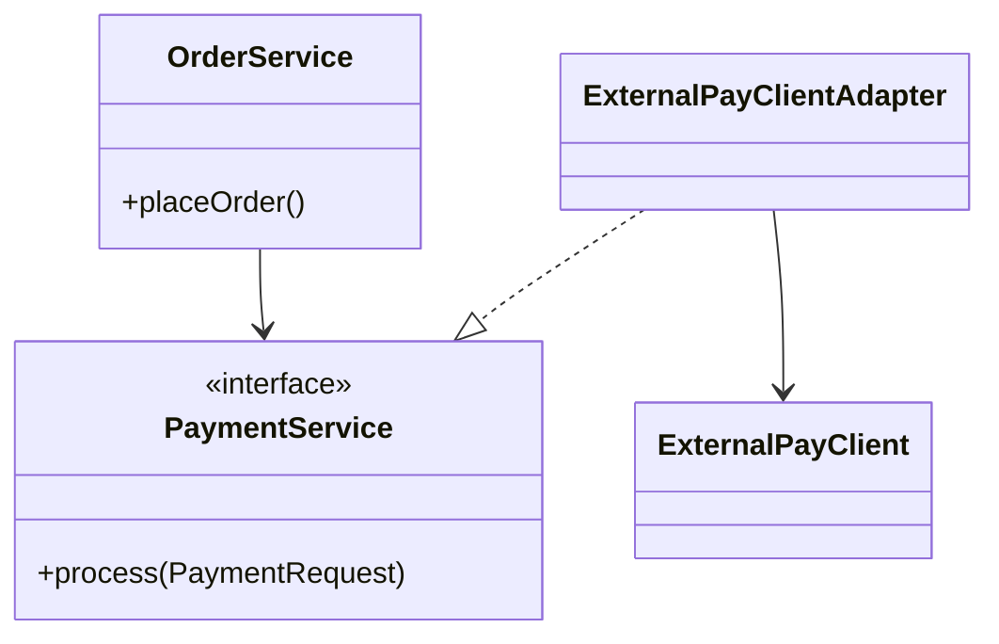

# 02-1. 어댑터 (Adapter)

## 02-1-1. 개념과 쓰임새

### 개요
어댑터(Adapter)는 호환되지 않는 인터페이스를 가진 기존 객체(Adaptee)를, 클라이언트가 기대하는 인터페이스(Target)에 맞춰서 연결해 주는 구조 패턴입니다. 즉, "끼워맞춤 변환기"로서 기존 코드를 변경하지 않고도 새 환경에서 재사용할 수 있게 합니다.

학습 목표
- GoF 어댑터의 의도와 구조(Target, Adapter, Adaptee)를 이해한다.
- 스프링 MVC/웹 애플리케이션에서 어댑터가 어떻게 쓰이는지 파악한다.
- 외부 라이브러리·레거시 코드의 인터페이스를 안전하게 감싸는 방법을 익힌다.

### 핵심 구조 (Mermaid Class Diagram)



- Client는 Target 인터페이스만 알며, Adapter는 내부에 Adaptee를 합성하고 호출을 변환합니다.
- 기존 Adaptee를 변경하지 않고도 새 표준(Target)에 맞게 재사용할 수 있습니다.

### 간단 예시 (Java 최소 코드)

```java
// Target: 우리 애플리케이션이 기대하는 결제 서비스
public interface PaymentService {
    void process(PaymentRequest request);
}

// Adaptee: 외부 결제 SDK가 제공하는 타입/메서드
public final class ExternalPayClient {
    public void pay(ExtPayPayload payload) { /* ... */ }
}

// Adapter: 외부 SDK를 우리의 Target에 맞춰 감싼다
public class ExternalPayClientAdapter implements PaymentService {
    private final ExternalPayClient client;

    public ExternalPayClientAdapter(ExternalPayClient client) {
        this.client = client;
    }

    @Override
    public void process(PaymentRequest request) {
        ExtPayPayload payload = new ExtPayPayload(request.getAmount(), request.getCurrency());
        client.pay(payload);
    }
}
```

- 구현 코드는 최소화하고, "인터페이스 변환"의 핵심만 보여줍니다.


## 02-1-2. 스프링에서의 적용 사례

### 개요
스프링 MVC는 어댑터 패턴을 광범위하게 사용합니다. 특히 "핸들러(컨트롤러) 실행 방식"이 제각각이어도, DispatcherServlet은 HandlerAdapter를 통해 통일된 방식으로 호출합니다.

### 예시 1: Spring MVC의 HandlerAdapter (Sequence)



- 다양한 컨트롤러 스타일(@Controller, Functional Endpoint 등)을, 여러 HandlerAdapter가 각각의 방식으로 "적응"하여 DispatcherServlet에 동일한 계약을 제공합니다.

### 예시 2: HttpMessageConverter (구조)



- 요청/응답 바디를 도메인 객체로 변환하거나 반대로 변환할 때, 다양한 메시지 포맷 라이브러리(Jackson 등)를 스프링 표준 계약에 맞춰 어댑팅합니다.

### 예시 3: Spring Security PasswordEncoder
- 과거/현재 다양한 해시 알고리즘을 하나의 PasswordEncoder 계약에 맞춰 감싸 실제 저장/검증을 통일합니다.


## 02-1-3. 웹 애플리케이션에서의 실전 적용

### 개요
외부 결제/메일/로그/클라우드 SDK를 직접 여기저기서 호출하면 결합도가 높고 교체가 어렵습니다. 어댑터로 감싸면 테스트와 교체가 쉬워집니다.

### 실전 구조 (Class Diagram)



- OrderService는 PaymentService(Target)에만 의존하므로 외부 결제사를 바꿔도 OrderService는 변경되지 않습니다.
- 테스트에서는 PaymentService의 가짜 구현을 주입하여 단위 테스트가 쉬워집니다.


## 02-1-4. 장단점과 사용 시점

### 장점
- 기존 코드(Adaptee) 변경 없이 재사용 가능.
- 외부 라이브러리/레거시와의 결합을 느슨하게 유지.
- 교체 용이: Target 인터페이스 뒤에서 다양한 어댑터를 갈아끼울 수 있음.

### 단점
- 계층/클래스 수 증가로 복잡도 상승 가능.
- 잘못 설계하면 어댑터가 도메인 규칙까지 떠안아 비대해질 수 있음.

### 사용 시점
- 외부 SDK나 레거시 인터페이스를 애플리케이션 표준 계약에 맞춰야 할 때.
- 프레임워크/엔진이 기대하는 콜백 계약에 기존 객체를 연결해야 할 때.
- 여러 구현체를 유연하게 교체하고 싶고, 클라이언트 코드를 안정적으로 보호해야 할 때.


## 02-1-5. 5가지 키워드로 정리하는 핵심 포인트
1. 인터페이스 변환: Adaptee를 Target 계약에 맞춰 연결한다.
2. 합성 우선: 어댑터는 대개 내부에 Adaptee를 합성하고 변환/호출을 위임한다.
3. 프레임워크 접점: 스프링 MVC의 HandlerAdapter, HttpMessageConverter가 전형적 사례다.
4. 교체 가능성: Target 뒤에서 다양한 어댑터를 갈아끼워 벤더 락인을 줄인다.
5. 테스트 용이성: 외부 의존을 감싸 목/스텁으로 대체하기 쉽다.


## 확인 문제
1. 어댑터 패턴의 핵심 의도로 가장 적절한 것은?
    - [ ] 객체 생성 과정을 단계적으로 분리한다.
    - [ ] 서브클래싱으로 생성을 지연시킨다.
    - [ ] 호환되지 않는 인터페이스를 변환하여 재사용 가능하게 한다.
    - [ ] 동일한 제품군을 일관되게 생성한다.

2. 다음 중 스프링에서 어댑터 패턴의 대표적 적용으로 가장 올바른 것은?
    - [ ] BeanPostProcessor가 빈 초기화를 최적화한다.
    - [ ] HandlerAdapter가 다양한 컨트롤러를 DispatcherServlet 계약에 맞춘다.
    - [ ] @Transactional이 트랜잭션 경계를 관리한다.
    - [ ] ApplicationEventPublisher가 이벤트를 발행한다.

3. [복수 응답] 어댑터를 적용하기 좋은 상황을 모두 고르시오.
    - [ ] 외부 결제/메일 SDK를 우리 도메인 계약에 맞춰야 할 때
    - [ ] 동일 도메인의 하위 타입을 상위 타입으로 업캐스팅할 때
    - [ ] 프레임워크가 요구하는 콜백 인터페이스에 레거시 객체를 연결해야 할 때
    - [ ] 외부 라이브러리 교체 가능성을 높이고 테스트 대체를 쉽게 하고 싶을 때
    - [ ] 단일 구현만 고정하여 영구적으로 변경하지 않으려 할 때

> [정답 및 해설 보기](../answers_and_explanations.md#02-1-어댑터-adapter)
