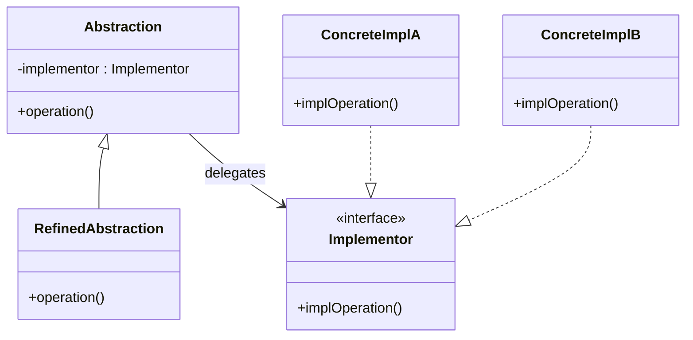
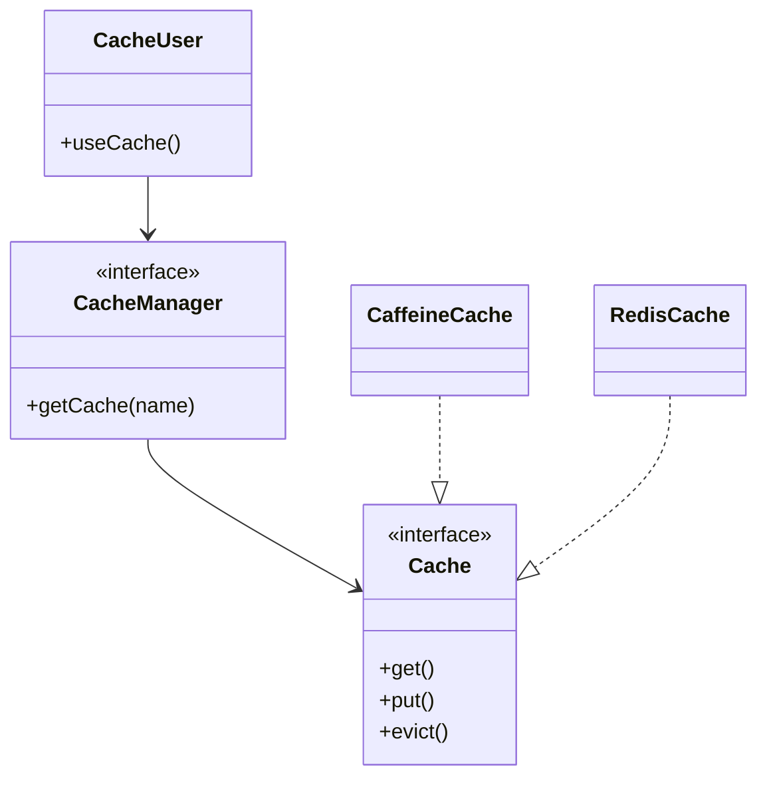
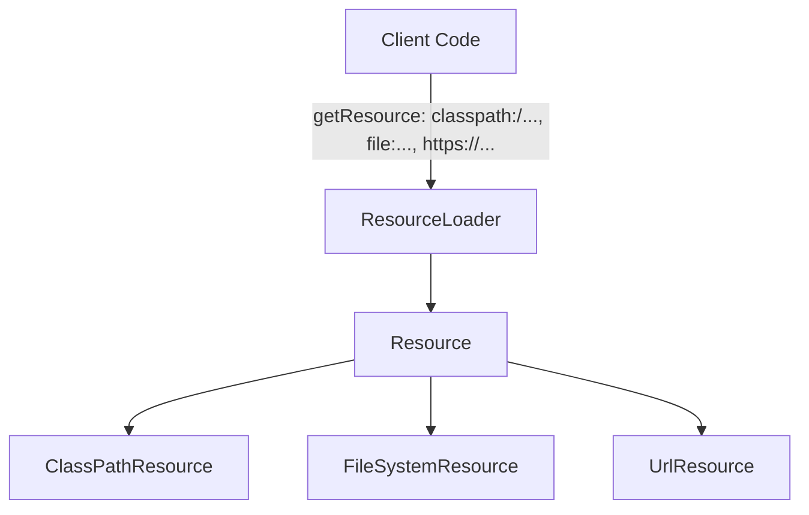
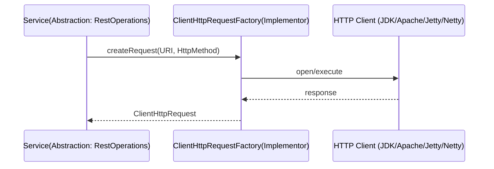
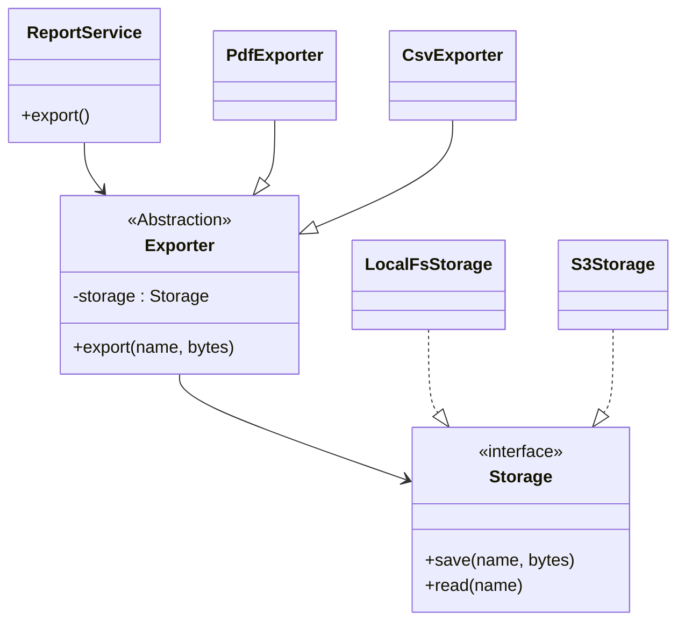

# 02-2. 브리지 (Bridge)

## 02-2-1. 개념과 쓰임새

### 개요
브리지(Bridge)는 "추상(Abstraction) 계층"과 그 추상이 실제로 수행되는 "구현(Implementor) 계층"을 분리하여, 두 축을 서로 독립적으로 확장할 수 있게 하는 구조 패턴입니다. 상속만으로 확장하려 할 때 발생하는 클래스 폭증 문제를, 조합(합성)과 인터페이스 분리로 완화합니다.

학습 목표
- GoF 브리지의 핵심 구조(Abstraction, RefinedAbstraction, Implementor, ConcreteImplementor)를 이해한다.
- 스프링/웹 애플리케이션에서 브리지처럼 추상과 구현을 분리해 교체 가능한 구조를 파악한다.
- 상속 폭증 대신 합성과 인터페이스를 통해 진화 가능한 설계를 익힌다.

### 핵심 구조 (Mermaid Class Diagram)



- Abstraction은 고수준 정책을 정의하고, 실제 일은 Implementor에 위임합니다.
- Abstraction/Implementor를 각각 독립적으로 확장할 수 있어 조합 폭발을 방지합니다.

### 간단 예시 (Java 최소 코드)

```java
// Implementor: 메시지 전송 방법
public interface MessageSender {
    void send(String channel, String content);
}

public final class EmailSender implements MessageSender {
    @Override
    public void send(String channel, String content) {
        /* SMTP ... */
    }
}

public final class SmsSender implements MessageSender {
    @Override
    public void send(String channel, String content) {
        /* SMS API ... */
    }
}

// Abstraction: 알림 도메인의 고수준 정책
public class Notification {
    protected final MessageSender sender; // Bridge

    public Notification(MessageSender sender) {
        this.sender = sender;
    }

    public void notify(String to, String message) {
        sender.send(to, message);
    }
}

// RefinedAbstraction: 정책을 확장
public final class UrgentNotification extends Notification {
    public UrgentNotification(MessageSender sender) {
        super(sender);
    }

    @Override
    public void notify(String to, String message) {
        super.notify(to, "[URGENT] " + message);
    }
}
```

- 알림 정책(Notification)과 전송 기술(MessageSender)을 분리해, "정책 × 전송 기술"의 조합을 유연하게 구성할 수 있습니다.


## 02-2-2. 스프링에서의 적용 사례

### 개요
스프링은 다양한 영역에서 "추상-구현 분리"를 적용하여, 구현 기술을 교체 가능하게 하고 테스트/운영 환경별 구성을 유연하게 만듭니다. 다음 구성들은 브리지의 의도를 강하게 보여줍니다.

### 예시 1: Spring Cache Abstraction (구조)



- Abstraction: Cache/CacheManager
- Implementor: CaffeineCache, RedisCache 등 구체 캐시 구현
- 고수준 서비스는 Cache 계약에만 의존하므로 구현을 독립적으로 교체할 수 있습니다.

### 예시 2: Resource/ResourceLoader (브리지 스타일의 추상화)



- 동일한 Abstraction(org.springframework.core.io.Resource) 아래에서 다양한 리소스 구현을 다룹니다.
- 코드 변경 없이 위치/프로토콜에 따라 구현이 교체되어 동작합니다.

### 예시 3: RestOperations × ClientHttpRequestFactory



- RestTemplate(WebClient는 다른 스타일)이 상위 API(Abstraction)를 제공하고, 하부 HTTP 클라이언트 선택은 팩토리/전략(Implementor)에 위임됩니다.
- 운영 환경에 맞춰 구현을 바꿔도 상위 호출부는 동일한 코드를 유지합니다.


## 02-2-3. 웹 애플리케이션에서의 실전 적용

### 개요
멀티 채널 알림, 파일 저장소, 결제/로그 전송 등에서 정책과 전달 기술을 분리하면 운영 요구(성능/보안/비용)에 따라 구현만 교체할 수 있습니다.

### 실전 구조 (Class Diagram)



- Exporter(추상) × Storage(구현)를 분리하여, "문서 형식"과 "저장소" 축을 독립적으로 확장합니다.


## 02-2-4. 장단점과 사용 시점

### 장점
- 두 축(추상/구현)을 분리해 독립적 확장을 지원, 클래스 폭증 방지.
- 구현 교체 용이: 운영/테스트 환경에 맞춰 손쉽게 바꿀 수 있음.
- 결합도 감소: 상위 정책은 계약(인터페이스)에만 의존.

### 단점
- 초기 설계 복잡도가 증가하고 계층이 늘어날 수 있음.
- 불필요하게 적용하면 과설계가 될 위험.

### 사용 시점
- 플랫폼/벤더/프로토콜이 바뀔 수 있어 구현 교체 가능성이 높은 경우.
- 고수준 정책을 다양하게 확장하면서도 하부 자원 접근을 자유롭게 바꾸고 싶은 경우.
- 상속 조합으로 인한 클래스 폭증이 예견되는 경우.


## 02-2-5. 5가지 키워드로 정리하는 핵심 포인트
1. 분리와 위임: 추상과 구현을 나누고 위임으로 연결한다.
2. 독립 확장: 두 축을 각각 확장해 조합 폭발을 제어한다.
3. 합성 우선: 상속 대신 합성으로 유연하게 결합한다.
4. 스프링 추상화: Cache/Resource/HTTP 클라이언트 등에서 구현 교체를 쉽게 한다.
5. 과설계 주의: 필요할 때 적용해 복잡도를 통제한다.


## 확인 문제
1. 브리지 패턴의 핵심 의도로 가장 적절한 것은?
    - [ ] 호환되지 않는 인터페이스를 변환해 재사용 가능하게 한다.
    - [ ] 추상과 구현을 분리해 각자 독립적으로 확장 가능하게 한다.
    - [ ] 동일 제품군 객체를 일관되게 생성한다.
    - [ ] 객체 생성을 단계적으로 분리하여 완성한다.

2. 다음 중 스프링에서 브리지의 의도와 가장 잘 맞는 사례는?
    - [ ] HandlerAdapter로 컨트롤러 호출 계약을 맞춘다.
    - [ ] Cache/CacheManager 추상 뒤에서 Caffeine/Redis 구현을 교체한다.
    - [ ] 프록시로 지연 로딩을 구현한다.
    - [ ] 템플릿 메서드로 하위 클래스에서 생성 훅을 결정한다.

3. [복수 응답] 브리지를 적용하기 좋은 상황을 모두 고르시오.
    - [ ] 상위 정책과 하위 기술을 각자 바꿔가며 조합해야 할 때
    - [ ] 구현 교체 가능성이 낮고 단일 상속만으로 충분할 때
    - [ ] 운영/테스트 환경에 따라 하위 리소스 접근 방식을 바꿔야 할 때
    - [ ] 상속 조합으로 클래스 수가 폭증할 것이 예상될 때
    - [ ] 동일 도메인 하위 타입을 상위 타입으로 업캐스팅할 때

> [정답 및 해설 보기](../answers_and_explanations.md#02-2-브리지-bridge)
