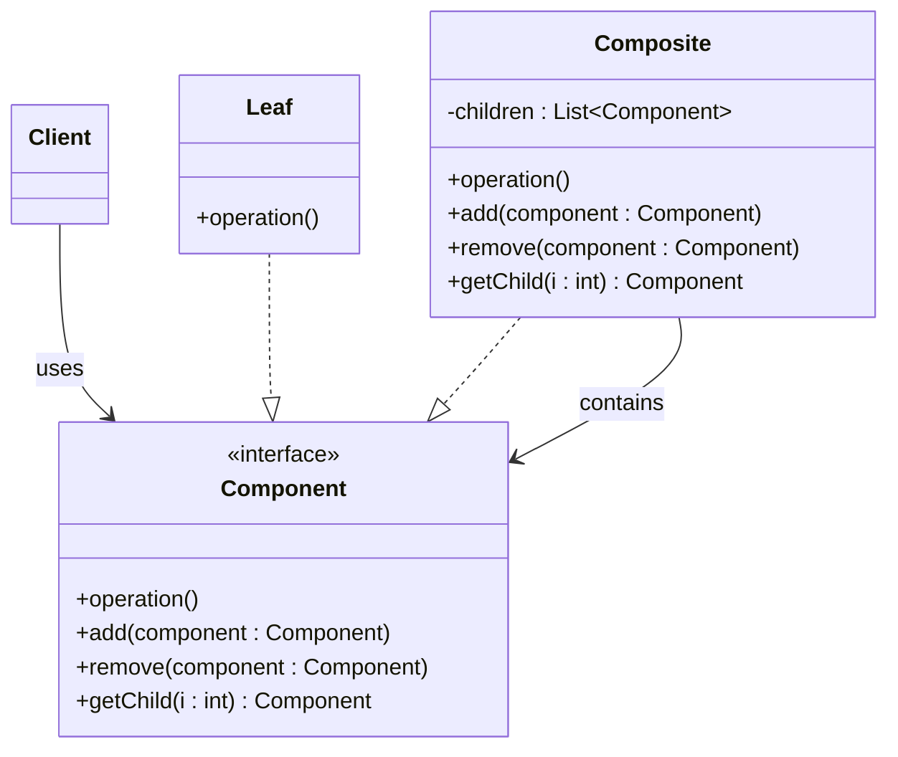
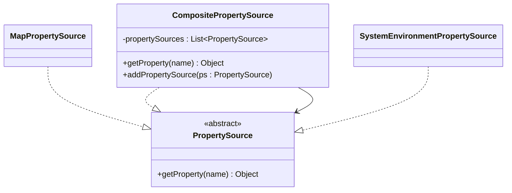
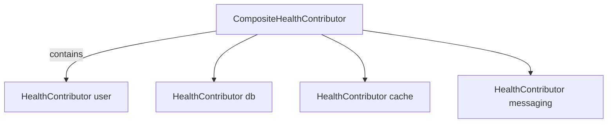
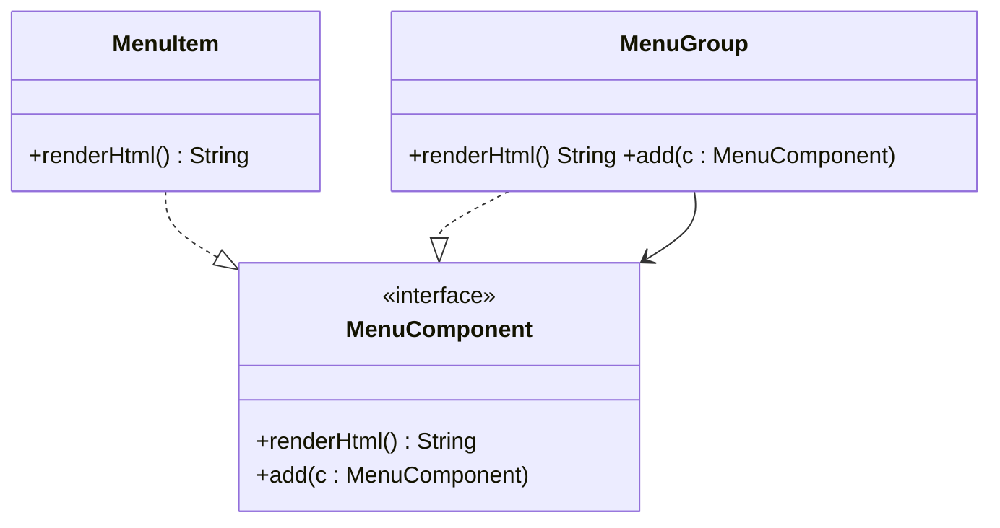

# 02-3. 컴포지트 (Composite)

## 02-3-1. 개념과 쓰임새

### 개요
컴포지트(Composite)는 부분-전체(Part-Whole) 계층 구조를 동일하게 다룰 수 있도록 해 주는 구조 패턴입니다. 클라이언트는 개별 객체(Leaf)와 복합 객체(Composite)를 같은 인터페이스(Component)로 취급해 재귀적 구조를 투명하게 사용할 수 있습니다.

학습 목표
- GoF 컴포지트의 의도와 구조(Component, Leaf, Composite)를 이해한다.
- 스프링/웹 애플리케이션에서 트리 구조를 다루는 전형적 사례를 파악한다.
- 컴포지트 설계 시 투명성/안전성 트레이드오프를 구분한다.

### 핵심 구조 (Mermaid Class Diagram)



- 투명성(모든 연산을 Component에 둠) vs 안전성(구성 변경 연산은 Composite에만 둠) 중 선택해야 합니다.
- 재귀적 호출을 통해 전체 트리에 동일한 연산을 적용할 수 있습니다.

### 간단 예시 (Java 최소 코드)

```java
// Component
public interface Node {
    String render();
    default void add(Node child) { throw new UnsupportedOperationException(); }
}

// Leaf
public final class TextNode implements Node {
    private final String text;
    public TextNode(String text) { this.text = text; }
    public String render() { return text; }
}

// Composite
import java.util.*;
public class GroupNode implements Node {
    private final List<Node> children = new ArrayList<>();
    @Override public String render() {
        StringBuilder sb = new StringBuilder();
        for (Node n : children) sb.append(n.render());
        return sb.toString();
    }
    @Override public void add(Node child) { children.add(child); }
}
```

- TextNode(Leaf)와 GroupNode(Composite)를 동일한 Node 인터페이스로 다루어, 렌더링을 재귀적으로 수행합니다.


## 02-3-2. 스프링에서의 적용 사례

### 개요
스프링 생태계 곳곳에서 "여러 구성요소를 하나처럼" 다루는 컴포지트 구조가 등장합니다. 속성 소스, 헬스 컨트리뷰터, 배치 처리기 등에서 트리/목록을 하나의 상위 타입으로 묶어 처리합니다.

### 예시 1: CompositePropertySource (구조)



- 스프링 환경(env)은 여러 PropertySource를 합쳐 하나의 논리적 소스처럼 조회합니다. 이는 전형적인 컴포지트입니다.

### 예시 2: Spring Boot Actuator의 CompositeHealthContributor



- 여러 하위 HealthContributor를 묶어 계층적으로 노출합니다. 상위는 하위를 탐색하여 전체 상태를 구성합니다.

### 예시 3: Spring Batch의 CompositeItemProcessor/Writer
- 여러 ItemProcessor를 연결하여 하나의 프로세서처럼 동작시킵니다. 클라이언트는 ItemProcessor 인터페이스 하나만 의존합니다.


## 02-3-3. 웹 애플리케이션에서의 실전 적용

### 개요
웹에서는 메뉴/카테고리/페이지 블록과 같은 UI 트리가 흔합니다. 트리 전체에 동일한 렌더링/검증/권한 체크를 적용하기에 컴포지트가 적합합니다.

### 실전 구조: 내비게이션 메뉴 트리



- 컨트롤러/뷰는 MenuComponent 하나만 다루면 되며, 항목/그룹을 동일하게 처리합니다.

### 간단 컨트롤러 연계 아이디어
- 서비스가 MenuComponent 트리를 만들어 반환하면, 뷰 템플릿(Thymeleaf 등)이 재귀적으로 renderHtml을 호출해 출력합니다.


## 02-3-4. 장단점과 사용 시점

### 장점
- 클라이언트 단순화: 개별과 집합을 동일 인터페이스로 다룬다.
- 재귀적 처리: 전체 트리에 동일 연산을 일괄 적용하기 쉽다.
- 확장성: 새로운 Leaf/Composite 타입 추가가 용이하다.

### 단점
- 제약 약화: 모든 연산을 상위 인터페이스에 두면(type safety 약화) 일부 구현에서 의미 없는 연산이 생길 수 있다.
- 디버깅 난이도: 깊은 재귀/복합 구조는 추적이 어렵다.
- 성능 고려: 대규모 트리 순회 시 비용이 증가할 수 있다.

### 사용 시점
- 부분-전체 계층(카테고리, 메뉴, 페이지 블록, 조직도 등)을 동일하게 다뤄야 할 때.
- 클라이언트 코드가 단순한 상위 계약만으로 트리를 투명하게 사용해야 할 때.
- 여러 구성요소를 논리적으로 하나처럼 묶어 조회/처리해야 할 때.


## 02-3-5. 5가지 키워드로 정리하는 핵심 포인트
1. 부분-전체 트리: Leaf와 Composite를 동일 계약으로.
2. 재귀 처리: 연산을 트리 전체에 전파.
3. 투명성 vs 안전성: 어디에 연산을 둘지 결정.
4. 스프링 사례: CompositePropertySource, CompositeHealthContributor, CompositeItemProcessor.
5. 웹 UI 트리: 메뉴/카테고리/페이지 블록 렌더링에 적합.


## 확인 문제
1. 컴포지트 패턴의 핵심 의도로 가장 적절한 것은?
    - [ ] 호환되지 않는 인터페이스를 변환해 재사용 가능하게 한다.
    - [ ] 부분-전체 계층을 동일한 인터페이스로 다루게 한다.
    - [ ] 추상과 구현을 분리해 독립 확장을 가능하게 한다.
    - [ ] 객체 생성 과정을 단계적으로 분리한다.

2. 다음 중 스프링에서 컴포지트의 전형적 사례로 가장 적절한 것은?
    - [ ] HandlerInterceptor 체인으로 요청을 전처리한다.
    - [ ] CompositePropertySource로 여러 PropertySource를 하나처럼 조회한다.
    - [ ] HandlerAdapter로 다양한 컨트롤러를 호출 계약에 맞춘다.
    - [ ] Proxy를 이용해 지연 로딩을 구현한다.

3. [복수 응답] 컴포지트를 적용하기 좋은 상황을 모두 고르시오.
    - [ ] 메뉴/카테고리와 같은 트리를 동일한 API로 렌더링해야 할 때
    - [ ] 단일 구현만 있고 트리 구조가 전혀 없을 때
    - [ ] 여러 상태 점검 컴포넌트를 하나의 상위 헬스로 묶어 노출해야 할 때
    - [ ] 하위 기술을 상위 정책과 독립적으로 교체해야 할 때
    - [ ] 여러 프로세서를 연결해 하나의 프로세서처럼 동작시키고 싶을 때

> [정답 및 해설 보기](../answers_and_explanations.md#02-3-컴포지트-composite)
