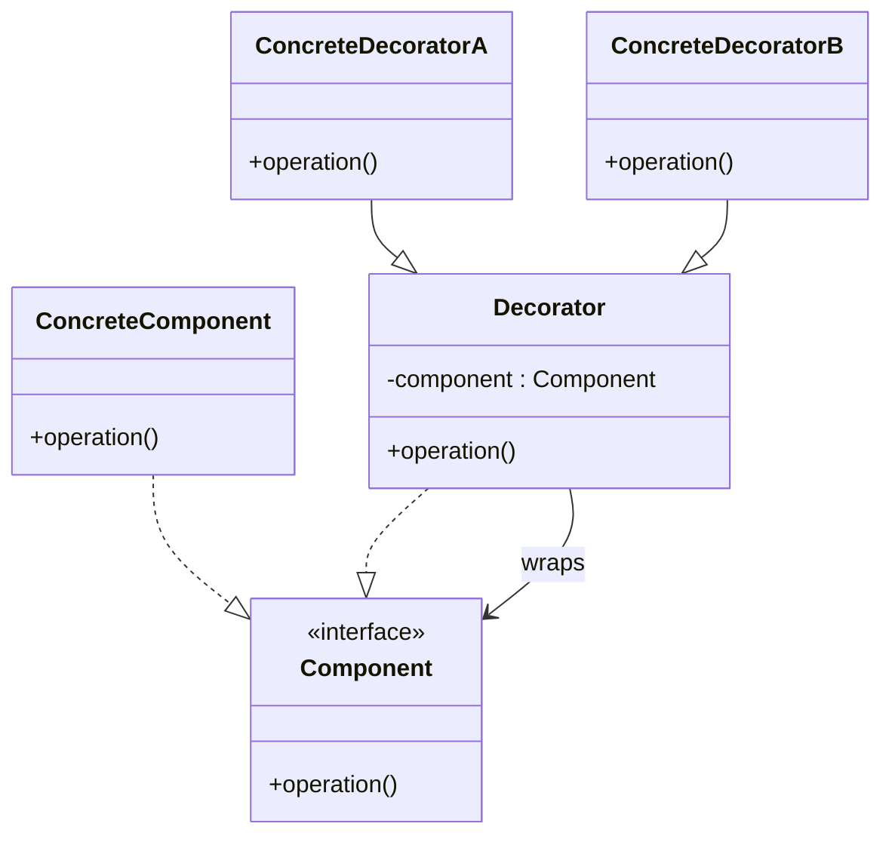
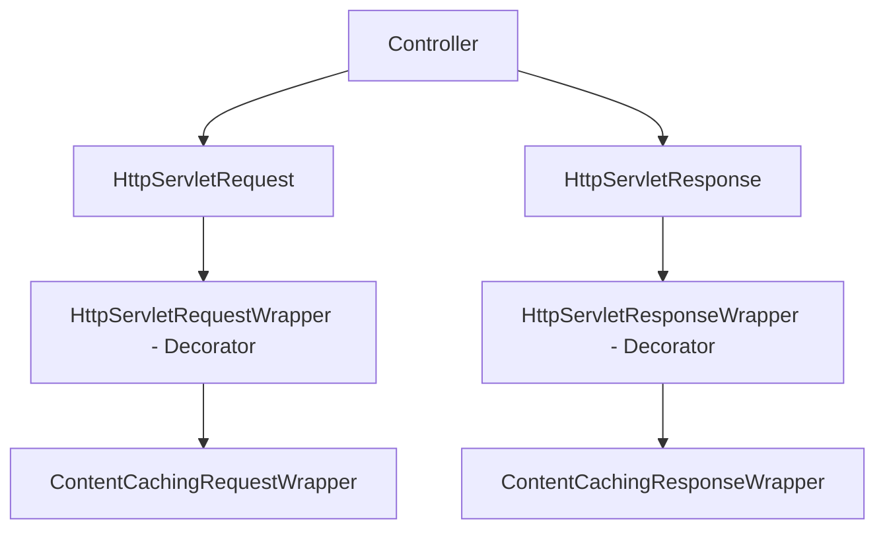
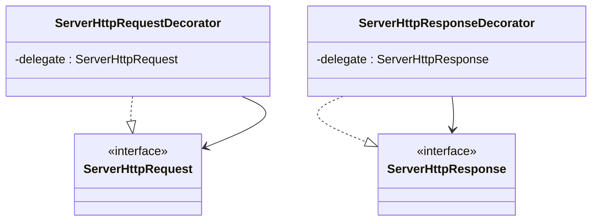
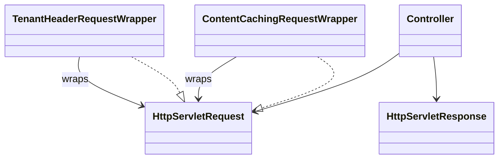

# 02-4. 데코레이터 (Decorator)

## 02-4-1. 개념과 쓰임새

### 개요
데코레이터(Decorator)는 "같은 인터페이스(계약)를 유지한 채" 객체에 책임(기능)을 덧입히는 구조 패턴입니다. 상속으로 기능을 확장하면 조합이 폭발하고 유연성이 떨어질 수 있으나, 데코레이터는 합성으로 기존 객체를 감싸며 동적으로 기능을 추가합니다.

학습 목표
- GoF 데코레이터의 의도와 구조(Component, ConcreteComponent, Decorator, ConcreteDecorator)를 이해한다.
- 스프링/웹 애플리케이션에서 요청/응답 래퍼 등 데코레이터 사례를 파악한다.
- 상속 폭증을 피하고 런타임에 기능을 조합하는 방법을 익힌다.

### 핵심 구조 (Mermaid Class Diagram)



- 데코레이터는 Component 계약을 구현하며 내부에 동일 계약의 component를 보유해 호출을 위임하고, 전후로 기능을 추가합니다.
- 클라이언트는 감싸기(데코레이션) 여부를 모른 채 Component 계약만 사용합니다.

### 간단 예시 (Java 최소 코드)

```java
import java.util.HashMap;
import java.util.Map;

// Component: 가격 계산 서비스 계약
public interface PricingService {
    int price(String sku, int qty);
}

// ConcreteComponent: 기본 구현
public final class BasicPricingService implements PricingService {
    @Override
    public int price(String sku, int qty) {
        return 100 * qty; // 데모를 위한 단순 계산
    }
}

// Decorator: 공통 래퍼
public abstract class PricingServiceDecorator implements PricingService {
    protected final PricingService delegate;

    protected PricingServiceDecorator(PricingService delegate) {
        this.delegate = delegate;
    }
}

// ConcreteDecorator: 로깅 추가
public final class LoggingPricingService extends PricingServiceDecorator {
    public LoggingPricingService(PricingService delegate) {
        super(delegate);
    }

    @Override
    public int price(String sku, int qty) {
        System.out.println("pricing start: " + sku);
        int result = delegate.price(sku, qty);
        System.out.println("pricing done: " + result);
        return result;
    }
}

// ConcreteDecorator: 단순 캐싱 추가 (데모용)
public final class CachingPricingService extends PricingServiceDecorator {
    private final Map<String, Integer> cache = new HashMap<>();

    public CachingPricingService(PricingService delegate) {
        super(delegate);
    }

    @Override
    public int price(String sku, int qty) {
        String key = sku + ":" + qty;
        Integer cached = cache.get(key);
        if (cached != null) {
            return cached;
        }
        int result = delegate.price(sku, qty);
        cache.put(key, result);
        return result;
    }
}
```

- 실행 시점에 Logging → Caching → Basic 순으로 감싸 조합할 수 있습니다.
- 계약은 동일하므로 클라이언트는 교체/조합 사실을 의식할 필요가 없습니다.


## 02-4-2. 스프링에서의 적용 사례

### 개요
스프링 및 웹 스택에서는 "같은 타입을 감싸 기능을 더하는 래퍼"가 널리 쓰입니다. 특히 서블릿/리액티브 요청·응답 래퍼는 전형적인 데코레이터입니다.

### 예시 1: HttpServletRequestWrapper/HttpServletResponseWrapper (서블릿)



- javax.servlet.http.HttpServletRequestWrapper/ResponseWrapper는 같은 계약을 유지하며 요청/응답에 기능을 덧붙입니다.
- Spring Web의 ContentCachingRequestWrapper/ResponseWrapper는 바디를 읽고 다시 사용할 수 있도록 캐싱을 추가하는 구체 데코레이터입니다.

### 예시 2: WebFlux ServerHttpRequestDecorator/ServerHttpResponseDecorator



- 리액티브 스택에서도 동일 계약을 구현한 데코레이터로 기능을 추가합니다(헤더 조작, 로깅, 트레이싱 등).

### 예시 3: ClientHttpRequestDecorator (WebClient 내부 구성)
- WebClient의 하부 구성에서 ClientHttpRequest를 감싸면서 메타데이터 추가, 로깅/메트릭 등 부가 기능을 투명하게 부여합니다.
- 동일 계약을 구현하고 내부 delegate로 위임하는 전형적 데코레이터입니다.


## 02-4-3. 웹 애플리케이션에서의 실전 적용

### 개요
감사 로깅, 멱등 키 주입, 멀티 테넌트 식별자 전파, 요청 바디 반복 읽기 등은 데코레이터로 구현하면 기존 컨트롤러/핸들러 코드를 바꾸지 않고 기능을 덧입힐 수 있습니다.

### 실전 구조 (Class Diagram)



- 다양한 래퍼를 조합해 필요한 기능을 순차로 추가할 수 있습니다.
- 조합 순서가 의미를 가질 수 있으므로 설계 시 주의합니다.


## 02-4-4. 장단점과 사용 시점

### 장점
- 동적 조합: 런타임에 여러 데코레이터를 자유롭게 합성 가능.
- 개방-폐쇄 원칙: 기존 코드를 변경하지 않고 기능 확장.
- 투명성: 클라이언트는 동일 계약만 의존하므로 교체가 용이.

### 단점
- 래퍼 체인 복잡도: 중첩이 깊어지면 디버깅/추적이 어려움.
- 구성 순서 민감도: 전후 순서에 따라 결과가 달라질 수 있음.
- 오버헤드: 위임/래핑 비용과 상태 보관(예: 캐시)의 메모리 비용.

### 사용 시점
- 기존 타입의 계약은 바꾸지 않고 부가 기능(로깅, 캐싱, 검증, 측정)을 추가해야 할 때.
- 많은 조합을 상속으로 표현하면 클래스 폭증이 예상될 때.
- 런타임 조건/환경에 따라 기능을 켜고 끄며 조합해야 할 때.


## 02-4-5. 5가지 키워드로 정리하는 핵심 포인트
1. 동일 계약 유지: Component 인터페이스를 바꾸지 않는다.
2. 합성 기반 확장: 내부 delegate에 위임하고 전후 처리로 기능 추가.
3. 동적 조합: 실행 시 여러 데코레이터를 순서대로 감쌀 수 있다.
4. 스프링 래퍼: Request/Response/ClientHttpRequest 데코레이터가 전형.
5. 순서와 성능: 체인 순서와 오버헤드에 유의.


## 확인 문제
1. 데코레이터 패턴의 핵심 의도로 가장 적절한 것은?
    - [ ] 호환되지 않는 인터페이스를 변환해 재사용 가능하게 한다.
    - [ ] 객체에 새로운 책임을 동적으로 추가하되 동일한 인터페이스를 유지한다.
    - [ ] 추상과 구현을 분리해 독립적으로 확장한다.
    - [ ] 동일 제품군 객체를 일관되게 생성한다.

2. 다음 중 스프링에서 데코레이터의 대표적 적용으로 가장 올바른 것은?
    - [ ] HandlerAdapter로 다양한 컨트롤러를 호출한다.
    - [ ] ContentCachingRequestWrapper로 HttpServletRequest를 감싸 바디 재사용을 가능하게 한다.
    - [ ] @Transactional로 트랜잭션 경계를 관리한다.
    - [ ] RestTemplate의 HttpMessageConverter를 통해 JSON을 변환한다.

3. [복수 응답] 데코레이터를 적용하기 좋은 상황을 모두 고르시오.
    - [ ] 기존 계약은 유지하면서 로깅/캐싱/검증 같은 부가 기능을 추가해야 할 때
    - [ ] 새로운 메서드를 추가해 인터페이스 자체를 바꿔야 할 때
    - [ ] 상속으로 조합이 폭증할 것이 예상될 때
    - [ ] 런타임 조건에 따라 기능을 켜고 끄며 조합해야 할 때
    - [ ] 타입 변환으로 호환되지 않는 인터페이스를 맞춰야 할 때

> [정답 및 해설 보기](../answers_and_explanations.md#02-4-데코레이터-decorator)
