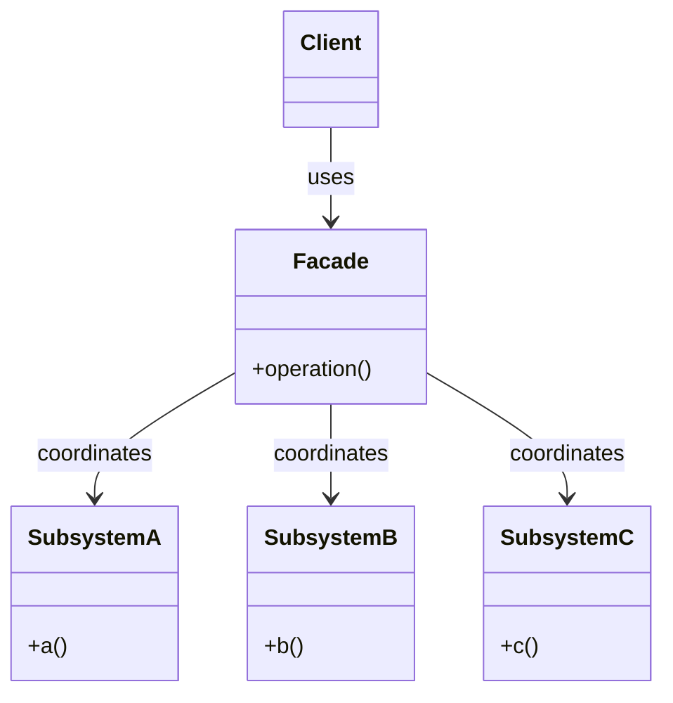
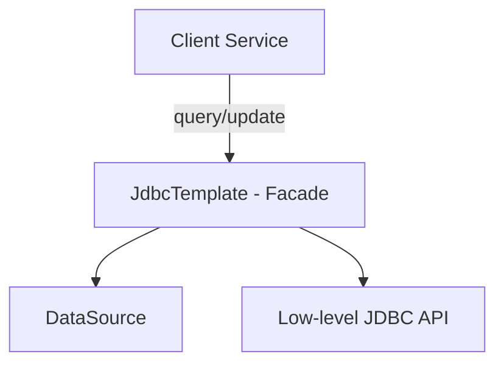
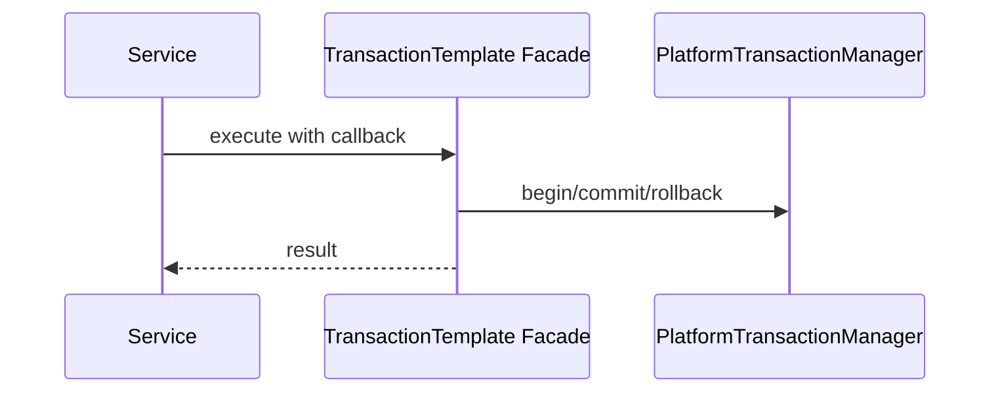
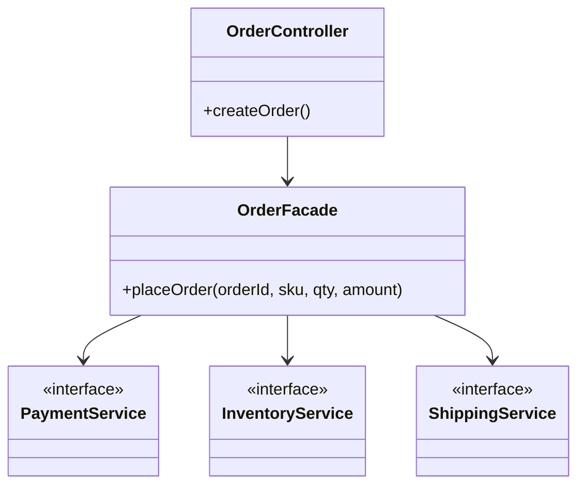

# 02-5. 퍼사드 (Facade)

## 02-5-1. 개념과 쓰임새

### 개요
퍼사드(Facade)는 복잡한 하위 서브시스템의 사용을 단순화하기 위해, 간단하고 일관된 고수준 인터페이스를 제공하는 구조 패턴입니다. 퍼사드는 내부 구성요소들의 세부 구현과 상호작용을 감추고, 클라이언트에게 필요한 최소한의 진입점만 노출합니다.

학습 목표
- GoF 퍼사드의 의도와 구조(Facade, Subsystems)를 이해한다.
- 스프링/웹 애플리케이션에서 템플릿/헬퍼가 퍼사드로 동작하는 사례를 파악한다.
- 서비스 레이어에서 퍼사드를 설계하며 결합도와 복잡도를 낮추는 방법을 익힌다.

### 핵심 구조 (Mermaid Class Diagram)



- 클라이언트는 Facade 하나만 사용합니다. Facade 내부에서 여러 서브시스템 호출 순서와 예외, 트랜잭션 경계를 조율합니다.
- 퍼사드는 인터페이스를 변환하는 어댑터와 달리, “단순화된 진입점”을 제공하여 사용성을 높입니다.

### 간단 예시 (Java 최소 코드)

```java
// 하위 서브시스템(예: 결제, 재고, 배송)
public interface PaymentService { void pay(String orderId, int amount); }
public interface InventoryService { void reserve(String sku, int qty); }
public interface ShippingService { void requestShipment(String orderId); }

// Facade: 주문 처리 고수준 API
public class OrderFacade {
    private final PaymentService payment;
    private final InventoryService inventory;
    private final ShippingService shipping;

    public OrderFacade(PaymentService payment, InventoryService inventory, ShippingService shipping) {
        this.payment = payment;
        this.inventory = inventory;
        this.shipping = shipping;
    }

    public void placeOrder(String orderId, String sku, int qty, int amount) {
        inventory.reserve(sku, qty);
        payment.pay(orderId, amount);
        shipping.requestShipment(orderId);
    }
}
```

- 클라이언트는 OrderFacade.placeOrder만 호출하면 됩니다. 내부 순서/실패 처리/로깅/트랜잭션 경계 확장은 Facade가 담당합니다.


## 02-5-2. 스프링에서의 적용 사례

### 개요
스프링은 복잡한 저수준 API를 단순화해 주는 템플릿/헬퍼를 많이 제공합니다. 이들은 퍼사드로서 하위 리소스 관리, 예외 변환, 일관된 계약을 제공합니다.

### 예시 1: JdbcTemplate 


- JdbcTemplate은 커넥션/스테이트먼트/리소스 해제/예외 변환까지 묶어 단순한 메서드로 제공합니다. 복잡한 JDBC 상호작용을 감춥니다.

### 예시 2: TransactionTemplate

- 트랜잭션 시작/커밋/롤백의 저수준 절차를 감추고, 람다 블록 실행만으로 경계를 단순화합니다.

### 예시 3: RestTemplate / WebClient (고수준 HTTP Facade)
- RestTemplate은 HTTP 메서드 호출, 헤더/바디 처리, 메시지 컨버전 등을 단순화합니다.
- WebClient는 리액티브 스타일이지만, 고수준 API로 다양한 HTTP 클라이언트 구성 요소를 감춥니다.

### 예시 4: JavaMailSender
- JavaMail의 복잡한 Session/MimeMessage 구성을 감추고 간단한 send 메서드로 제공하는 전형적인 퍼사드입니다.


## 02-5-3. 웹 애플리케이션에서의 실전 적용

### 개요
도메인 단위의 "유스케이스"를 퍼사드로 묶으면, 컨트롤러나 다른 서비스가 복잡한 절차를 알 필요 없이 간단한 API만 호출할 수 있습니다.

### 실전 구조 (Class Diagram)



- 컨트롤러는 퍼사드로만 상호작용합니다. 복잡한 도메인 시나리오를 퍼사드에 응집시켜 재사용성과 테스트 용이성을 높입니다.

### 설계 팁
- 퍼사드는 상태를 최소화하고, 실패 시나리오를 명확히 정의합니다.
- 트랜잭션/락/로깅/감사를 퍼사드 경계에서 일관되게 처리합니다.
- 하위 서비스의 변화가 클라이언트에 파급되지 않도록 퍼사드 메서드 시그니처를 안정적으로 유지합니다.


## 02-5-4. 장단점과 사용 시점

### 장점
- 복잡한 서브시스템을 감추어 사용성을 높이고 학습 비용을 낮춘다.
- 결합도 감소: 클라이언트는 퍼사드 계약에만 의존한다.
- 횡단 관심사(트랜잭션, 로깅, 보안)를 일관된 경계에서 처리하기 쉽다.

### 단점
- 잘못 설계하면 퍼사드가 비대해져서 "거대한 서비스"가 될 수 있다.
- 너무 많은 책임을 한 곳에 몰면 변경 영향이 커진다.
- 과도한 추상화는 특정 기능 제어가 어려울 수 있다.

### 사용 시점
- 복잡한 워크플로우를 단순화된 진입점으로 제공하고 싶을 때.
- 저수준 API의 리소스/예외/보일러플레이트를 감추고 싶을 때.
- 컨트롤러나 외부 호출자가 도메인 규칙의 절차를 몰라도 되게 하고 싶을 때.


## 02-5-5. 5가지 키워드로 정리하는 핵심 포인트
1. 단순화된 진입점: 복잡한 절차를 감춘 고수준 API.
2. 조율과 캡슐화: 호출 순서, 예외, 트랜잭션을 내부에서 조율.
3. 스프링 템플릿: JdbcTemplate, TransactionTemplate, JavaMailSender.
4. 경계에서의 일관성: 로깅/보안/검증을 퍼사드 경계에서.
5. 비대화 방지: 책임 분리와 작은 퍼사드 유지.


## 확인 문제
1. 퍼사드 패턴의 핵심 의도로 가장 적절한 것은?
    - [ ] 호환되지 않는 인터페이스를 변환해 재사용 가능하게 한다.
    - [ ] 복잡한 서브시스템을 감추고 단순한 고수준 인터페이스를 제공한다.
    - [ ] 추상과 구현을 분리해 독립 확장을 가능하게 한다.
    - [ ] 객체 생성 과정을 단계적으로 분리한다.

2. 다음 중 스프링에서 퍼사드의 전형적 사례로 가장 올바른 것은?
    - [ ] HandlerAdapter가 다양한 컨트롤러를 공통 계약에 맞춘다.
    - [ ] JdbcTemplate이 JDBC 리소스 관리와 예외 변환을 감추고 간단한 메서드를 제공한다.
    - [ ] Proxy로 지연 로딩을 구현한다.
    - [ ] CompositePropertySource로 여러 소스를 하나처럼 조회한다.

3. [복수 응답] 퍼사드를 적용하기 좋은 상황을 모두 고르시오.
    - [ ] 컨트롤러가 여러 하위 서비스를 순서대로 호출해야 할 때 이를 단순화하고 싶다.
    - [ ] 저수준 API의 보일러플레이트(리소스/예외)를 숨기고 싶다.
    - [ ] 인터페이스 불일치를 해결해 타입을 변환해야 한다.
    - [ ] 도메인 유스케이스를 한 메서드로 제공해 외부 호출을 단순화하고 싶다.
    - [ ] 부분-전체 트리를 동일 인터페이스로 다뤄야 한다.

> [정답 및 해설 보기](../answers_and_explanations.md#02-5-퍼사드-facade)
