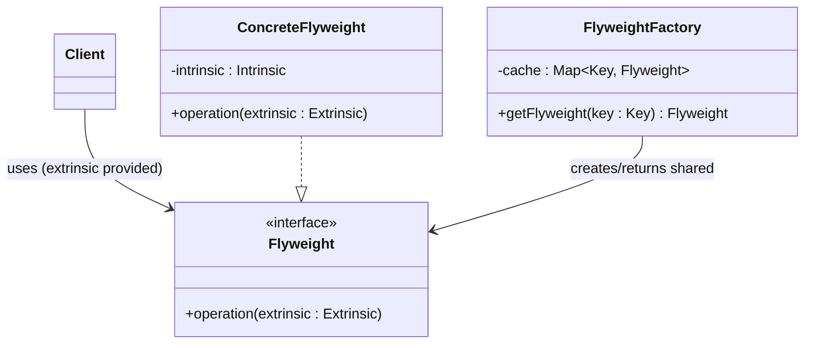
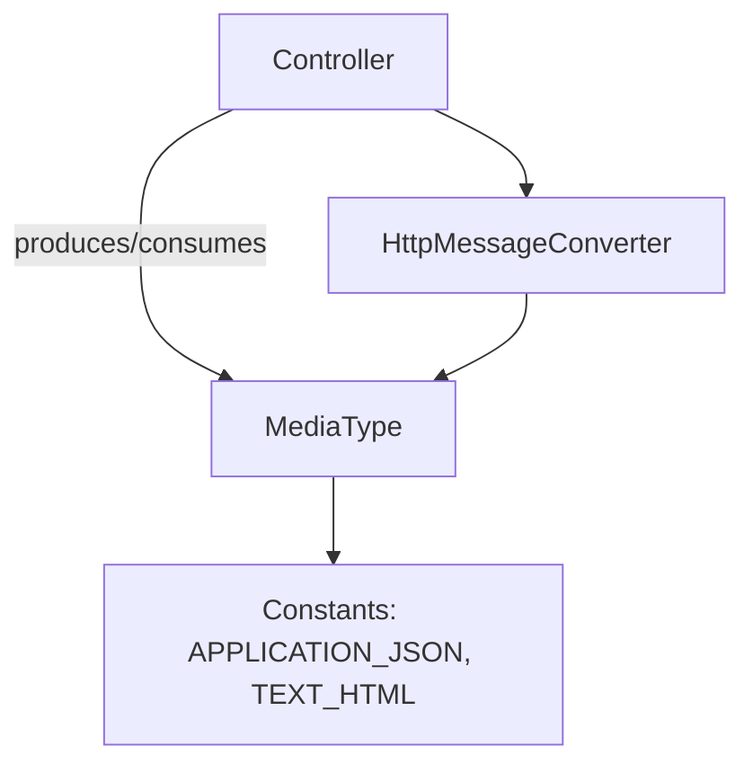
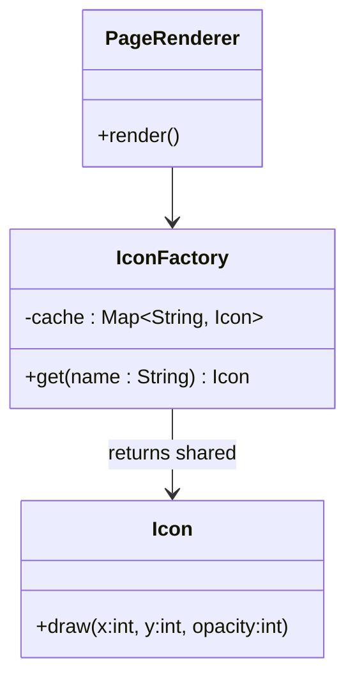
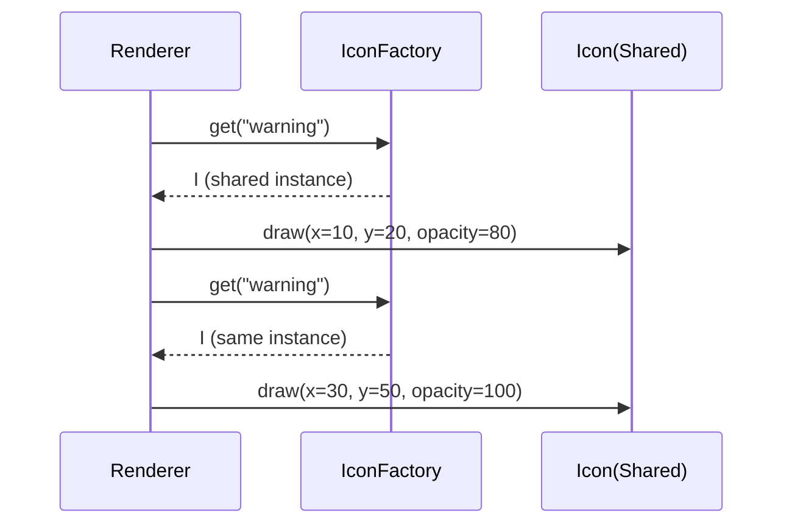

# 02-6. 플라이웨이트 (Flyweight)

## 02-6-1. 개념과 쓰임새

### 개요
플라이웨이트(Flyweight)는 많은 수의 유사한 객체가 필요할 때, 객체의 내부에서 변하지 않는 "내재 상태(intrinsic state)"를 공유하고, 매번 달라지는 "외재 상태(extrinsic state)"는 호출 시점의 인자로 전달하여 메모리 사용량을 극적으로 줄이는 구조 패턴입니다.

학습 목표
- 내재 상태와 외재 상태의 구분을 이해한다.
- 팩토리(풀)로 동일 내재 상태를 공유하는 구조를 설계한다.
- 스프링/웹 애플리케이션에서 공유 가능한 불변 객체를 안전하게 재사용하는 방법을 파악한다.

### 핵심 구조 (Mermaid Class Diagram)



- ConcreteFlyweight는 불변의 내재 상태만 보유합니다.
- 클라이언트는 외재 상태를 메서드 인자로 전달하여 동작을 완성합니다.
- FlyweightFactory는 동일 키에 대해 같은 인스턴스를 반환하여 공유를 보장합니다.

### 간단 예시 (Java 최소 코드)

```java
// Intrinsic state: 아이콘의 픽셀 데이터, 불변
public final class Icon {
    private final byte[] pixels; // 불변으로 간주
    private final int width;
    private final int height;
    public Icon(byte[] pixels, int width, int height) {
        this.pixels = pixels; this.width = width; this.height = height;
    }
    public void draw(int x, int y, int opacity) { /* 외재 상태(x,y,opacity)로 그리기 */ }
}

// Flyweight Factory: 같은 이름의 아이콘은 공유
import java.util.*;
public final class IconFactory {
    private static final Map<String, Icon> CACHE = new HashMap<>();
    public static Icon get(String name) {
        Icon icon = CACHE.get(name);
        if (icon == null) {
            // 실제로는 디스크/네트워크에서 로드 후 불변 Icon 생성
            icon = new Icon(loadPixels(name), 16, 16);
            CACHE.put(name, icon);
        }
        return icon; // 공유 인스턴스
    }
    private static byte[] loadPixels(String name) { return new byte[16 * 16 * 4]; }
}

// 사용: 위치/투명도 등은 외재 상태로 전달
Icon warn = IconFactory.get("warning");
warn.draw(10, 20, 80);
Icon warn2 = IconFactory.get("warning"); // 같은 인스턴스 재사용
warn2.draw(30, 50, 100);
```

- 아이콘의 픽셀 데이터(내재 상태)는 공유됩니다.
- 좌표, 투명도 등 실행 맥락(외재 상태)은 호출 시에만 전달합니다.


## 02-6-2. 스프링에서의 적용 사례

### 개요
스프링 자체가 "GoF 플라이웨이트"를 명시적으로 표방하는 구성은 많지 않지만, 불변 값 객체를 재사용하거나 상수/캐시를 통해 동일 인스턴스를 공유하는 곳에서 유사한 의도가 발견됩니다.

### 예시 1: MimeType/MediaType의 상수와 재사용 (구조)



- org.springframework.http.MediaType와 org.springframework.util.MimeType은 불변이며, 자주 쓰이는 형식은 상수로 제공되어 광범위하게 재사용됩니다.
- 동일 의미의 객체를 매번 생성하지 않고 상수/공유 인스턴스를 사용하여 할당/GC 비용을 줄입니다.

### 예시 2: HttpStatus/Locale 등 불변 값의 공유
- HttpStatus는 enum으로 각 상태 코드를 전역에서 하나의 인스턴스로 공유합니다(열거형은 사실상 플라이웨이트에 해당).
- Locale, Charset, ZoneId 등 JDK의 불변 값 타입은 팩토리/캐시를 통해 같은 의미의 인스턴스를 재사용하는 경우가 많습니다. 스프링 구성요소는 이들을 그대로 공유하여 비용을 절약합니다.

### 예시 3: 템플릿 엔진의 캐시된 템플릿
- Thymeleaf/Spring MVC 환경에서 템플릿을 캐시하면, "컴파일된 템플릿 표현(내재 상태)"을 공유하고, 각 요청의 모델 데이터(외재 상태)는 렌더 호출 시 주입합니다.
- 엄밀히 GoF 구조 그대로는 아니지만, 내재/외재 상태 분리와 공유라는 핵심을 충족합니다.


## 02-6-3. 웹 애플리케이션에서의 실전 적용

### 개요
대량의 UI 요소(아이콘, 폰트 글리프), 정적 리소스 메타데이터, 정규식/포맷터와 같은 불변 객체는 요청마다 새로 만들 필요가 없습니다. 플라이웨이트로 동일 의미의 인스턴스를 공유하면 메모리와 생성 시간을 절약할 수 있습니다.

### 실전 구조 (Class Diagram)



- PageRenderer는 필요한 아이콘을 팩토리에서 가져오고, 좌표/색/투명도 등 외재 상태로 그립니다.
- 대규모 목록/대시보드 렌더링에서 메모리 사용량을 크게 줄일 수 있습니다.

### 시퀀스 (Sequence)




## 02-6-4. 장단점과 사용 시점

### 장점
- 메모리 절약: 동일 내재 상태를 공유하여 인스턴스 수를 줄입니다.
- 생성 비용 절감: 빈번한 생성/파싱/컴파일(정규식, 템플릿 등)을 피할 수 있습니다.
- 캐시 친화성: 동일 객체 재사용으로 GC 압력을 낮출 수 있습니다.

### 단점
- 복잡성 증가: 팩토리/캐시 관리, 동기화 고려가 필요합니다.
- 외재 상태 누락 위험: 메서드 호출 시 필요한 외재 상태를 빠뜨리면 버그가 발생합니다.
- 변경 불가 전제: 내재 상태는 불변이어야 하므로, 가변 설계에서는 적용이 어렵습니다.

### 사용 시점
- 대량의 유사 객체가 필요하고, 공통 불변 상태를 분리/공유할 수 있을 때.
- 정규식 Pattern, DateTimeFormatter, MediaType 등 재사용 가능한 불변 객체를 빈번히 생성하고 있을 때.
- 대규모 리스트/지도 UI 렌더링에서 아이콘/스타일/폰트 글리프 등 공유가 가능할 때.


## 02-6-5. 5가지 키워드로 정리하는 핵심 포인트
1. 내재 vs 외재: 불변은 내부에, 가변은 인자로.
2. 팩토리 캐시: 동일 키는 같은 인스턴스를 돌려준다.
3. 불변 객체: 공유를 위해선 불변이어야 안전하다.
4. 메모리/성능: 인스턴스 폭증을 억제한다.
5. 스프링/웹: MediaType 상수, enum, 템플릿 캐시 등에서 개념을 적용.


## 확인 문제
1. 플라이웨이트 패턴의 핵심 아이디어로 가장 적절한 것은?
    - [ ] 상속으로 기능을 확장해 조합을 줄인다.
    - [ ] 동일한 내재 상태를 공유하고 외재 상태는 호출 시 제공한다.
    - [ ] 복잡한 서브시스템을 단순 인터페이스로 감춘다.
    - [ ] 호환되지 않는 인터페이스를 변환한다.

2. 다음 중 플라이웨이트의 적용으로 보기 가장 적절한 것은?
    - [ ] 요청마다 새로운 MediaType("application/json") 객체를 생성해 사용한다.
    - [ ] 같은 정규식을 매번 Pattern.compile로 생성한다.
    - [ ] HttpStatus 같은 enum 인스턴스를 전역에서 공유한다.
    - [ ] 매 요청마다 다른 내재 상태를 가진 가변 객체를 재사용한다.

3. [복수 응답] 플라이웨이트를 적용하기 좋은 상황을 모두 고르시오.
    - [ ] 동일 의미의 불변 값을 매우 자주 생성하는 경우
    - [ ] 각 객체가 서로 다른 가변 내부 상태를 강하게 보유해야 하는 경우
    - [ ] 템플릿을 캐시해 반복 렌더링 비용을 줄이고 싶은 경우
    - [ ] 아이콘/글리프 등 리소스를 여러 위치에 표시하되 픽셀 데이터는 공유하고 싶은 경우
    - [ ] 외재 상태를 전달하기 어렵고, 객체가 내부에 모든 상태를 들고 있어야만 하는 경우

> [정답 및 해설 보기](../answers_and_explanations.md#02-6-플라이웨이트-flyweight)
