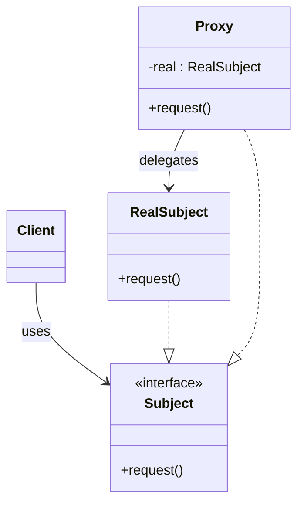
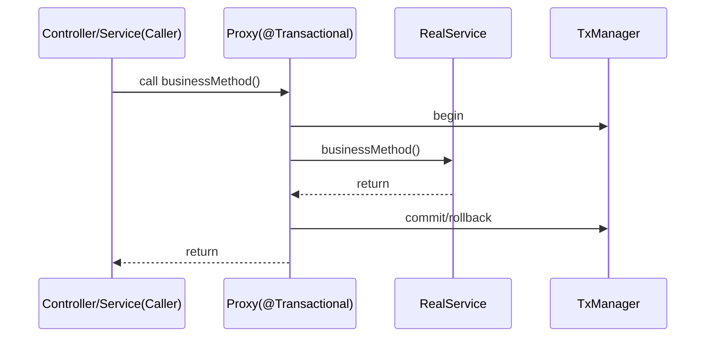
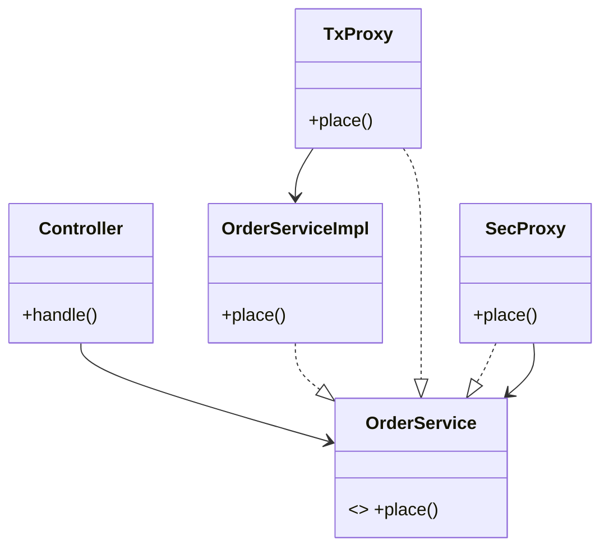

# 02-7. 프록시 (Proxy)

## 02-7-1. 개념과 쓰임새

### 개요
프록시(Proxy)는 다른 객체(RealSubject)에 대한 접근을 제어하거나, 부가 기능을 투명하게 제공하기 위해 그 객체를 대리하는 구조 패턴입니다. 클라이언트는 동일한 인터페이스(Subject)를 통해 프록시를 호출하고, 프록시는 필요 시 실제 객체에 위임하기 전에 선행/후행 로직(접근 제어, 캐시, 지연 로딩, 원격 호출, 로깅 등)을 수행합니다.

학습 목표
- GoF 프록시의 의도와 구조(Subject, RealSubject, Proxy)를 이해한다.
- 스프링 AOP/프록시(JDK 동적 프록시, CGLIB)의 작동 방식을 파악한다.
- 트랜잭션, 보안, 레이지 로딩 등 웹/스프링에서의 실전 활용을 익힌다.

### 핵심 구조 (Mermaid Class Diagram)



- 클라이언트는 Subject만 알고, Proxy/RealSubject 중 무엇이 호출되는지 신경 쓰지 않습니다.
- 프록시는 접근 제어, 캐시, 레이트 리미트, 트랜잭션 경계 결정 등 부가기능을 수행할 수 있습니다.

### 간단 예시 (Java 최소 코드)

```java
// Subject
public interface ReportService {
    String generate(String id);
}

// RealSubject
public final class RealReportService implements ReportService {
    @Override
    public String generate(String id) {
        // 무거운 연산을 흉내낸다
        return "report-" + id;
    }
}

// Proxy: 접근 제어 + 캐시 예시
import java.util.*;
public final class CachingSecuredReportProxy implements ReportService {
    private final ReportService target; // RealSubject
    private final Set<String> allowed = Set.of("ADMIN", "ANALYST");
    private final Map<String, String> cache = new HashMap<>();

    public CachingSecuredReportProxy(ReportService target) {
        this.target = target;
    }

    @Override
    public String generate(String id) {
        String role = CurrentUser.role(); // 가정: 현재 사용자 역할 조회(데모)
        if (!allowed.contains(role)) {
            throw new SecurityException("forbidden");
        }
        String cached = cache.get(id);
        if (cached != null) return cached; // 캐시된 결과 반환
        String result = target.generate(id);
        cache.put(id, result);
        return result;
    }
}
```

- 같은 인터페이스를 구현해 클라이언트 교체 비용 없이 접근 제어와 캐시를 투명하게 제공합니다.


## 02-7-2. 스프링에서의 적용 사례

### 개요
스프링은 DI 컨테이너와 AOP를 통해 런타임에 프록시 객체를 자동으로 만들어 빈에 주입합니다. 대표적으로 @Transactional, @Cacheable, @Secured/@PreAuthorize 등이 프록시 기반으로 작동합니다.

### 예시 1: @Transactional 프록시 (Sequence)



- 스프링은 비즈니스 빈 주위에 프록시를 두고, 메서드 호출 전후로 트랜잭션을 시작/종료합니다.
- 이때 인터페이스가 있으면 기본적으로 JDK 동적 프록시, 없으면 CGLIB 기반 클래스 프록시가 사용됩니다(설정에 따라 다름).

### 예시 2: JDK 동적 프록시 최소 예시

```java
import java.lang.reflect.*;

ReportService target = new RealReportService();
ReportService proxy = (ReportService) Proxy.newProxyInstance(
        ReportService.class.getClassLoader(),
        new Class<?>[]{ReportService.class},
        new InvocationHandler() {
            @Override public Object invoke(Object proxyObj, Method method, Object[] args) throws Throwable {
                System.out.println("before: " + method.getName());
                Object result = method.invoke(target, args);
                System.out.println("after: " + method.getName());
                return result;
            }
        });
```

- 스프링 AOP의 원리 이해에 도움이 되는 JDK 동적 프록시 기본 형태입니다.

### 예시 3: Hibernate/JPA의 지연 로딩 프록시
- JPA 구현체는 엔티티 연관을 프록시로 반환해 실제 접근 시점까지 DB 로딩을 지연합니다.
- 프록시는 식별자만 보유하다가, 게터 호출 등 실제 데이터가 필요할 때 로딩합니다(영속성 컨텍스트/트랜잭션 범위 주의).


## 02-7-3. 웹 애플리케이션에서의 실전 적용

### 개요
프록시는 접근 경계에서 정책을 일관되게 적용하기에 적합합니다. 인증/인가, 레이트 리미팅, 캐시, 모니터링, 서킷 브레이커 등의 횡단 관심사를 비즈니스 코드 밖에서 조율할 수 있습니다.

### 실전 구조 (Mermaid Class Diagram)



- 여러 프록시를 체인처럼 둘러쌀 수 있습니다(보안 → 트랜잭션 → 실제 구현 등). 순서가 의미를 가지므로 주의합니다.


## 02-7-4. 장단점과 사용 시점

### 장점
- 접근 제어/캐시/로깅/트랜잭션 등 횡단 관심사를 투명하게 적용.
- 원격 프록시, 가상 프록시(지연 로딩), 보호 프록시 등 다양한 변형 지원.
- 클라이언트는 동일 인터페이스만 의존하여 교체가 용이.

### 단점
- 프록시 체인 복잡도 증가로 디버깅이 어려울 수 있음.
- 프록시 경유로 인한 호출 오버헤드가 추가됨.
- AOP 프록시 한계: 프록시 내부 self-invocation, final 메서드, private 호출 등 제약.

### 사용 시점
- 트랜잭션/보안/캐시/모니터링 등 공통 정책을 호출 경계에서 일관 적용하고자 할 때.
- 객체 생성 비용이 크거나 원격 자원의 지연 로딩이 필요할 때.
- 외부 시스템 호출을 보호(서킷 브레이커/리트라이/레이트 리미트)하고자 할 때.


## 02-7-5. 5가지 키워드로 정리하는 핵심 포인트
1. 동일 인터페이스: Proxy와 RealSubject는 같은 Subject 계약을 구현한다.
2. 접근 제어와 정책: 인증/인가, 트랜잭션, 캐시, 로깅 등 경계에서 처리.
3. 동적 생성: 스프링 AOP는 JDK/CGLIB 프록시로 빈을 동적으로 감싼다.
4. 지연 로딩: 가상 프록시로 실제 객체 사용 시점까지 초기화를 늦춘다.
5. 한계와 순서: 프록시 체인 순서, self-invocation, final 메서드 제약에 유의.


## 확인 문제
1. 프록시 패턴의 핵심 의도로 가장 적절한 것은?
    - [ ] 호환되지 않는 인터페이스를 변환해 재사용 가능하게 한다.
    - [ ] 객체에 새로운 책임을 동적으로 추가하되 동일한 인터페이스를 유지한다.
    - [ ] 다른 객체에 대한 접근을 제어하거나 부가 기능을 투명하게 제공하기 위해 대리한다.
    - [ ] 복잡한 서브시스템을 단순한 고수준 인터페이스로 감춘다.

2. 다음 중 스프링에서 "프록시" 기반으로 동작하는 것으로 가장 올바른 것은?
    - [ ] @Transactional을 통한 트랜잭션 경계 적용
    - [ ] HttpMessageConverter를 통한 JSON 직렬화/역직렬화
    - [ ] CompositePropertySource를 통한 속성 조회
    - [ ] ContentCachingRequestWrapper로 요청 바디 캐싱

3. [복수 응답] 프록시를 적용하기 좋은 상황을 모두 고르시오.
    - [ ] 레이트 리미트나 서킷 브레이커로 외부 호출을 보호해야 할 때
    - [ ] 인터페이스 불일치로 타입을 변환해야 할 때
    - [ ] 권한 검사/감사 로깅을 서비스 경계에서 일관되게 적용하고 싶을 때
    - [ ] 엔티티 연관을 지연 로딩해 성능을 최적화하고 싶을 때
    - [ ] 동일한 트리 구조를 동일 인터페이스로 다뤄야 할 때

> [정답 및 해설 보기](../answers_and_explanations.md#02-7-프록시-proxy)
