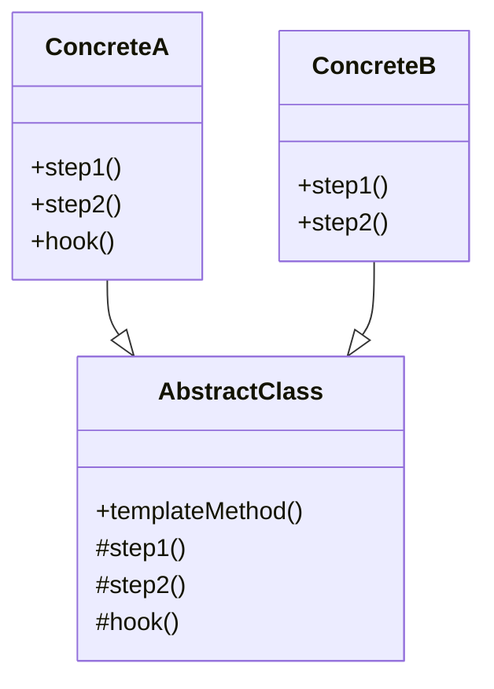
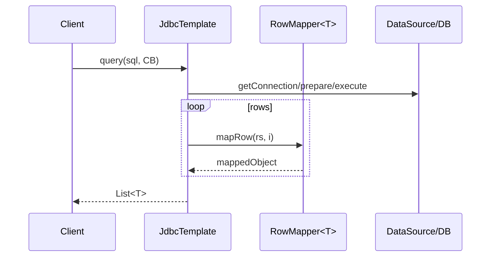
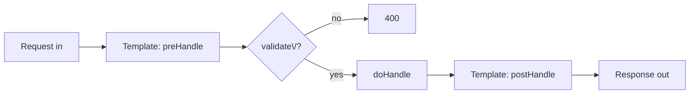

# 03-10. 템플릿 메서드 (Template Method)

## 03-10-1. 개념과 쓰임새

### 개요
템플릿 메서드(Template Method) 패턴은 상위 클래스가 "알고리즘의 골격"을 정의하고, 일부 단계(hook)를 하위 클래스가 재정의하여 구체 동작을 바꾸도록 하는 행위 패턴입니다. 상위 클래스의 템플릿은 전체 순서를 고정하고, 변하는 부분만 하위 클래스에서 확장합니다. 이를 통해 코드 중복을 줄이고 공통 흐름을 재사용하면서도 변동 지점을 유연하게 치환할 수 있습니다.

학습 목표
- 알고리즘 골격과 훅 메서드의 관계를 이해한다.
- 스프링의 템플릿/콜백(JdbcTemplate 등)과의 연관성을 파악한다.
- 웹 애플리케이션에서 공통 전처리/후처리/에러 처리 흐름을 템플릿화하는 방법을 익힌다.

### 핵심 구조 (Mermaid Class Diagram)



- AbstractClass가 templateMethod로 전체 절차를 정의하고, 일부 단계(step1/step2/hook)를 하위 클래스가 재정의합니다.
- hook은 선택적 재정의 지점으로, 기본 구현을 두고 필요 시 바꿀 수 있습니다.

### 간단 예시 (Java 최소 코드)

```java
public abstract class DataImporter { // 상위 템플릿
    // 템플릿: 변경 불가 골격 (관례상 final 권장)
    public final void run() {
        open();
        read();
        if (preValidate()) { // 훅: 기본 true, 하위에서 재정의 가능
            process();
        }
        close();
    }

    protected abstract void open();
    protected abstract void read();
    protected abstract void process();
    protected void close() { /* optional default */ }
    protected boolean preValidate() { return true; }
}

public final class CsvDataImporter extends DataImporter {
    @Override
    protected void open() {
        System.out.println("open csv");
    }

    @Override
    protected void read() {
        System.out.println("read csv rows");
    }

    @Override
    protected void process() {
        System.out.println("process csv");
    }

    @Override
    protected boolean preValidate() {
        return true;
    }
}

public final class JsonDataImporter extends DataImporter {
    @Override
    protected void open() {
        System.out.println("open json");
    }

    @Override
    protected void read() {
        System.out.println("read json array");
    }

    @Override
    protected void process() {
        System.out.println("process json");
    }

    @Override
    protected void close() {
        System.out.println("close json");
    }
}

// 사용 예시
DataImporter importer = new CsvDataImporter();
importer.run();
```

- run()은 final로 선언하여 알고리즘 골격을 고정했습니다. 하위 클래스는 단계별 메서드만 재정의합니다.
- hook(preValidate)로 조건부 처리나 선택적 확장을 허용합니다.


## 03-10-2. 스프링에서의 적용 사례

### 개요
GoF 템플릿 메서드는 "상속 기반의 훅 오버라이드" 방식을 말합니다. 스프링은 상속 대신 "템플릿/콜백" 조합을 널리 사용합니다. 즉, 고정된 골격을 가진 템플릿 클래스가 있고, 변하는 부분은 콜백(람다/인터페이스)로 주입해 실행합니다. 개념적으로 알고리즘 골격과 훅을 분리한다는 점에서 템플릿 메서드와 유사한 의도를 가집니다.

### 예시 1: JdbcTemplate의 템플릿/콜백 (Sequence)



- 커넥션 획득/자원 해제/예외 변환은 템플릿이 수행하고, 변하는 부분은 RowMapper 콜백이 담당합니다.
- 알고리즘 골격을 고정하고, 후크를 외부에서 주입하는 형태입니다.

### 예시 2: RestTemplate/WebClient 교환 흐름
- RestTemplate은 요청 생성, 오류 처리, 메시지 변환을 템플릿이 담당하고, 변하는 부분은 RequestCallback/ResponseExtractor 혹은 메시지 컨버터가 맡습니다.
- WebClient도 요청 파이프라인은 고정하고, 사용자가 빌더/연산자로 세부를 조립합니다(내부적으로 템플릿화된 흐름).

### 예시 3: 테스트 템플릿 (Spring Boot Test slices)
- @DataJpaTest, @WebMvcTest 등은 공통 부트스트랩(골격)을 제공하고, 테스트 본문에서 각자 행위를 정의합니다.


## 03-10-3. 웹 애플리케이션에서의 실전 적용

### 개요
컨트롤러/서비스 단에서 공통 전처리(검증/인증), 본 처리, 후처리(감사/메트릭) 흐름을 템플릿으로 고정하고, 세부 구현만 바꿔 재사용성을 높일 수 있습니다. 상속형 템플릿이 과하면, 조합형(템플릿/콜백)으로 대체합니다.

### 실전 구조 (Mermaid Flowchart)



- validate\/? 노드의 슬래시와 물음표는 ASCII로 이스케이프했습니다.
- preHandle/postHandle을 고정하고, doHandle을 하위 구현에서 재정의해 로직을 바꿉니다.

### 간단 예시 (Spring 스타일 의사코드)

```java
public abstract class AbstractApiHandler<TReq, TRes> {

    public final TRes handle(TReq req) {
        pre(req);
        validate(req);
        TRes res = doHandle(req);
        post(req, res);
        return res;
    }

    protected void pre(TReq req) { /* 공통 로깅/권한 컨텍스트 */ }

    protected void validate(TReq req) { /* 기본 검증(하위 재정의 가능) */ }

    protected abstract TRes doHandle(TReq req);

    protected void post(TReq req, TRes res) { /* 감사/메트릭 */ }

}

public final class CancelOrderHandler extends AbstractApiHandler<Long, String> {

    @Override
    protected void validate(Long id) { /* id 검사 */ }

    @Override
    protected String doHandle(Long id) { /* 서비스 호출 */
        return "OK";
    }

}
```

- handle은 템플릿 골격이며 final로 고정합니다. 하위 클래스는 핵심 단계만 구현합니다.
- 스프링 빈으로 등록해 여러 엔드포인트에서 재사용할 수 있습니다.


## 03-10-4. 장단점과 사용 시점

### 장점
- 재사용성: 알고리즘 골격을 한 곳에 두고 공통 흐름을 표준화.
- 확장 용이성: 변하는 단계만 하위 클래스나 콜백으로 교체.
- 일관성: 전처리/후처리/에러 처리 기준을 통일.

### 단점
- 상속 남용 위험: 계층이 깊어지면 유연성이 떨어지고 결합도가 증가.
- 훅 설계 난이도: 어느 단계까지 고정/확장할지 경계가 어렵다.
- 테스트 어려움: 템플릿 내부에 로직이 과도하면 단위 테스트가 어려울 수 있음.

### 사용 시점
- 동일한 절차의 재사용이 많고, 일부 단계만 커스터마이징될 때.
- 자원 관리/예외 변환/트랜잭션 등 공통 보일러플레이트를 고정하고 싶을 때.
- 상속이 과하면 템플릿/콜백(전략/함수형)으로 전환을 고려.


## 03-10-5. 5가지 키워드로 정리하는 핵심 포인트
1. 알고리즘 골격: 상위 클래스의 final 템플릿이 전체 순서를 고정한다.
2. 훅 메서드: 변하는 부분은 protected 훅으로 열어 재정의한다.
3. 템플릿/콜백: 스프링은 상속 대신 콜백 주입으로 같은 의도를 달성하기도 한다.
4. 일관된 자원 관리: 커넥션/예외 변환/트랜잭션을 템플릿이 책임진다.
5. 남용 주의: 깊은 상속 대신 조합(전략/함수형)도 함께 고려한다.


## 확인 문제
1. 템플릿 메서드 패턴의 핵심 의도에 가장 가까운 것은?
    - [ ] 요청을 객체로 캡슐화해 호출자와 수신자의 결합을 느슨하게 한다.
    - [ ] 알고리즘의 골격을 상위 클래스에 정의하고, 일부 단계를 하위 클래스가 재정의한다.
    - [ ] 호환되지 않는 인터페이스를 변환하여 재사용 가능하게 한다.
    - [ ] 객체의 내부 상태를 스냅샷으로 저장하고 복구한다.

2. 다음 중 스프링에서 "템플릿/콜백"이 제공하는 장점으로 가장 적절한 것은?
    - [ ] 콜백을 통해 자원 관리/예외 변환 같은 공통 흐름을 템플릿이 맡고, 가변 로직만 주입해 실행한다.
    - [ ] 실행 시점과 요청을 분리하여 큐잉/재시도를 간단하게 한다.
    - [ ] 상태에 따른 행동을 상태 객체로 캡슐화해 교체 가능하게 한다.
    - [ ] 동일한 트리 구조를 동일 인터페이스로 다룬다.

3. [복수 응답] 템플릿 메서드(또는 템플릿/콜백)를 적용하기 좋은 상황을 모두 고르시오.
    - [ ] DB 접근에서 연결 획득/해제/예외 변환은 공통 처리하고, 행 단위 매핑만 다를 때
    - [ ] 동일한 절차(전처리→핵심→후처리)를 표준화하고 일부 단계만 바뀔 때
    - [ ] 다양한 알고리즘을 런타임에 교체해야 할 때
    - [ ] 도메인 규칙을 DSL로 외부화해 해석해야 할 때
    - [ ] 외부 API 호출의 요청/응답 포맷은 다르지만, 재시도/로깅/오류 처리 흐름은 동일할 때

> [정답 및 해설 보기](../answers_and_explanations.md#03-10-템플릿-메서드-template-method)
