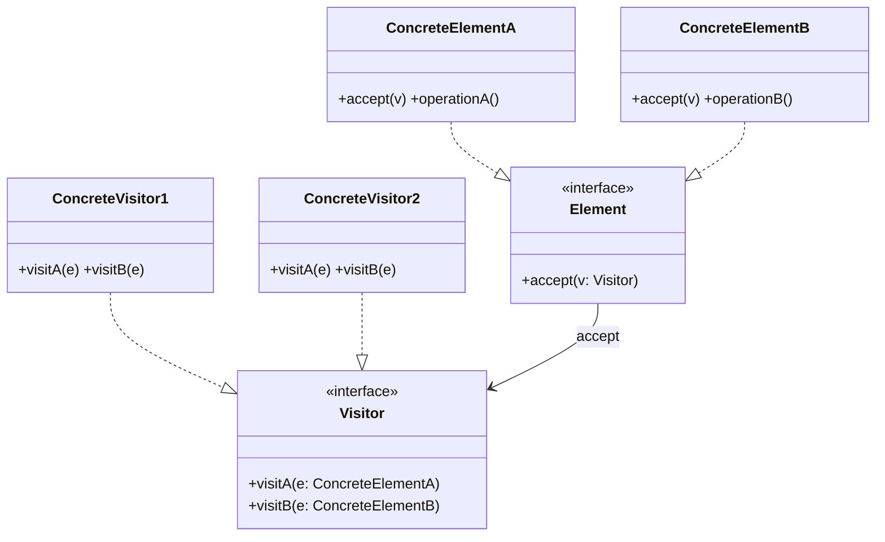
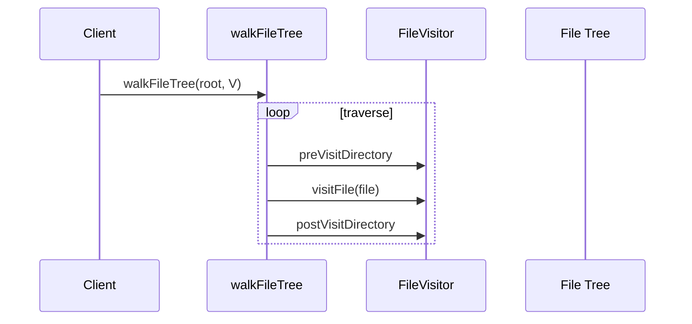
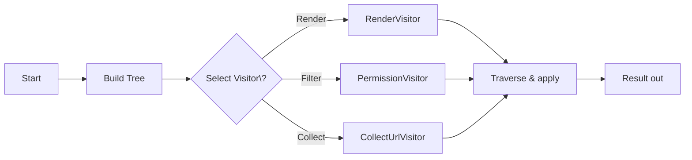

# 03-11. 방문자 (Visitor)

## 03-11-1. 개념과 쓰임새

### 개요
방문자(Visitor) 패턴은 "구조는 그대로 두고, 그 위에서 동작(연산)을 외부로 분리"하여 추가하는 행위 패턴입니다. 방문자는 요소(Element)들의 내부 구조를 변경하지 않고도 새로운 연산을 손쉽게 추가할 수 있게 해줍니다. 각 요소는 accept(Visitor) 메서드를 통해 방문자를 받아들이고, 방문자는 요소 타입별 메서드(visitX)를 통해 다형적으로 동작합니다.

학습 목표
- Element, ConcreteElement, Visitor, ConcreteVisitor의 구조와 이중 디스패치 개념을 이해한다.
- 스프링/자바에서의 적용 사례(NIO FileVisitor, Spring BeanDefinitionVisitor, AST Visitor 등)를 파악한다.
- 웹/서버에서 리소스 트리(메뉴, 카테고리, 컴포넌트 트리 등)에 새로운 연산을 추가하는 방법을 설계한다.

### 핵심 구조 (Mermaid Class Diagram)



- 요소는 accept로 방문자를 받아들이고, 방문자는 요소의 구체 타입에 따라 적절한 visit 메서드가 호출됩니다(이중 디스패치 효과).
- 구조(요소 계층)는 고정하고 연산(방문자)을 추가/교체하기 쉬운 장점이 있습니다.

### 간단 예시 (Java 최소 코드)

```java
import java.util.ArrayList;
import java.util.List;

// 요소(Element) 계약
public interface Element {
    void accept(Visitor v);
}

public final class ElementA implements Element {
    public String operationA() {
        return "A";
    }

    @Override
    public void accept(Visitor v) {
        v.visitA(this);
    }
}

public final class ElementB implements Element {
    public String operationB() {
        return "B";
    }

    @Override
    public void accept(Visitor v) {
        v.visitB(this);
    }
}

// 방문자(Visitor) 계약
public interface Visitor {
    void visitA(ElementA a);
    void visitB(ElementB b);
}

// 구체 방문자 1: 렌더링
public final class RenderVisitor implements Visitor {
    @Override
    public void visitA(ElementA a) {
        System.out.println("<A>" + a.operationA() + "</A>");
    }

    @Override
    public void visitB(ElementB b) {
        System.out.println("<B>" + b.operationB() + "</B>");
    }
}

// 구체 방문자 2: 수집/집계
public final class CollectVisitor implements Visitor {
    private final List<String> list = new ArrayList<>();

    @Override
    public void visitA(ElementA a) {
        list.add(a.operationA());
    }

    @Override
    public void visitB(ElementB b) {
        list.add(b.operationB());
    }

    public List<String> result() {
        return List.copyOf(list);
    }
}

// 사용 예시
List<Element> elements = List.of(new ElementA(), new ElementB());
Visitor render = new RenderVisitor();
for (Element e : elements) {
    e.accept(render);
}
CollectVisitor collector = new CollectVisitor();
for (Element e : elements) {
    e.accept(collector);
}
List<String> aggregated = collector.result(); // ["A", "B"]
```

- 동일한 요소 구조에 대해 서로 다른 방문자(Render, Collect 등)를 적용함으로써 연산을 외부로 분리합니다.
- 요소 타입을 추가하는 것은 상대적으로 비용이 큽니다(모든 Visitor에 visit 메서드 추가 필요).


## 03-11-2. 스프링에서의 적용 사례

### 개요
방문자는 트리/그래프 구조를 순회하며 연산을 적용하는 데 적합합니다. 스프링/자바 생태계에서도 구조 고정·연산 확장의 필요가 있는 곳에 방문자 개념이 활용됩니다.

### 예시 1: java.nio.file.FileVisitor (디렉터리 트리 방문)
- Files.walkFileTree(Path, FileVisitor)로 디렉터리 트리를 방문하며, 각 노드에 대해 preVisitDirectory, visitFile 등 콜백을 수행합니다.
- 구조(파일 트리)는 그대로 두고, 연산(카운트, 복사, 인덱싱 등)을 방문자로 분리합니다.



### 예시 2: Spring BeanDefinitionVisitor
- Spring의 BeanDefinitionVisitor는 BeanDefinition 내부의 값/속성을 방문하며 문자열 치환, 플레이스홀더 처리 등을 수행합니다.
- 빈 정의 구조를 변경하지 않고, 방문 로직을 통해 다양한 변환/검사를 적용합니다.

### 예시 3: AST Visitor(SpEL/파서 도구)
- 표현식/파서(예: SpEL 내부 AST, ANTLR 기반 DSL)에서 노드 방문자로 해석/검증/최적화 연산을 분리합니다.


## 03-11-3. 웹 애플리케이션에서의 실전 적용

### 개요
메뉴/카테고리/컴포넌트 트리 같은 계층 구조 위에 다양한 연산(렌더링, 권한 필터링, 통계 집계, URL 수집)을 방문자로 분리하면, 구조를 건드리지 않고 기능을 확장할 수 있습니다.

### 실전 구조 (Mermaid Flowchart)



- Select Visitor\?의 물음표는 ASCII로 이스케이프했습니다.
- 방문자는 트리 순회 알고리즘과 분리되어, 목적별 연산을 독립적으로 교체/조합할 수 있습니다.


## 03-11-4. 장단점과 사용 시점

### 장점
- 연산 추가 용이: 요소 구조를 변경하지 않고 새로운 연산(방문자)을 쉽게 추가.
- 관심사 분리: 순회/연산 분리로 가독성과 테스트 용이성 향상.
- 다형적 처리: 요소 타입별 다른 처리를 이중 디스패치로 명확하게 구현.

### 단점
- 요소 타입 추가 비용: 새 Element 타입을 도입하면 모든 Visitor가 수정 대상.
- 캡슐화 침해 위험: 방문자가 요소의 내부에 과도하게 의존하면 결합도가 높아질 수 있음.
- 복잡성 증가: 작은 구조엔 과한 설계가 될 수 있음.

### 사용 시점
- 요소 구조는 비교적 안정적이고, 그 위의 연산을 자주 추가/변경해야 할 때.
- 트리/그래프 구조를 다양한 목적(렌더링, 검증, 수집, 변환)으로 반복 방문해야 할 때.
- AST/파일 시스템/메뉴 트리 등 계층 구조에 공통 순회 로직과 별개로 연산을 모듈화하고 싶을 때.


## 03-11-5. 5가지 키워드로 정리하는 핵심 포인트
1. 구조-연산 분리: Element는 구조, Visitor는 연산을 담당.
2. 이중 디스패치: accept + visitX로 타입별 동작 바인딩.
3. 확장 용이성: 연산(Visitor) 추가는 쉽고, 요소 타입 추가는 상대적으로 비쌈.
4. 트리 순회: 파일 시스템/AST/메뉴 트리 등 계층 구조에 적합.
5. 스프링 사례: BeanDefinitionVisitor, 파서/표현식의 AST Visitor, NIO FileVisitor.


## 확인 문제
1. 방문자 패턴의 핵심 의도에 가장 가까운 것은?
    - [ ] 객체의 내부 상태를 캡슐화한 스냅샷으로 저장하고 복구한다.
    - [ ] 구조를 바꾸지 않고 새로운 연산을 요소 계층 밖(방문자)으로 분리해 추가한다.
    - [ ] 호환되지 않는 인터페이스를 변환하여 재사용 가능하게 한다.
    - [ ] 동일한 인터페이스를 유지한 채 객체에 동적으로 책임을 추가한다.

2. 다음 중 자바/스프링에서 "방문자" 개념과 가장 관련이 깊은 것은?
    - [ ] Spring AOP의 @Transactional 프록시
    - [ ] java.nio.file.FileVisitor를 이용한 디렉터리 순회
    - [ ] HttpMessageConverter를 통한 JSON 직렬화/역직렬화
    - [ ] RestTemplate의 exchange 호출

3. [복수 응답] 방문자 패턴을 적용하기 좋은 상황을 모두 고르시오.
    - [ ] 메뉴/카테고리 트리를 순회하며 권한별로 필터링하거나 렌더링 규칙을 적용해야 할 때
    - [ ] 동일한 트리 구조를 동일 인터페이스로 다뤄야 할 때(구조 통일 자체)
    - [ ] AST/표현식을 해석/검증/최적화하는 여러 연산을 유연하게 추가해야 할 때
    - [ ] 디렉터리 트리를 방문하며 파일 수집/복사/인덱싱 등 작업을 바꾸어 가며 수행해야 할 때
    - [ ] 단일 클래스 간 1:1 호출만 있는 단순한 흐름일 때

> [정답 및 해설 보기](../answers_and_explanations.md#03-11-방문자-visitor)
