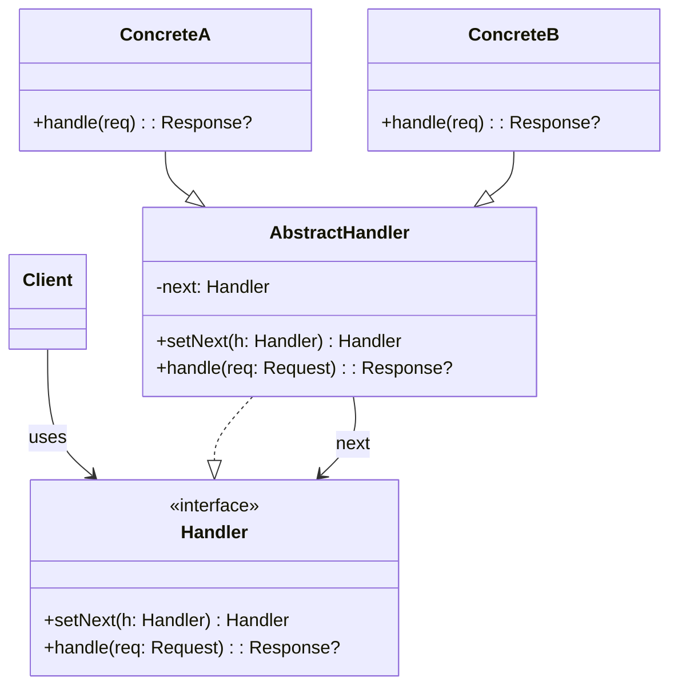
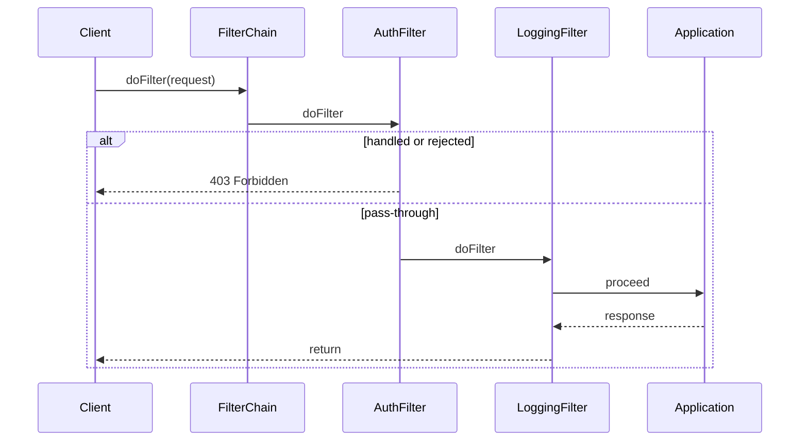
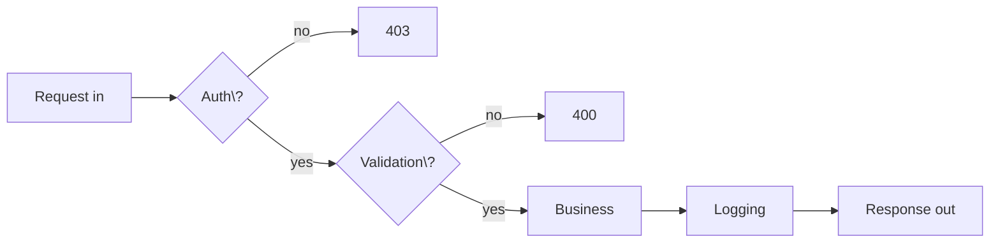

# 03-1. 책임 연쇄 (Chain of Responsibility)

## 03-1-1. 개념과 쓰임새

### 개요
책임 연쇄(Chain of Responsibility, CoR)는 요청을 처리할 수 있는 여러 처리자(handler)를 체인으로 연결하고, 요청이 처리될 때까지 순서대로 전달하는 행위 패턴입니다. 각 처리자는 자신이 처리할 수 있으면 처리하고, 처리하지 못하면 다음 처리자에게 넘깁니다. 이로써 송신자(클라이언트)와 수신자(구체 처리자) 간 결합을 느슨하게 하고, 처리 로직의 조합/확장을 유연하게 할 수 있습니다.

학습 목표
- CoR의 의도와 구조(Handler 인터페이스, ConcreteHandler, next 연결)를 이해한다.
- 스프링/웹에서의 필터 체인, 인터셉터 체인, 예외 해결 체인 등 실제 사례를 파악한다.
- 검증/인증/인가/로깅 등 횡단 관심사의 파이프라인화를 설계할 수 있다.

### 핵심 구조 (Mermaid Class Diagram)



- 각 처리자는 공통 계약(Handler)을 따르고, "처리 또는 위임" 규칙을 구현합니다.
- 체인의 순서 구성에 따라 시스템의 동작이 달라지므로 설계 시 명시적 관리가 중요합니다.

### 간단 예시 (Java 최소 코드)

```java
// 요청/응답 도메인(데모용)
public final class Request {
    public final String userRole;
    public final String payload;
    public Request(String userRole, String payload) {
        this.userRole = userRole;
        this.payload = payload;
    }
}

public final class Response {
    public final int status;
    public final String body;
    public Response(int status, String body) {
        this.status = status;
        this.body = body;
    }
}

// Handler 계약
public interface Handler {
    Handler setNext(Handler next);
    Response handle(Request req);
}

// 공통 베이스
public abstract class AbstractHandler implements Handler {
    private Handler next;
    @Override public Handler setNext(Handler next) {
        this.next = next; return next;
    }
    protected Response next(Request req) {
        return (next != null) ? next.handle(req) : null; // null이면 미처리 의미
    }
}

// 구체 처리자: 권한 검사
public final class AuthHandler extends AbstractHandler {
    @Override public Response handle(Request req) {
        if ("ADMIN".equals(req.userRole)) {
            return next(req); // 통과, 다음으로 위임
        }
        return new Response(403, "forbidden");
    }
}

// 구체 처리자: 입력 검증
public final class ValidationHandler extends AbstractHandler {
    @Override public Response handle(Request req) {
        if (req.payload == null || req.payload.isBlank()) {
            return new Response(400, "bad request");
        }
        return next(req); // 통과
    }
}

// 구체 처리자: 실제 처리
public final class BusinessHandler extends AbstractHandler {
    @Override public Response handle(Request req) {
        // 실제 비즈니스 로직 처리
        return new Response(200, "ok:" + req.payload);
    }
}

// 체인 구성 예시
Handler chain = new AuthHandler();
chain.setNext(new ValidationHandler())
     .setNext(new BusinessHandler());

Response res = chain.handle(new Request("ADMIN", "hello"));
// => 200 OK
```

- setNext의 반환값을 Handler로 두어 플루언트하게 체인을 구성할 수 있습니다.
- 처리 결과를 반환하지 않고 단순히 void로 흐르게 할 수도 있으나, 웹/서비스에서는 응답/결과를 명시하는 편이 유용합니다.


## 03-1-2. 스프링에서의 적용 사례

### 개요
스프링과 웹 스택에는 이미 다양한 “체인” 메커니즘이 존재합니다. 핵심은 요청이 연속된 처리 단계(필터/인터셉터/리졸버)를 통과하거나 중간에서 단락(short-circuit)될 수 있다는 점입니다.

### 예시 1: Servlet Filter Chain / Spring Security FilterChain (Sequence)



- Spring Security는 여러 보안 필터를 FilterChain으로 묶어 순서대로 적용합니다.
- 특정 필터가 인증/인가 실패를 판단하면 체인을 중단하고 즉시 응답을 반환합니다.

### 예시 2: HandlerInterceptor 체인
- Spring MVC의 HandlerInterceptor는 preHandle → (핸들러 실행) → postHandle → afterCompletion 순으로 호출됩니다.
- preHandle에서 false를 반환하면 이후 체인이 중단되고 컨트롤러가 호출되지 않습니다.

### 예시 3: HandlerExceptionResolver 체인
- 예외가 발생하면 등록된 HandlerExceptionResolver들이 순서대로 예외를 처리하려 시도합니다.
- 어떤 리졸버가 ModelAndView를 반환하면 체인이 종료됩니다.


## 03-1-3. 웹 애플리케이션에서의 실전 적용

### 개요
CoR는 검증/보안/정책/로깅을 단계별로 분리하여 유지보수성과 재사용성을 높여줍니다. 체인의 각 단계는 SRP(단일 책임 원칙)를 따르며, 필요 시 순서 조정이나 단계 추가/삭제가 용이합니다.

### 실전 구조 (Mermaid Flowchart)



- 인증 실패 시 403, 유효성 실패 시 400으로 단락하고, 통과하면 실제 비즈니스로 이동합니다.
- 로깅/모니터링 단계는 비즈니스 전후 어디에도 배치할 수 있습니다.


## 03-1-4. 장단점과 사용 시점

### 장점
- 결합도 감소: 클라이언트는 누가 처리하는지 모른 채 요청만 보냅니다.
- 유연한 확장: 처리 단계를 쉽게 추가/교체/순서 변경 가능.
- 단일 책임 강화: 각 처리자는 하나의 관심사에 집중.

### 단점
- 디버깅 복잡성: 체인이 길어질수록 흐름 추적이 어려움.
- 순서 의존성: 단계 순서가 의미를 가지며, 잘못 구성 시 오동작.
- 불명확한 처리자: 어떤 단계가 최종 처리자인지 모호해질 수 있음.

### 사용 시점
- 입력 검증 → 인증/인가 → 비즈니스 → 로깅 같은 파이프라인이 필요할 때.
- 다단계 정책 적용(요금 할인 규칙, 쿠폰 적용 순서, 스팸 필터 순서 등)이 있을 때.
- 예외 처리/해결 전략을 계단식으로 시도하고 싶을 때.


## 03-1-5. 5가지 키워드로 정리하는 핵심 포인트
1. 처리 또는 위임: 각 단계는 처리하거나 다음으로 넘긴다.
2. 순서의 의미: 구성 순서가 시스템 동작을 결정한다.
3. 느슨한 결합: 클라이언트는 구체 처리자를 모른다.
4. 파이프라인화: 검증/보안/정책/로깅을 단계로 분리.
5. 단락(short-circuit): 중간에서 즉시 종료해 효율을 높일 수 있다.


## 확인 문제
1. 책임 연쇄 패턴의 핵심 의도에 가장 가까운 설명은?
    - [ ] 동일한 인터페이스를 유지한 채 객체에 동적으로 책임을 추가한다.
    - [ ] 요청을 일렬의 처리자에게 전달하여 처리 가능자가 맡고, 불가하면 다음으로 위임한다.
    - [ ] 복잡한 서브시스템을 단순한 고수준 인터페이스로 감춘다.
    - [ ] 객체 생성 과정을 단계별로 분리하고 다양한 표현을 가능하게 한다.

2. 다음 중 스프링에서 "체인"으로 동작하는 구성요소로 가장 적절한 것은?
    - [ ] JdbcTemplate의 RowMapper 목록
    - [ ] Spring MVC HandlerInterceptor 목록
    - [ ] @Transactional AOP 포인트컷 목록
    - [ ] ObjectMapper의 Module 등록 목록

3. [복수 응답] 책임 연쇄를 적용하기 좋은 상황을 모두 고르시오.
    - [ ] 인증/인가, 입력 검증, 로깅을 단계별로 통과시키고 싶을 때
    - [ ] 호환되지 않는 인터페이스를 어댑터로 변환해야 할 때
    - [ ] 여러 예외 처리 전략을 순서대로 시도해 첫 성공으로 종료하고 싶을 때
    - [ ] 동일한 요청을 모든 처리자가 반드시 처리해야 할 때
    - [ ] 할인 규칙/쿠폰 적용 순서를 유연하게 조합하고 싶을 때

> [정답 및 해설 보기](../answers_and_explanations.md#03-1-책임-연쇄-chain-of-responsibility)
