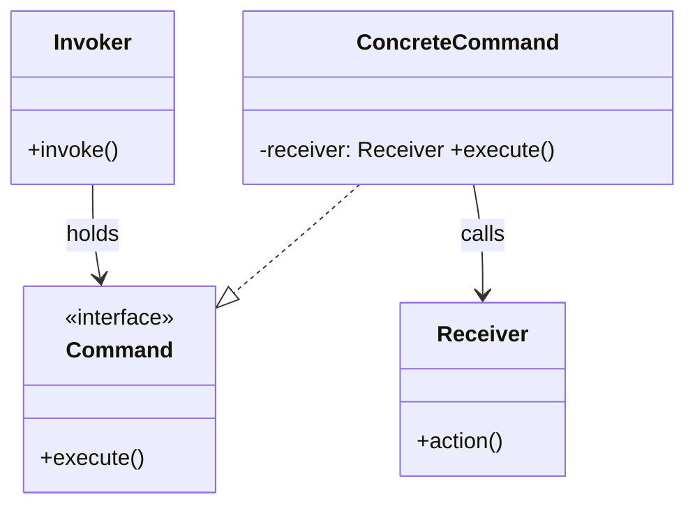
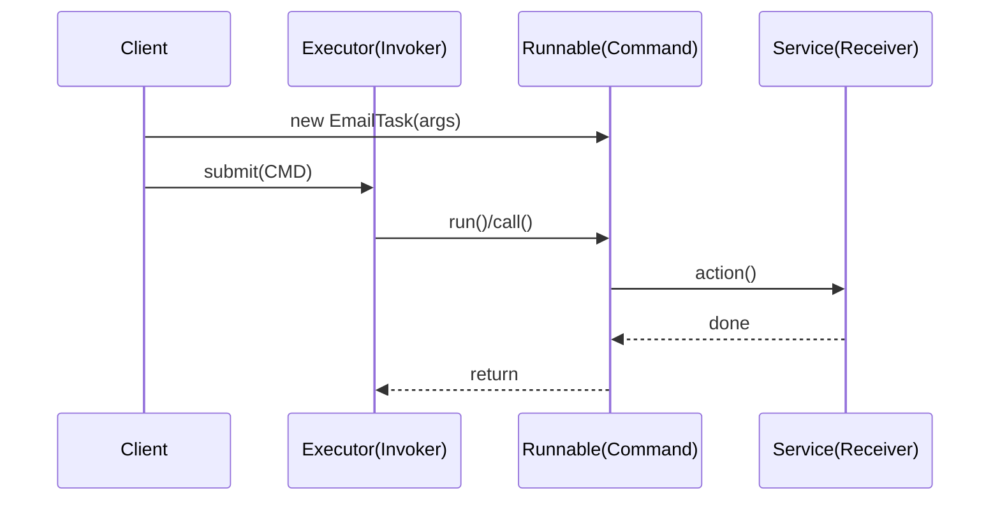
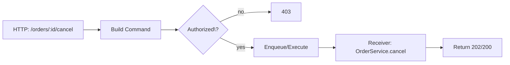

# 03-2. 커맨드 (Command)

## 03-2-1. 개념과 쓰임새

### 개요
커맨드(Command) 패턴은 "요청을 캡슐화"하여 호출자(Invoker)와 실제 작업자(Receiver)를 분리하는 행위 패턴입니다. 요청 자체를 객체로 표현함으로써 큐잉, 로깅, 되돌리기(undo), 매크로(복합 명령) 등의 부가 기능을 유연하게 지원할 수 있습니다. 클라이언트는 명령의 세부 구현을 몰라도 동일한 인터페이스로 실행할 수 있습니다.

학습 목표
- Command, ConcreteCommand, Invoker, Receiver의 구조와 역할을 이해한다.
- 스프링/웹에서 커맨드식 설계가 쓰이는 지점(요청 캡슐화, 큐 처리, Task/Callable/Runnable, 배치 작업)을 파악한다.
- 버튼/엔드포인트/메시지에 명령을 바인딩하는 실전 활용법과 undo/재시도/로깅 전략을 익힌다.

### 핵심 구조 (Mermaid Class Diagram)



- Invoker는 Command 인터페이스에만 의존하며, execute 호출 시 실제 동작은 Receiver가 수행합니다.
- 요청을 객체로 다루기 때문에 큐에 저장, 재시도, 로그 기록, 매크로 조합 등이 쉬워집니다.

### 간단 예시 (Java 최소 코드)

```java
// Command 계약
public interface Command {
    void execute();
}

// Receiver: 실제 동작 수행자
public final class MailSender {
    public void send(String to, String body) {
        // 실제 메일 발송 로직이 있다고 가정
        System.out.println("send to=" + to + ", body=" + body);
    }
}

// ConcreteCommand: 요청 캡슐화
public final class SendMailCommand implements Command {
    private final MailSender receiver; // Receiver
    private final String to;
    private final String body;

    public SendMailCommand(MailSender receiver, String to, String body) {
        this.receiver = receiver;
        this.to = to;
        this.body = body;
    }

    @Override
    public void execute() {
        receiver.send(to, body);
    }
}

// Invoker: 명령을 받아 실행(큐/버튼/스케줄러 등)
public final class CommandInvoker {
    public void invoke(Command cmd) {
        cmd.execute();
    }
}

// 사용 예시
MailSender receiver = new MailSender();
Command cmd = new SendMailCommand(receiver, "user@example.com", "Hello");
new CommandInvoker().invoke(cmd);
```

- 요청의 매개변수(to, body)와 실행 로직을 Command 객체로 캡슐화했습니다. Invoker는 execute만 호출합니다.
- undo가 필요하면 Command에 undo()를 추가하고, 상태 스냅샷은 메멘토와 함께 사용할 수 있습니다.


## 03-2-2. 스프링에서의 적용 사례

### 개요
스프링과 웹 생태계에서는 Runnable/Callable/Task/Message 핸들러처럼 "실행 가능한 요청"을 객체로 다루는 곳에서 커맨드의 철학이 녹아 있습니다. 배치/비동기/메시징/스케줄링에서 특히 유용합니다.

### 예시 1: TaskExecutor에 Runnable/Callable 제출 (Sequence)



- Runnable/Callable은 execute에 해당하는 run/call로 계약이 좁혀진 커맨드로 볼 수 있습니다. Executor가 Invoker 역할을 합니다.

### 예시 2: Spring Batch Tasklet/Step
- Spring Batch의 Tasklet은 "한 번의 작업 수행"을 캡슐화한 커맨드 성격입니다.
- Step은 하나 이상의 Tasklet이나 청크 기반 작업을 실행하고 재시도/재시작 메타데이터를 관리합니다.

### 예시 3: 메시징 핸들러(Spring Integration/Spring Cloud Stream)
- 메시지를 Command 객체의 페이로드로 보거나, 핸들러가 메시지당 execute를 수행하는 구조로 해석할 수 있습니다.
- 실패 시 재시도/데드 레터 큐 등 커맨드 재처리 전략을 유연하게 적용할 수 있습니다.


## 03-2-3. 웹 애플리케이션에서의 실전 적용

### 개요
HTTP 엔드포인트/버튼/메뉴를 "명령"으로 바라보면, UI 혹은 API 계층에서 구체 동작을 캡슐화하고 통일된 실행/감사/권한 정책을 적용하기가 쉬워집니다.

### 실전 구조 (Mermaid Flowchart)



- 컨트롤러에서 입력을 검증하고 Command로 캡슐화한 뒤 즉시 실행하거나 큐에 저장해 비동기 처리할 수 있습니다.
- 감사 로깅/트랜잭션/리트라이 정책을 Invoker나 데코레이터로 일관 적용할 수 있습니다.

### 간단 예시 (Spring MVC 스타일)

```java
// Command
public interface OrderCommand { void execute(); }

// Receiver
public final class OrderService {
    public void cancel(Long orderId, String reason) { /* ... */ }
}

// ConcreteCommand
public final class CancelOrderCommand implements OrderCommand {
    private final OrderService service; private final Long id; private final String reason;
    public CancelOrderCommand(OrderService s, Long id, String reason) {
        this.service = s; this.id = id; this.reason = reason;
    }
    @Override public void execute() { service.cancel(id, reason); }
}

// Invoker 예시: 공통 실행기(트랜잭션, 로깅 포함)
public final class CommandExecutor {
    public void execute(OrderCommand cmd) {
        // 공통 전처리(권한, 로깅, 트랜잭션 시작 등)
        cmd.execute();
        // 공통 후처리(커밋, 감사 로그 등)
    }
}
```


## 03-2-4. 장단점과 사용 시점

### 장점
- 느슨한 결합: 호출자와 수신자를 분리하고, 실행 시점을 유연하게 조정(즉시/지연/비동기)할 수 있다.
- 재사용/구성: 명령을 큐에 저장, 매크로로 묶기, 로깅/감사/재시도 정책과 조합하기 쉽다.
- 확장성: 새로운 명령을 추가해도 Invoker는 동일 인터페이스만 의존한다.

### 단점
- 클래스 수 증가: 명령 유형마다 별도 클래스로 늘어날 수 있다.
- 상태 관리 부담: undo/재시도 위해 스냅샷/이력 관리가 필요하면 복잡도가 상승한다.
- 과용 위험: 간단한 one-shot 호출까지 불필요한 래핑을 도입할 수 있다.

### 사용 시점
- 사용자의 행위(버튼/메뉴/엔드포인트)를 독립된 명령으로 캡슐화하고 싶을 때.
- 비동기 큐/스케줄링/배치로 요청을 보관, 재시도, 재생산해야 할 때.
- 되돌리기(undo)나 매크로(복합 명령) 같은 고급 기능이 요구될 때.


## 03-2-5. 5가지 키워드로 정리하는 핵심 포인트
1. 요청의 캡슐화: execute 계약으로 요청을 객체화한다.
2. Invoker/Receiver 분리: 호출자와 실제 작업자의 결합을 끊는다.
3. 저장·전달·재시도: 명령을 큐/로그로 보관하고 재처리하기 쉽다.
4. 확장·조합: 새 명령 추가, 매크로/데코레이터와의 조합이 유연하다.
5. undo/메멘토: 되돌리기 요구엔 상태 스냅샷과 함께 설계한다.


## 확인 문제
1. 커맨드 패턴의 핵심 의도로 가장 적절한 것은?
    - [ ] 호환되지 않는 인터페이스를 변환해 재사용 가능하게 한다.
    - [ ] 요청을 객체로 캡슐화해 호출자와 수신자의 결합을 느슨하게 한다.
    - [ ] 동일한 인터페이스를 유지한 채 객체에 동적으로 책임을 추가한다.
    - [ ] 복잡한 서브시스템을 단순한 고수준 인터페이스로 감춘다.

2. 다음 중 스프링/자바에서 커맨드 패턴의 성격과 가장 거리가 먼 것은?
    - [ ] Executor에 제출되는 Runnable/Callable 작업
    - [ ] Spring Batch의 Tasklet 작업 단위
    - [ ] Spring MVC의 HandlerInterceptor 체인 자체
    - [ ] 메시지를 받아 처리하는 메시지 핸들러

3. [복수 응답] 커맨드 패턴을 적용하기 좋은 상황을 모두 고르시오.
    - [ ] 버튼/엔드포인트 동작을 객체로 캡슐화해 로깅·권한·트랜잭션을 일괄 적용할 때
    - [ ] 요청을 큐에 저장해 재시도/스케줄 실행이 필요할 때
    - [ ] 인터페이스 불일치를 해결해 타입을 변환해야 할 때
    - [ ] 되돌리기(undo)나 매크로 명령이 요구될 때
    - [ ] 동일한 트리 구조를 동일 인터페이스로 다뤄야 할 때

> [정답 및 해설 보기](../answers_and_explanations.md#03-2-커맨드-command)
