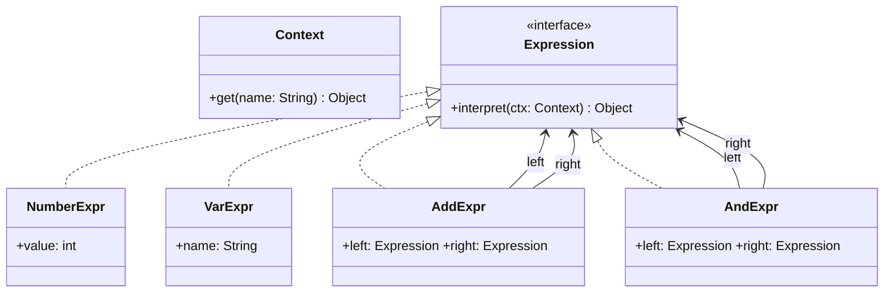
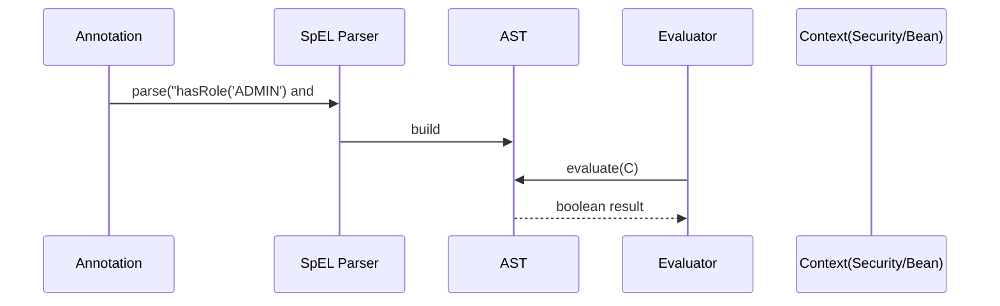
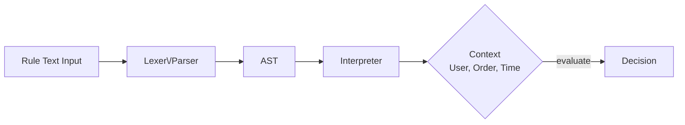

# 03-3. 인터프리터 (Interpreter)

## 03-3-1. 개념과 쓰임새

### 개요
인터프리터(Interpreter)는 도메인 전용 언어(DSL) 혹은 간단한 문법으로 표현된 문장을 해석해 결과를 도출하는 행위 패턴입니다. 일반적으로 문장을 의미 단위(토큰/노드)로 분해하여 추상 구문 트리(AST)를 만들고, 각 노드가 자신의 의미를 해석(evaluate/interpret)합니다.

학습 목표
- 인터프리터의 의도와 구조(표현식 인터페이스, 단말/비단말 표현식, 컨텍스트)를 이해한다.
- 스프링에서의 SpEL(Spring Expression Language), Spring Security의 표현식 등 적용 사례를 파악한다.
- 웹 애플리케이션에서 간단 규칙/필터 DSL을 설계하고 해석하는 흐름을 이해한다.

### 핵심 구조 (Mermaid Class Diagram)



- Expression은 해석 계약을 정의합니다.
- 단말(Terminal) 표현식: NumberExpr, VarExpr처럼 더 이상 하위 노드가 없는 노드입니다.
- 비단말(Non-terminal) 표현식: AddExpr, AndExpr처럼 하위 표현식을 조합합니다.

### 간단 예시 (Java 최소 코드)

```java
import java.util.Map;

// 해석 컨텍스트
public final class Context {
    private final Map<String, Object> values;
    public Context(Map<String, Object> values) { this.values = values; }
    public Object get(String name) { return values.get(name); }
}

// 표현식 계약
public interface Expression {
    Object interpret(Context ctx);
}

// 단말 표현식: 상수 숫자
public final class NumberExpr implements Expression {
    private final int value;
    public NumberExpr(int value) { this.value = value; }
    @Override public Object interpret(Context ctx) { return value; }
}

// 단말 표현식: 변수 참조
public final class VarExpr implements Expression {
    private final String name;
    public VarExpr(String name) { this.name = name; }
    @Override public Object interpret(Context ctx) { return ctx.get(name); }
}

// 비단말 표현식: 덧셈
public final class AddExpr implements Expression {
    private final Expression left, right;
    public AddExpr(Expression left, Expression right) { this.left = left; this.right = right; }
    @Override public Object interpret(Context ctx) {
        int l = ((Number) left.interpret(ctx)).intValue();
        int r = ((Number) right.interpret(ctx)).intValue();
        return l + r;
    }
}

// 비단말 표현식: 불리언 AND
public final class AndExpr implements Expression {
    private final Expression left, right;
    public AndExpr(Expression left, Expression right) { this.left = left; this.right = right; }
    @Override public Object interpret(Context ctx) {
        boolean l = (Boolean) left.interpret(ctx);
        boolean r = (Boolean) right.interpret(ctx);
        return l && r;
    }
}

// 사용 예
Context ctx = new Context(Map.of("x", 10, "flag", true));
Expression expr = new AndExpr(
        new VarExpr("flag"),
        new AddExpr(new VarExpr("x"), new NumberExpr(5)) // 10 + 5 = 15 (truthy가 아닌 정수이므로 실제 사용시 비교식을 결합)
);
// 위 예시는 타입 혼합 데모이므로, 실전에서는 비교식(>=, ==) 등을 별도 Expression으로 추가하여 안전하게 구성합니다.
```

- 실전에서는 타입 안전성과 연산자 우선순위를 다뤄야 하므로, 비교식(GreaterThanExpr 등)과 파서가 필요합니다.


## 03-3-2. 스프링에서의 적용 사례

### 개요
스프링은 다양한 “표현식 언어”를 내장하거나 연동합니다. 이는 도메인 문법을 해석해 값을 계산하거나 접근을 제어하는 인터프리터의 전형적 사례입니다.

### 예시 1: SpEL(Spring Expression Language)
- @Value("#{...}") 또는 XML/Java 설정에서 SpEL을 사용하여 Bean 속성 주입, 조건식 평가, 메서드 호출을 수행합니다.
- MethodSecurityExpressionHandler, @PreAuthorize("hasRole('ADMIN') and #id == principal.id") 등에서도 SpEL/표현식 트리를 해석합니다.



### 예시 2: Spring Security 표현식
- WebSecurity/MethodSecurity에서 access("hasAuthority('SCOPE_read')") 등 표현식을 정의하면, 런타임에 현재 Authentication/Principal을 컨텍스트로 해석합니다.

### 예시 3: 경로/패턴 해석기
- AntPathMatcher, PathPattern은 "+", "*", "**"와 같은 패턴 토큰을 해석하여 요청 경로 매칭을 수행합니다(좁은 의미의 인터프리터적 해석).


## 03-3-3. 웹 애플리케이션에서의 실전 적용

### 개요
간단한 비즈니스 규칙을 코드 배포 없이 변경하고 싶을 때, 읽기 쉬운 DSL을 정의하고 인터프리터로 해석하도록 설계할 수 있습니다. 예: 할인 규칙, 피처 플래그, 접근 제어 규칙 등.

### 규칙 DSL 흐름 (Mermaid Flowchart)



- 규칙 텍스트에서 토큰화/파싱을 거쳐 AST를 만들고, 컨텍스트(사용자 역할, 주문 금액, 현재 시간 등)를 입력으로 해석하여 최종 결정을 반환합니다.


## 03-3-4. 장단점과 사용 시점

### 장점
- 도메인 규칙을 데이터(문자열/구성)로 외부화하여 배포 없이 변경 가능.
- 복잡한 조건을 선언적으로 표현하여 가독성 향상.
- AST 재사용으로 최적화/캐싱/도구화가 가능.

### 단점
- 파서/AST/해석기 구현 비용과 학습 곡선.
- 잘못 설계된 DSL은 모호성/우선순위 문제로 유지보수 어려움.
- 동적 평가의 보안 이슈(샌드박싱, 입력 검증, 타입/권한 제약 필요).

### 사용 시점
- 권한/정책/요금/할인 등 규칙을 선언적으로 구성하고 잦은 변경이 필요한 경우.
- 보안 표현식(SpEL, Method Security), 템플릿 엔진에서 데이터 바인딩/조건 계산이 필요한 경우.
- 경로/패턴 매칭 등 제한된 문법을 고성능으로 해석해야 하는 경우.


## 03-3-5. 5가지 키워드로 정리하는 핵심 포인트
1. DSL과 AST: 문법을 정의하고 AST로 변환해 해석한다.
2. 컨텍스트: 해석 시 외부 환경(사용자, 요청, 시간 등)을 입력으로 사용한다.
3. 단말/비단말 표현식: 기본 값과 연산을 조합해 의미를 구성한다.
4. 스프링 사례: SpEL, Security 표현식, 경로 패턴 등 인터프리터 응용.
5. 안전성: 샌드박싱, 타입 제약, 캐싱으로 안전하고 빠르게 평가한다.


## 확인 문제
1. 인터프리터 패턴의 핵심 의도로 가장 적절한 것은?
    - [ ] 객체에 새로운 책임을 동적으로 추가한다.
    - [ ] 도메인 전용 언어의 문장을 해석해 의미를 계산한다.
    - [ ] 호환되지 않는 인터페이스를 변환한다.
    - [ ] 복잡한 서브시스템을 단순한 고수준 인터페이스로 감춘다.

2. 다음 중 스프링에서 인터프리터의 적용 사례로 가장 적절한 것은?
    - [ ] BeanPostProcessor로 라이프사이클 훅을 연결한다.
    - [ ] @PreAuthorize("hasRole('ADMIN') and #id == principal.id") 같은 표현식을 평가한다.
    - [ ] @Transactional로 트랜잭션 경계를 적용한다.
    - [ ] RestTemplate로 외부 API를 호출한다.

3. [복수 응답] 다음 중 간단한 규칙 DSL을 설계해 인터프리터로 해석하기 좋은 상황을 모두 고르시오.
    - [ ] 할인 정책을 금액/등급/시간대 조건으로 유연하게 바꾸고 싶을 때
    - [ ] URL 경로 패턴 매칭을 커스터마이징해야 할 때
    - [ ] 동일한 트리 구조를 동일 인터페이스로 다뤄야 할 때
    - [ ] 기능 플래그를 조건식으로 제어하고 배포 없이 전환하고 싶을 때
    - [ ] 여러 데이터 소스를 통합한 퍼사드 API를 만들 때

> [정답 및 해설 보기](../answers_and_explanations.md#03-3-인터프리터-interpreter)
