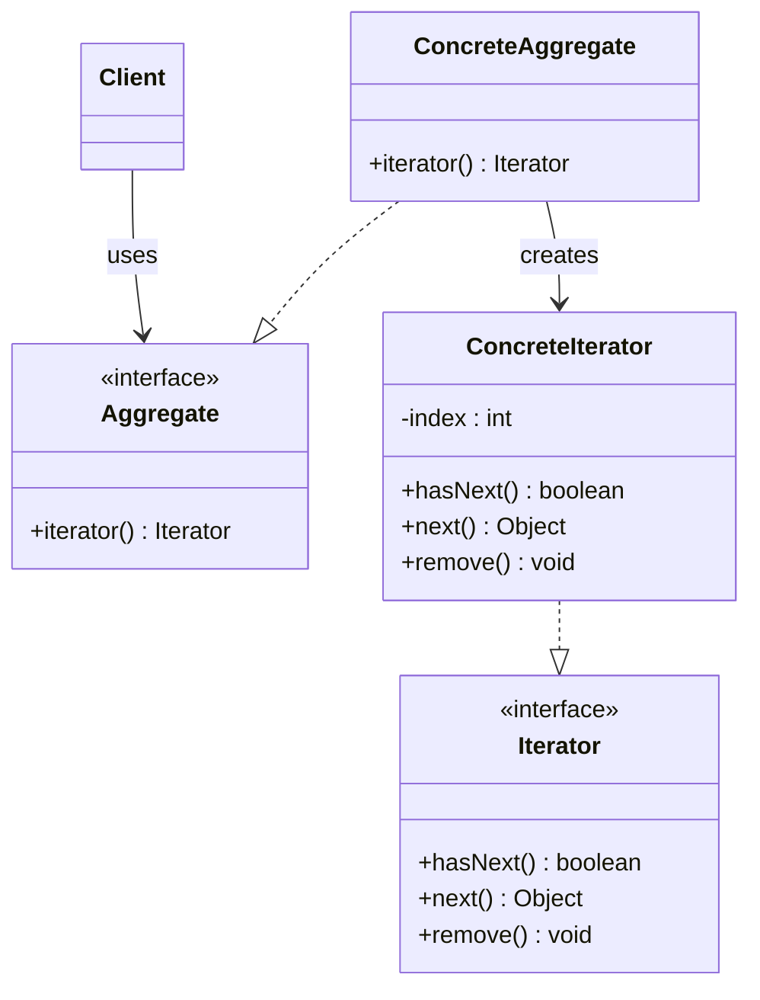
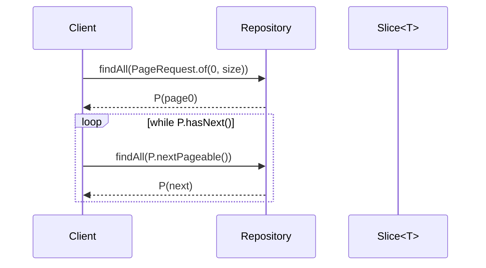
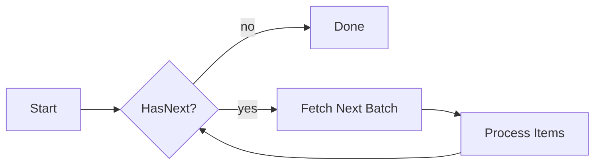

# 03-4. 반복자 (Iterator)

## 03-4-1. 개념과 쓰임새

### 개요
반복자(Iterator) 패턴은 집합체(Aggregate)의 내부 표현을 노출하지 않고, 그 요소들을 순차적으로 접근할 수 있도록 하는 통일된 인터페이스를 제공합니다. 컬렉션의 구현을 변경하더라도 반복 방식은 동일 계약(Iterator)을 통해 일관되게 유지됩니다.

학습 목표
- Iterator의 의도와 구조(Iterator, ConcreteIterator, Aggregate, ConcreteAggregate)를 이해한다.
- 자바 컬렉션의 Iterable/Iterator, 향상된 for, Stream의 기본 반복 모델을 이해한다.
- 스프링/웹에서 페이징, 커서, 스트리밍 처리 등 반복적 접근이 필요한 사례를 파악한다.

### 핵심 구조 (Mermaid Class Diagram)



- 집합체는 iterator()를 통해 반복자를 생성하고, 클라이언트는 hasNext/next 계약만으로 순회합니다.
- 내부 배열, 연결 리스트, 원격 커서 등 표현이 달라도 반복 계약은 동일합니다.

### 간단 예시 (Java 최소 코드)

```java
// 사용자 정의 집합체와 반복자
public final class IntArray implements Iterable<Integer> { // Iterable 제공 시 for-each 가능
    private final int[] values;
    public IntArray(int... values) { this.values = values; }
    @Override public java.util.Iterator<Integer> iterator() {
        return new java.util.Iterator<Integer>() {
            private int index = 0;
            @Override public boolean hasNext() { return index < values.length; }
            @Override public Integer next() { return Integer.valueOf(values[index++]); }
            @Override public void remove() { throw new UnsupportedOperationException(); }
        };
    }
}

// 사용
IntArray arr = new IntArray(1, 2, 3);
for (int v : arr) { // Iterable 덕분에 향상된 for 사용
    System.out.println(v);
}
```

- Iterable을 구현하면 자바의 for-each 문법으로 간결하게 순회할 수 있습니다.
- Iterator는 상태(index)를 캡슐화하여 집합체 내부 구조를 감춥니다.


## 03-4-2. 스프링에서의 적용 사례

### 개요
스프링과 자바 생태계에는 반복자 모델이 널리 쓰입니다. 컬렉션, 스트림, 페이지/슬라이스, 커서 기반 조회 등에서 내부 표현과 순회 로직을 분리해줍니다.

### 예시 1: Spring Data의 Page/Slice 순회
- Page<T>는 getContent()로 리스트를 제공하고, Slice<T>는 다음 페이지가 있는지 hasNext()로 알려줍니다.
- 반복자 본질은 “다음 요소가 있는가?”와 “다음 요소는 무엇인가?”의 계약이며, 페이지 네비게이션은 반복의 확장된 형태로 볼 수 있습니다.



### 예시 2: JdbcTemplate와 ResultSet 순회
- JdbcTemplate은 내부적으로 JDBC ResultSet을 next()로 순회하며 RowMapper로 매핑합니다.
- 사용자는 while(rs.next())의 반복 세부를 숨긴 템플릿 API를 사용합니다.

### 예시 3: Stream과 반복
- Stream은 내부 반복(internal iteration)을 통해 요소 처리 파이프라인(map/filter/reduce)을 수행합니다.
- Iterator는 외부 반복(external iteration)이며, Stream.iterator()로 변환도 가능합니다.


## 03-4-3. 웹 애플리케이션에서의 실전 적용

### 개요
대용량 데이터 조회, 무한 스크롤, 로그/이벤트 스트리밍 등에서 반복자적 접근이 중요합니다. 메모리 과다 사용을 피하고, 커서/배치 단위로 안전하게 순회해야 합니다.

### 실전 구조 (Mermaid Flowchart)



- HasNext\? 노드의 물음표는 ASCII로 이스케이프했습니다.
- 배치 가져오기와 처리 사이에 트랜잭션 경계를 신중히 설정하세요.


## 03-4-4. 장단점과 사용 시점

### 장점
- 캡슐화: 집합체 내부 구조를 노출하지 않고 순회 가능.
- 일관성: 다양한 컬렉션/커서에 동일한 순회 인터페이스 적용.
- 유연성: 외부 반복/내부 반복 모델을 상황에 맞게 선택.

### 단점
- 상태 관리: 반복자 상태(index/커서)로 인해 동시성 이슈 가능.
- 오용 위험: 큰 컬렉션을 메모리에 모두 적재해 순회하면 OOM 위험.
- 복잡성: 커서/페이지네이션은 반복 자체보다 추가 관리가 필요.

### 사용 시점
- 컬렉션 내부 표현에 독립적인 순회가 필요할 때.
- 대용량 데이터에 대해 커서/페이지 단위로 안전하게 접근할 때.
- 외부 반복이 필요하거나, Stream의 내부 반복과 상호 변환해야 할 때.


## 03-4-5. 5가지 키워드로 정리하는 핵심 포인트
1. 내부 표현 은닉: iterator()가 순회 세부를 캡슐화한다.
2. 외부 vs 내부 반복: Iterator(외부), Stream(내부) 상호 변환 가능.
3. 상태 캡슐화: index/커서를 반복자 내부에서 관리.
4. 페이지/커서: 대용량 처리엔 Slice/Page/커서로 나눠 순회.
5. for-each 친화: Iterable 구현으로 문법적 가독성 향상.


## 확인 문제
1. 반복자 패턴의 핵심 의도에 가장 가까운 것은?
    - [ ] 객체 생성 과정을 단계별로 분리한다.
    - [ ] 집합체의 내부 표현을 노출하지 않고 요소에 순차적으로 접근할 수 있게 한다.
    - [ ] 동일한 인터페이스를 유지한 채 객체에 동적으로 책임을 추가한다.
    - [ ] 복잡한 서브시스템을 단순한 고수준 인터페이스로 감춘다.

2. 다음 중 자바/스프링에서 반복자(혹은 그 변형) 개념과 가장 거리가 먼 것은?
    - [ ] Iterable/Iterator를 통한 for-each 순회
    - [ ] Spring Data Slice/Page를 이용한 페이지 네비게이션
    - [ ] JDBC ResultSet의 next() 반복과 RowMapper 매핑
    - [ ] 퍼사드(Facade)로 하위 서브시스템을 감싸는 API 설계

3. [복수 응답] 반복자 패턴을 적용하거나 고려하기 좋은 상황을 모두 고르시오.
    - [ ] 대용량 목록을 커서나 배치 단위로 순회해야 할 때
    - [ ] 내부 표현을 숨긴 채 일관된 순회 인터페이스를 제공해야 할 때
    - [ ] 인터페이스 불일치를 변환해야 할 때
    - [ ] 무한 스크롤/스트리밍 처리가 필요할 때
    - [ ] 동일한 트리 구조를 동일 인터페이스로 다뤄야 할 때

> [정답 및 해설 보기](../answers_and_explanations.md#03-4-반복자-iterator)
