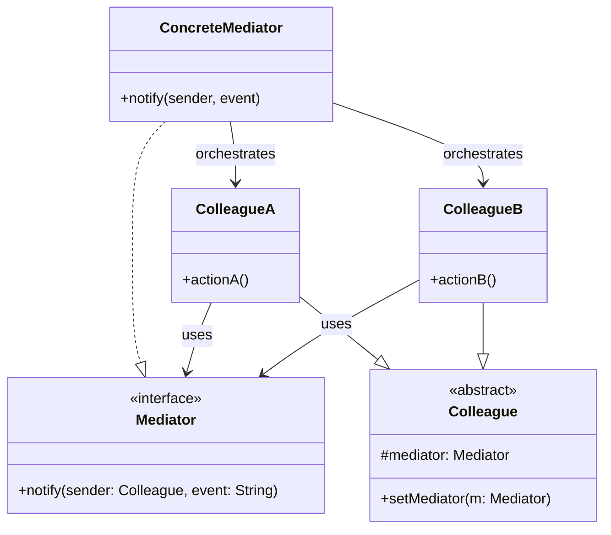
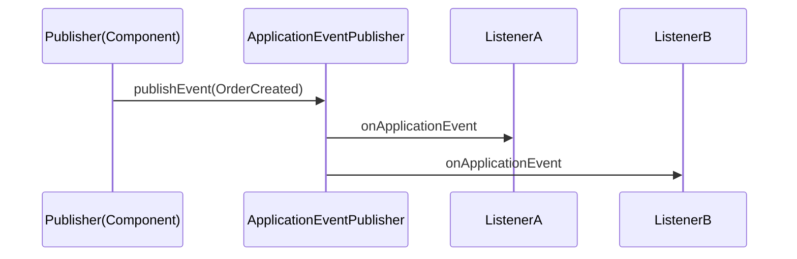
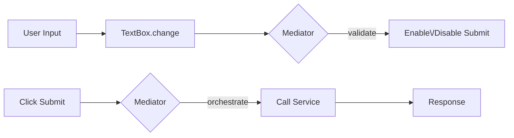

# 03-5. 중재자 (Mediator)

## 03-5-1. 개념과 쓰임새

### 개요
중재자(Mediator) 패턴은 서로 직접 참조하며 복잡하게 얽히기 쉬운 객체들(Colleague) 사이의 상호작용을 "중앙 조정자"인 중재자(Mediator)에게 위임하는 행위 패턴입니다. 각 구성 요소는 서로를 직접 호출하지 않고 중재자를 통해 상호작용하므로, 객체들 간 결합도가 낮아지고 상호작용 규칙을 한곳에서 관리할 수 있습니다.

학습 목표
- Colleague들이 직접 연결되지 않고 Mediator를 통해 통신하는 구조를 이해한다.
- 스프링/웹에서의 이벤트 퍼블리셔, 메시지 브로커, 대화상자(Form) 조정 등의 사례를 파악한다.
- 복잡한 상호작용 규칙을 중앙에서 관리하는 설계를 익힌다.

### 핵심 구조 (Mermaid Class Diagram)



- Colleague는 서로 직접 호출하지 않고, 이벤트/요청을 Mediator에게 알립니다(notify).
- ConcreteMediator는 현재 상태와 규칙에 따라 적절한 Colleague의 행동을 조정합니다.

### 간단 예시 (Java 최소 코드)

```java
// Mediator 계약
public interface Mediator {
    void notify(Colleague sender, String event);
}

// Colleague 베이스
public abstract class Colleague {
    protected final Mediator mediator;
    protected Colleague(Mediator mediator) { this.mediator = mediator; }
}

public final class Button extends Colleague {
    public Button(Mediator mediator) { super(mediator); }
    public void click() { mediator.notify(this, "click"); }
}

public final class TextBox extends Colleague {
    private String text = "";
    public TextBox(Mediator mediator) { super(mediator); }
    public void setText(String t) { this.text = t; mediator.notify(this, "change"); }
    public String getText() { return text; }
}

public final class FormMediator implements Mediator {
    private final Button submit;
    private final TextBox name;
    public FormMediator(Button submit, TextBox name) {
        this.submit = submit; this.name = name;
    }
    @Override public void notify(Colleague sender, String event) {
        // 간단한 규칙: 이름이 비어 있으면 제출 불가 (데모용 로깅)
        if (sender == name && "change".equals(event)) {
            if (name.getText() == null || name.getText().isBlank()) {
                System.out.println("[Mediator] disable submit");
            } else {
                System.out.println("[Mediator] enable submit");
            }
        }
        if (sender == submit && "click".equals(event)) {
            if (name.getText() == null || name.getText().isBlank()) {
                System.out.println("[Mediator] validation error");
            } else {
                System.out.println("[Mediator] submit: " + name.getText());
            }
        }
    }
}

// 사용 예시
TextBox name = new TextBox(null); // 우선 null로 생성 후
Button submit = new Button(null);
FormMediator mediator = new FormMediator(submit, name);
// 간단화를 위해 다시 생성 대신 익명 서브클래스/세터로 주입해도 됨
```

- 실제 코드는 Colleague에 Mediator를 생성자 주입하고, Mediator가 각 Colleague를 보유하여 상호관계를 조정합니다.
- Colleague 간 직접 의존이 사라져 결합도가 낮아지고, 상호작용 규칙은 Mediator에 집중됩니다.


## 03-5-2. 스프링에서의 적용 사례

### 개요
스프링 생태계에는 구성 요소 간 직접 결합을 줄이고 중앙 조정자 혹은 허브를 통해 통신하는 메커니즘이 다수 존재합니다. 이는 중재자 패턴의 철학과 맞닿아 있습니다.

### 예시 1: ApplicationEventPublisher (Sequence)



- 퍼블리셔와 리스너는 서로를 직접 참조하지 않고, 이벤트 허브가 중재합니다.
- 런타임에 리스너 추가/제거가 용이하고, 다대다 상호작용을 느슨하게 연결합니다.

### 예시 2: Spring Integration/Cloud Stream의 메시지 브로커
- 구성 요소는 메시지를 채널/브로커에 발행하고, 구독자는 해당 채널을 통해 메시지를 수신합니다.
- 발신자와 수신자는 브로커(중재자)를 통해 간접 연결되어 확장성과 교체 가능성이 높습니다.

### 예시 3: WebSocket STOMP Broker
- 클라이언트가 특정 destination으로 전송하면, 브로커가 구독자들에게 라우팅합니다.
- 서버 컴포넌트/클라이언트가 서로 직접 연결되지 않고 브로커가 메시지 전달을 중재합니다.


## 03-5-3. 웹 애플리케이션에서의 실전 적용

### 개요
다양한 UI 컴포넌트나 서브시스템이 얽힌 화면/흐름에서, 중재자를 도입해 상호작용 규칙을 중앙에 모으면 변경이 쉬워지고 테스트가 단순해집니다.

### 실전 구조 (Mermaid Flowchart)



- 각 컴포넌트(TextBox, Button)는 중앙 Mediator에게 상태 변화를 통지하고, Mediator는 검증/상태 전이를 조정합니다.
- 서버 측에서는 애그리게이터 컨트롤러가 다수의 서비스/클라이언트를 조정하는 형태로 중재자 역할을 수행할 수도 있습니다.


## 03-5-4. 장단점과 사용 시점

### 장점
- 결합도 감소: Colleague 간 직접 참조를 제거하여 변경 파급을 줄인다.
- 규칙의 집중: 상호작용 로직을 Mediator에 모아 한 곳에서 관리/변경 가능.
- 재사용성: Colleague는 단순해져 다른 컨텍스트에서도 재사용이 쉬워진다.

### 단점
- 중재자 비대화: 많은 규칙이 모이면 Mediator가 비대해져 복잡도가 증가.
- 간접 호출 비용: 모든 상호작용이 Mediator를 거치며 디버깅 경로가 길어질 수 있음.
- 과용 위험: 간단한 상호작용까지 중앙화하면 오히려 가독성이 떨어질 수 있음.

### 사용 시점
- 구성 요소 사이의 상호작용 규칙이 복잡하고 변경이 잦을 때.
- 다수의 컴포넌트가 느슨하게 협력해야 하며 직접 결합을 피하고 싶을 때.
- 이벤트 기반/브로커 기반 아키텍처를 통해 발신자와 수신자를 분리하고 싶을 때.


## 03-5-5. 5가지 키워드로 정리하는 핵심 포인트
1. 중앙 조정자: 상호작용 규칙을 Mediator에 집중한다.
2. 느슨한 결합: Colleague 간 직접 참조를 제거한다.
3. 이벤트 통지: Colleague는 상태 변화를 Mediator에 알린다.
4. 브로커/허브: 스프링 이벤트, 메시지 브로커가 대표적 사례다.
5. 비대화 주의: Mediator가 지나치게 커지지 않게 모듈화/분할한다.


## 확인 문제
1. 중재자 패턴의 핵심 의도에 가장 가까운 것은?
    - [ ] 호환되지 않는 인터페이스를 변환해 재사용 가능하게 한다.
    - [ ] 객체에 새로운 책임을 동적으로 추가하되 동일한 인터페이스를 유지한다.
    - [ ] 서로 얽힌 객체 간 상호작용을 중앙 중재자에게 위임해 결합도를 낮춘다.
    - [ ] 복잡한 서브시스템을 단순한 고수준 인터페이스로 감춘다.

2. 다음 중 스프링에서 "중재자" 성격이 가장 뚜렷한 것은?
    - [ ] DataSource의 커넥션 풀링
    - [ ] ApplicationEventPublisher와 이벤트 리스너
    - [ ] @Transactional AOP 프록시
    - [ ] Bean Validation의 제약(annotation) 처리

3. [복수 응답] 중재자 패턴 적용을 고려하기 좋은 상황을 모두 고르시오.
    - [ ] 다수 컴포넌트의 상호작용 규칙이 빈번히 바뀌고 복잡할 때
    - [ ] 동일한 트리 구조를 동일 인터페이스로 다뤄야 할 때
    - [ ] 발신자-수신자를 간접 연결하는 메시지 브로커를 사용할 때
    - [ ] 두 클래스 간 단순한 1:1 호출 관계만 있을 때
    - [ ] UI 폼의 컴포넌트 간 활성화/검증 상태 전이를 중앙에서 조정할 때

> [정답 및 해설 보기](../answers_and_explanations.md#03-5-중재자-mediator)
