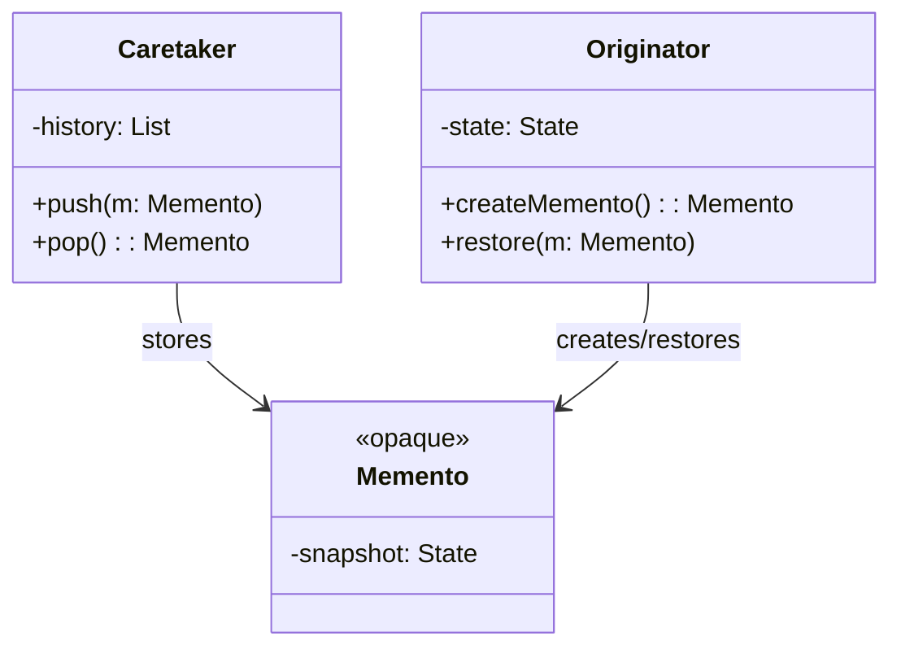
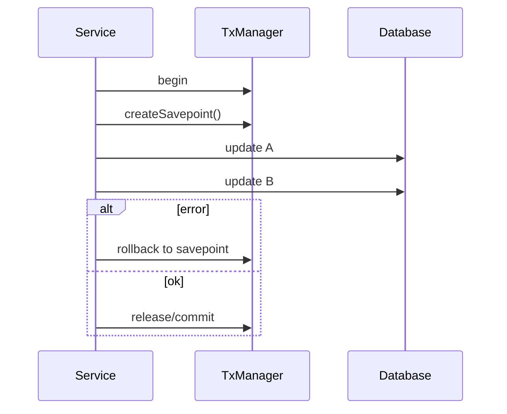
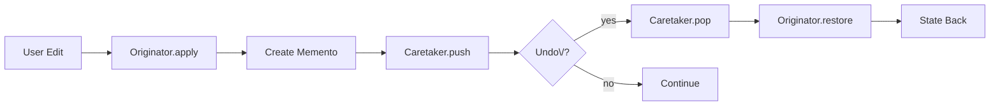

# 03-6. 메멘토 (Memento)

## 03-6-1. 개념과 쓰임새

### 개요
메멘토(Memento) 패턴은 객체의 내부 상태를 캡슐화된 스냅샷(메멘토)으로 저장해 두었다가, 필요한 시점에 원래 상태로 복구할 수 있도록 하는 행위 패턴입니다. 핵심은 Originator(상태의 소유자)가 자신의 상태를 Memento로 내보내고, Caretaker가 그 메멘토를 보관하며, 복구 시 Originator가 해당 메멘토로부터 상태를 복원한다는 점입니다. 내부 상태의 캡슐화를 유지한 채(외부에 상세 구조를 노출하지 않고) 되돌리기(undo)/재실행(redo) 기능을 구현할 수 있습니다.

학습 목표
- Originator, Memento, Caretaker의 역할과 상호작용을 이해한다.
- 스프링/웹 문맥에서 상태 스냅샷과 복구의 실전 사례를 파악한다.
- Undo/Redo, 트랜잭션 세이브포인트, 이벤트 소싱 스냅샷의 개념적 연결을 이해한다.

### 핵심 구조 (Mermaid Class Diagram)



- Memento의 내부는 캡슐화되어 외부에서 임의 수정할 수 없어야 합니다(불변·비공개).
- Caretaker는 스냅샷을 보관/관리하지만 스냅샷의 내용에는 관여하지 않습니다.

### 간단 예시 (Java 최소 코드)

```java
// 상태를 가진 Originator
public final class TextEditor { // Originator
    private StringBuilder content = new StringBuilder();

    public void type(String s) { content.append(s); }
    public String getText() { return content.toString(); }

    // 메멘토 생성
    public Memento save() { return new Memento(content.toString()); }
    // 메멘토로 복구
    public void restore(Memento m) { this.content = new StringBuilder(m.state()); }

    // 불변 메멘토(캡슐화)
    public static final class Memento { // Memento
        private final String state;
        private Memento(String state) { this.state = state; }
        private String state() { return state; }
    }
}

// Caretaker: 히스토리 보관
import java.util.ArrayDeque;
import java.util.Deque;
public final class History { // Caretaker
    private final Deque<TextEditor.Memento> stack = new ArrayDeque<>();
    public void backup(TextEditor.Memento m) { stack.push(m); }
    public TextEditor.Memento undo() { return stack.isEmpty() ? null : stack.pop(); }
}

// 사용 예시
TextEditor editor = new TextEditor();
History history = new History();

editor.type("Hello ");
history.backup(editor.save());
editor.type("World");
String now = editor.getText(); // "Hello World"

TextEditor.Memento m = history.undo();
if (m != null) editor.restore(m);
String restored = editor.getText(); // "Hello "
```

- 메멘토는 불변이고 내부 상태는 외부에서 접근 불가(private)로 두어 캡슐화를 지킵니다.
- 복구는 Originator만 수행하며, Caretaker는 단지 스냅샷을 보관/반환할 뿐입니다.


## 03-6-2. 스프링에서의 적용 사례

### 개요
스프링 자체가 메멘토 클래스를 제공하는 것은 아니지만, "상태 스냅샷을 저장하고 특정 지점으로 복구"한다는 아이디어는 여러 영역에서 활용됩니다.

### 예시 1: 트랜잭션 Savepoint (유사 메멘토)
- PlatformTransactionManager/JDBC에서 세이브포인트를 만들면, 해당 시점으로 롤백할 수 있습니다.
- 이는 데이터베이스 상태의 부분 스냅샷을 찍고(세이브포인트), 필요 시 그 지점으로 복구하는 메멘토적 사고방식과 유사합니다.



### 예시 2: 이벤트 소싱의 스냅샷
- Event Sourcing에서는 수많은 이벤트를 재생하는 비용을 줄이기 위해 주기적으로 Aggregate의 상태 스냅샷을 저장합니다.
- 스냅샷은 메멘토와 유사한 역할을 하며, 복구 시 해당 시점의 스냅샷을 로드한 뒤 이후 이벤트만 재생합니다.
- 스프링 기반 환경에서 Axon Framework 등 이벤트 소싱 프레임워크와 함께 흔히 사용됩니다.

### 예시 3: Spring StateMachine의 상태 스냅샷/복구 개념
- Spring Statemachine은 상태 머신의 현재 상태/확장 상태를 직렬화/복원하는 메커니즘을 제공합니다.
- 이는 UI/프로세스 플로우에서 특정 시점으로 돌아가거나, 중단점 이후 재개하는 데 유용합니다.


## 03-6-3. 웹 애플리케이션에서의 실전 적용

### 개요
폼 편집, 장바구니, 위자드(다단계 폼) 등에서 되돌리기/다시 실행 기능은 사용자 경험을 크게 개선합니다. Originator(편집 중 모델)와 Caretaker(히스토리)를 분리하면 UI/서버 모두에서 안정적인 Undo/Redo를 설계할 수 있습니다.

### 실전 구조 (Mermaid Flowchart)



- Undo\/? 노드의 물음표는 ASCII로 이스케이프했습니다.
- 서버 사이드에서는 세션/캐시/스토리지에 메멘토를 저장해 단계 되돌리기 기능을 제공할 수 있습니다(민감 데이터 취급 주의).


## 03-6-4. 장단점과 사용 시점

### 장점
- 캡슐화 유지: 내부 상태 구조를 외부(Caretaker)에 노출하지 않고 스냅샷 저장.
- Undo/Redo 용이: 사용자 행동 취소, 단계적 실험/회귀가 쉬움.
- 안정성: 실패 시 안전한 복구 포인트로 되돌릴 수 있음.

### 단점
- 메모리/스토리지 비용: 스냅샷이 크거나 자주 저장되면 비용 증가.
- 동기화 문제: 외부 세계(예: DB)와의 부조화를 조심해야 함(메멘토는 객체 내부 상태만 보관할 수 있음).
- 보안 이슈: 스냅샷에 민감 정보가 포함될 경우 암호화/마스킹/수명 관리 필요.

### 사용 시점
- 편집기/위자드/장바구니 등 사용자 조작의 Undo/Redo가 필요한 경우.
- 복구 지점이 필요한 도메인(트랜잭션 세이브포인트, 배치 작업의 체크포인트 등).
- 이벤트 소싱 시스템에서 빠른 로드를 위한 상태 스냅샷이 필요한 경우.


## 03-6-5. 5가지 키워드로 정리하는 핵심 포인트
1. Originator: 상태의 소유자이자 스냅샷 생성/복구 주체.
2. Memento: 캡슐화된 불변 스냅샷, 외부에서 변경 불가.
3. Caretaker: 스냅샷 보관/관리(내용에는 관여하지 않음).
4. Undo/Redo: 사용자 경험과 안정적 롤백/재실행을 지원.
5. 비용과 보안: 스냅샷 크기/빈도 및 민감 데이터 관리에 유의.


## 확인 문제
1. 메멘토 패턴의 핵심 의도에 가장 가까운 것은?
    - [ ] 객체에 새로운 책임을 동적으로 추가한다.
    - [ ] 내부 상태를 캡슐화한 스냅샷으로 저장하고 필요 시 복구한다.
    - [ ] 호환되지 않는 인터페이스를 변환해 재사용 가능하게 한다.
    - [ ] 요청을 객체로 캡슐화해 호출자와 수신자의 결합을 느슨하게 한다.

2. 다음 중 메멘토 패턴의 올바른 분리 책임 설명으로 가장 적절한 것은?
    - [ ] Caretaker가 메멘토 내부 상태를 편집해 성능을 최적화한다.
    - [ ] Originator는 메멘토를 만들고 복구하며, Caretaker는 그것을 보관한다.
    - [ ] Memento는 외부에서 setter로 내용을 갱신할 수 있어야 한다.
    - [ ] Originator는 상태를 공개하고 Caretaker가 직접 복구한다.

3. [복수 응답] 메멘토(또는 유사 개념)를 적용하기 좋은 상황을 모두 고르시오.
    - [ ] 텍스트 편집기의 Undo/Redo 구현
    - [ ] 데이터베이스 트랜잭션 세이브포인트 사용
    - [ ] 서로 다른 인터페이스를 연결해 호출을 가능하게 할 때
    - [ ] 이벤트 소싱 시스템의 상태 스냅샷 저장
    - [ ] 동적 프록시를 통한 접근 제어와 로깅 적용

> [정답 및 해설 보기](../answers_and_explanations.md#03-6-메멘토-memento)
