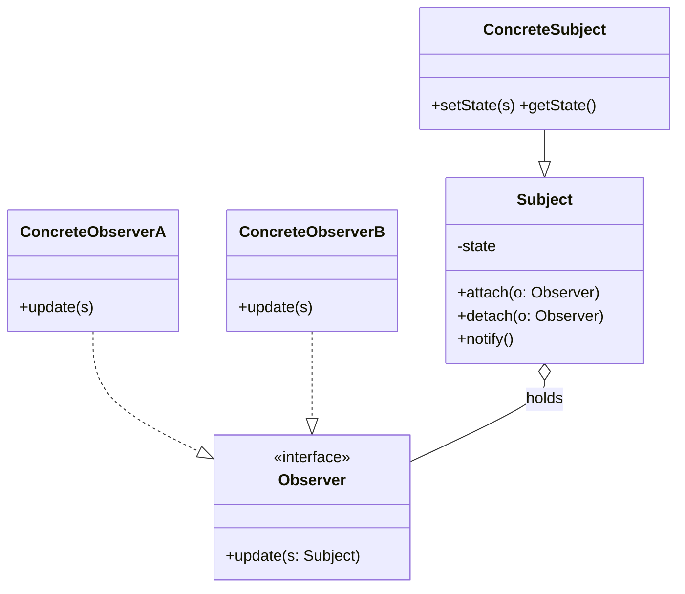
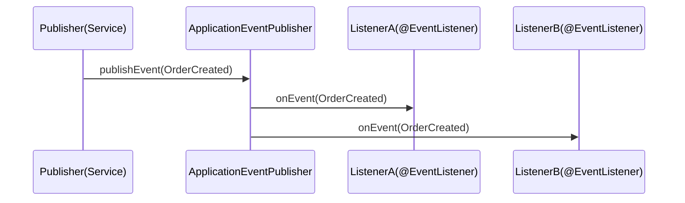
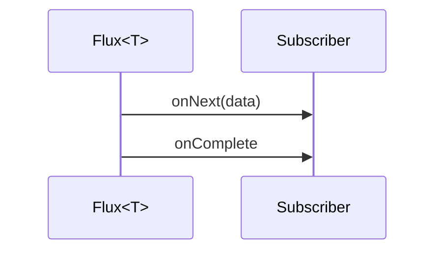
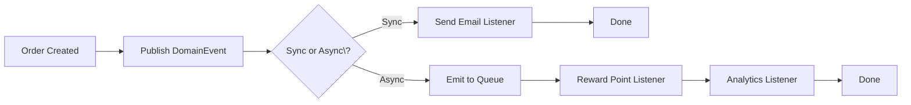

# 03-7. 옵저버 (Observer)

## 03-7-1. 개념과 쓰임새

### 개요
옵저버(Observer) 패턴은 어떤 객체의 상태 변화가 있을 때, 그 객체에 의존하는 다른 객체들(옵저버)에게 자동으로 통지되도록 일대다(one-to-many) 의존 관계를 정의하는 행위 패턴입니다. 주체(Subject, 또는 Publisher)가 상태 변화를 발행하면 여러 옵저버(Observer, 또는 Subscriber)가 이를 받아 반응합니다. 주체와 옵저버는 느슨하게 결합되어 런타임에 구독/해지가 유연합니다.

학습 목표
- Observer의 의도와 구조(Subject, Observer, attach/detach/notify)를 이해한다.
- 스프링에서의 이벤트(@EventListener), Reactive Streams(Flux/Mono), 서블릿/하이버네이트 리스너 등 적용 사례를 파악한다.
- 웹 애플리케이션에서 도메인 이벤트를 활용한 결합도 감소와 확장성 있는 설계를 익힌다.

### 핵심 구조 (Mermaid Class Diagram)



- Subject는 옵저버 등록/해지 및 알림을 담당합니다.
- 옵저버는 update 콜백을 통해 Subject의 상태를 조회하거나 전달받은 데이터로 반응합니다.

### 간단 예시 (Java 최소 코드)

```java
import java.util.ArrayList;
import java.util.List;

// 계약
interface Observer {
    void update(Subject s);
}

interface Subject {
    void attach(Observer o);
    void detach(Observer o);
    void notifyObservers();
}

// 주체
final class NewsPublisher implements Subject {
    private final List<Observer> observers = new ArrayList<>();
    private String latest;

    public void publish(String news) {
        this.latest = news;
        notifyObservers();
    }

    public String getLatest() {
        return latest;
    }

    @Override
    public void attach(Observer o) {
        observers.add(o);
    }

    @Override
    public void detach(Observer o) {
        observers.remove(o);
    }

    @Override
    public void notifyObservers() {
        for (Observer o : observers) {
            o.update(this);
        }
    }
}

// 옵저버
final class SmsSubscriber implements Observer {
    @Override
    public void update(Subject s) {
        String msg = ((NewsPublisher) s).getLatest();
        System.out.println("[SMS] " + msg);
    }
}
```

- 주체는 변경 시점에 전체 옵저버에게 알립니다. 옵저버는 등록/해지를 통해 동적으로 구성됩니다.


## 03-7-2. 스프링에서의 적용 사례

### 개요
스프링은 이벤트 퍼블리셔, 애노테이션 기반 리스너, 리액티브 스트림 등을 통해 옵저버 패턴을 폭넓게 활용합니다. 발행자와 구독자를 느슨하게 연결하여, 기능 확장을 이벤트 구독 추가만으로 구현할 수 있습니다.

### 예시 1: @EventListener / ApplicationEventPublisher (Sequence)



- 퍼블리셔는 이벤트 객체를 발행하고, 스프링이 등록된 리스너들에게 브로드캐스트합니다.
- 비동기 리스너(@Async)로 전환하면 호출자와 처리 시점을 분리할 수 있습니다.

### 예시 2: Reactor Flux/Mono 구독
- WebFlux/Reactor에서 Flux/Mono는 Publisher이고, subscribe는 Observer(Subscriber)입니다.
- onNext/onError/onComplete 콜백으로 비동기 스트림을 처리합니다.



### 예시 3: Servlet/Hibernate 리스너
- ServletContextListener, HttpSessionListener 등은 컨테이너 이벤트에 반응합니다.
- JPA/Hibernate의 엔티티 리스너(@PrePersist, @PostUpdate 등)는 엔티티 수명주기 이벤트에 반응합니다.


## 03-7-3. 웹 애플리케이션에서의 실전 적용

### 개요
주문 생성, 결제 완료 같은 도메인 이벤트를 발행하면 알림, 적립금, 통계 집계 등 부가 작업을 느슨하게 확장할 수 있습니다. 트랜잭션 경계, 동기/비동기 처리, 재시도 정책을 상황에 맞게 설계합니다.

### 실전 구조 (Mermaid Flowchart)



- Sync/Async\?의 물음표는 ASCII로 이스케이프했습니다.
- 동기 리스너는 트랜잭션 내에서 즉시 반응하고, 비동기 리스너는 큐/스케줄러를 통해 분리할 수 있습니다.


## 03-7-4. 장단점과 사용 시점

### 장점
- 느슨한 결합: 발행자와 구독자가 서로를 직접 알 필요가 없다.
- 확장 용이: 새로운 기능은 리스너 추가로 독립 개발/배포 가능.
- 재사용성: 동일 이벤트를 다양한 리스너가 각자 처리.

### 단점
- 흐름 추적 난이도: 이벤트 기반으로 제어 흐름이 분산되어 디버깅이 어려울 수 있음.
- 순서/일관성: 다수 리스너의 실행 순서, 실패 시 재시도/보상 처리 설계 필요.
- 과용 위험: 단순 동기 호출에까지 이벤트를 남용하면 복잡도 증가.

### 사용 시점
- 도메인 이벤트로 부가 기능(알림, 집계, 감사)을 느슨하게 연결하고 싶을 때.
- UI/실시간 스트림 처리(웹소켓, SSE, 리액티브 파이프라인)가 요구될 때.
- 컨테이너/엔티티 수명주기 이벤트에 반응해야 할 때.


## 03-7-5. 5가지 키워드로 정리하는 핵심 포인트
1. 일대다 통지: 한 번의 상태 변화로 다수 옵저버에 알린다.
2. 느슨한 결합: 발행자-구독자 간 의존을 최소화한다.
3. 동기/비동기: 처리 시점을 요구에 맞게 분리한다.
4. 에러/순서 정책: 실패 재시도, 역순서, 보상 트랜잭션을 설계한다.
5. 스프링 이벤트/리액티브: @EventListener와 Flux/Mono를 적극 활용한다.


## 확인 문제
1. 옵저버 패턴의 핵심 의도로 가장 적절한 것은?
    - [ ] 객체 생성 과정을 단계별로 분리하여 최종 단계에서 완성한다.
    - [ ] 어떤 객체의 상태 변화가 관련 객체들에게 자동으로 통지되도록 일대다 의존을 정의한다.
    - [ ] 호환되지 않는 인터페이스를 변환하여 재사용 가능하게 한다.
    - [ ] 동일한 인터페이스를 유지한 채 객체에 동적으로 책임을 추가한다.

2. 다음 중 스프링에서 옵저버 패턴의 적용으로 가장 적절한 것은?
    - [ ] @EventListener를 통한 ApplicationEvent 구독 처리
    - [ ] RestTemplate로 외부 API 호출
    - [ ] @Transactional을 통한 트랜잭션 경계 적용
    - [ ] HandlerInterceptor로 요청 전\u00B7후 훅 처리

3. [복수 응답] 옵저버 패턴을 적용하기 좋은 상황을 모두 고르시오.
    - [ ] 주문 생성 시 이메일 알림, 포인트 적립, 통계 집계를 각기 분리해 처리하고 싶을 때
    - [ ] 인터페이스 불일치를 변환해야 할 때
    - [ ] 웹소켓/SSE로 실시간 이벤트를 여러 구독자에게 전파해야 할 때
    - [ ] 컴포넌트 간 복잡한 상호작용 규칙을 중앙에서 조정해야 할 때
    - [ ] 엔티티 수명주기(@PostPersist 등)에 반응해 부가 로직을 실행해야 할 때

> [정답 및 해설 보기](../answers_and_explanations.md#03-7-옵저버-observer)
