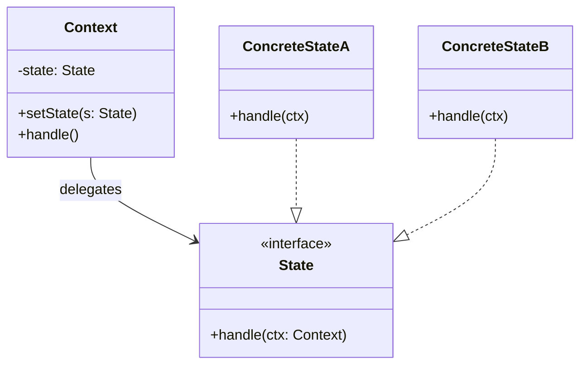
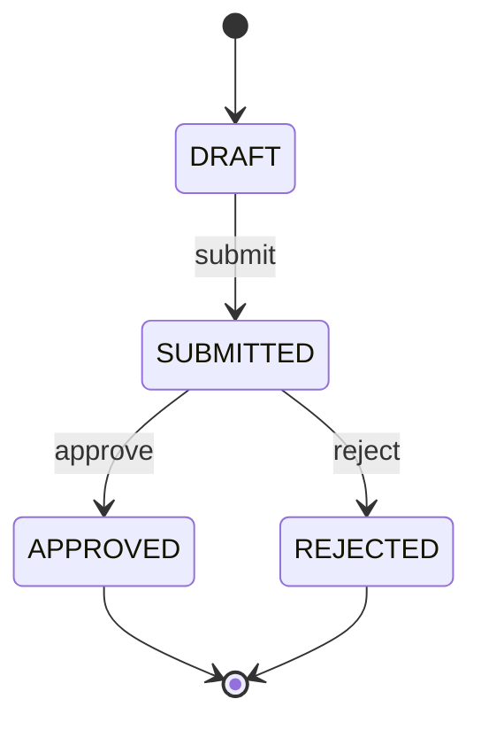
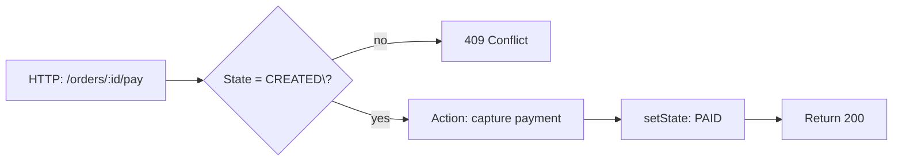

# 03-8. 상태 (State)

## 03-8-1. 개념과 쓰임새

### 개요
상태(State) 패턴은 객체의 내부 상태에 따라 그 객체의 행동이 바뀌도록 하면서, 상태별 로직을 각각의 상태 클래스로 캡슐화하는 행위 패턴입니다. 컨텍스트(Context)는 현재 상태 객체에 작업을 위임하며, 상태 전이가 일어나면 다른 상태 객체로 교체합니다. 이로써 if-else/switch 분기 남발을 줄이고, 상태 전이 규칙과 행동을 응집도 높게 관리할 수 있습니다.

학습 목표
- Context, State 인터페이스, ConcreteState의 구조를 이해한다.
- 스프링에서의 상태 머신(Spring Statemachine) 및 워크플로우/승인 절차 등 적용 지점을 파악한다.
- 웹 애플리케이션에서 주문/결제/티켓 등 실전 상태 전이를 설계한다.

### 핵심 구조 (Mermaid Class Diagram)



- Context는 현재 상태 객체에 작업을 위임하며, 상태가 바뀌면 setState로 교체합니다.
- 각 상태 클래스는 다음 상태로의 전이 규칙을 알고 있어 필요 시 컨텍스트의 상태를 변경합니다.

### 간단 예시 (Java 최소 코드)

```java
// 상태 계약
public interface State {
    void handle(Context ctx);
}

// 컨텍스트
public final class Context {
    private State state;
    public Context(State init) { this.state = init; }
    public void setState(State s) { this.state = s; }
    public void request() { state.handle(this); }
}

// 구체 상태들
public final class Draft implements State {
    @Override public void handle(Context ctx) {
        System.out.println("Draft -> submit");
        ctx.setState(new Submitted());
    }
}

public final class Submitted implements State {
    @Override public void handle(Context ctx) {
        System.out.println("Submitted -> approve");
        ctx.setState(new Approved());
    }
}

public final class Approved implements State {
    @Override public void handle(Context ctx) {
        System.out.println("Approved: done");
        // terminal 상태: 전이 없음
    }
}

// 사용 예
Context doc = new Context(new Draft());
doc.request(); // Draft -> submit
doc.request(); // Submitted -> approve
doc.request(); // Approved: done
```

- 분기문 대신 상태 객체 교체로 행동 변화가 일어납니다.
- 전이 규칙이 상태별로 응집되어 상태 추가/변경이 용이합니다.


## 03-8-2. 스프링에서의 적용 사례

### 개요
상태(State) 패턴의 철학은 스프링의 상태 머신, 승인/워크플로우, 배치 단계 전이 등에서 흔히 볼 수 있습니다. 특히 Spring Statemachine은 선언적 전이/가드/액션을 제공하여 복잡한 전이 그래프를 안정적으로 구현하게 돕습니다.

### 예시 1: Spring Statemachine의 상태 전이
- 상태(enum/문자열)와 이벤트를 정의하고, 전이(transition), 가드(guard), 액션(action)을 구성합니다.
- 런타임에 이벤트를 보내면 현재 상태의 규칙에 따라 다음 상태로 전이합니다.



- 코드에서는 상태/이벤트를 제너릭으로 구성하고, 전이에 가드(조건)나 액션(사이드 이펙트)을 연결합니다.

### 예시 2: 주문/결제 워크플로우
- 주문은 CREATED → PAID → SHIPPED → DELIVERED 같은 단계로 전이합니다.
- 환불/취소와 같은 예외 전이도 상태 머신으로 명시하면 유지보수가 쉬워집니다.

### 예시 3: 승인 프로세스(문서/요청)
- DRAFT → SUBMITTED → APPROVED/REJECTED 흐름을 상태 별 행동(편집 가능, 승인 버튼 활성화 등)과 함께 정의합니다.


## 03-8-3. 웹 애플리케이션에서의 실전 적용

### 개요
상태 전이가 많은 도메인(주문, 결제, 배송, 티켓, 문서 승인)은 상태 모델을 명시적으로 도입할 때 복잡도가 크게 낮아집니다. 컨트롤러/서비스는 Context로서 현재 상태 객체에 위임하고, 이벤트에 따라 전이를 수행합니다.

### 실전 구조 (Mermaid Flowchart)



- CREATED\?의 물음표는 ASCII로 이스케이프했습니다.
- 전이 조건(가드)과 액션(사이드 이펙트)을 상태 별로 응집시키면 테스트가 단순해집니다.

### 간단 예시 (Spring 스타일 의사코드)

```java
public enum OrderState { CREATED, PAID, SHIPPED, DELIVERED, CANCELED }

public interface OrderBehavior { void onPay(OrderContext ctx); void onShip(OrderContext ctx); }

public final class OrderContext {
    private OrderState state;
    private OrderBehavior behavior;
    public void set(OrderState s, OrderBehavior b) { this.state = s; this.behavior = b; }
    public OrderState state() { return state; }
    public void pay() { behavior.onPay(this); }
    public void ship() { behavior.onShip(this); }
}
```

- 실제로는 상태당 Behavior 구현(ConcreteState)을 두고, 전이 시 set(nextState, nextBehavior)을 호출합니다.
- Spring Statemachine을 사용하면 선언적으로 전이/가드/액션을 구성할 수 있습니다.


## 03-8-4. 장단점과 사용 시점

### 장점
- 응집도 향상: 상태별 규칙/행동을 해당 상태 클래스로 캡슐화.
- 분기 감소: 거대한 if-else/switch를 상태 객체 교체로 대체.
- 확장 용이: 새 상태 추가/전이 변경이 비교적 국소적.

### 단점
- 클래스 수 증가: 상태마다 클래스가 늘어날 수 있음.
- 전이 관리 복잡성: 상태/이벤트 조합이 많아지면 전이표 관리가 어려움.
- 분산 로직: 전이가 여러 상태로 흩어져 전체 흐름 파악이 어려울 수 있음(다이어그램 병행 권장).

### 사용 시점
- 도메인이 명확한 상태 전이와 그에 따른 행동 변화를 가진 경우(주문/결제/승인/티켓 등).
- 상태에 따른 허용/금지 행동이 다르고, 전이 규칙을 명시적으로 관리하고 싶을 때.
- 워크플로우/상태 머신 도구(Spring Statemachine 등)와 결합해 운영하고자 할 때.


## 03-8-5. 5가지 키워드로 정리하는 핵심 포인트
1. 캡슐화된 상태 행동: 상태마다 handle/행동을 구현해 응집한다.
2. 컨텍스트 위임: Context가 현재 상태에 작업을 위임한다.
3. 전이 규칙: 상태가 전이 조건/다음 상태를 결정한다.
4. 분기 제거: 거대한 if-else/switch를 줄인다.
5. 도구 활용: Spring Statemachine 등으로 선언적 전이를 구성한다.


## 확인 문제
1. 상태 패턴의 핵심 의도에 가장 가까운 것은?
    - [ ] 동일한 인터페이스를 유지한 채 객체에 동적으로 책임을 추가한다.
    - [ ] 객체의 내부 상태에 따라 행동이 바뀌도록 상태별 클래스로 캡슐화하고 전이를 관리한다.
    - [ ] 호환되지 않는 인터페이스를 변환하여 재사용 가능하게 한다.
    - [ ] 복잡한 서브시스템을 단순한 고수준 인터페이스로 감춘다.

2. 다음 중 스프링에서 상태 패턴(또는 상태 머신)의 적용으로 가장 적절한 것은?
    - [ ] @Transactional AOP 프록시로 트랜잭션 경계 적용
    - [ ] Spring Statemachine으로 주문 상태 전이와 가드/액션 구성
    - [ ] HandlerInterceptor 체인으로 전/후 훅 처리
    - [ ] RestTemplate의 exchange 호출

3. [복수 응답] 상태 패턴을 적용하기 좋은 상황을 모두 고르시오.
    - [ ] 주문/결제/배송처럼 명확한 전이 규칙과 행동 변화가 있을 때
    - [ ] 동일한 트리 구조를 동일 인터페이스로 다뤄야 할 때
    - [ ] 문서 승인(DRAFT→SUBMITTED→APPROVED/REJECTED) 같은 워크플로우를 명시하고 싶을 때
    - [ ] 인터페이스 불일치를 변환해야 할 때
    - [ ] 상태에 따라 사용 가능 기능/버튼 활성화가 달라질 때

> [정답 및 해설 보기](../answers_and_explanations.md#03-8-상태-state)
