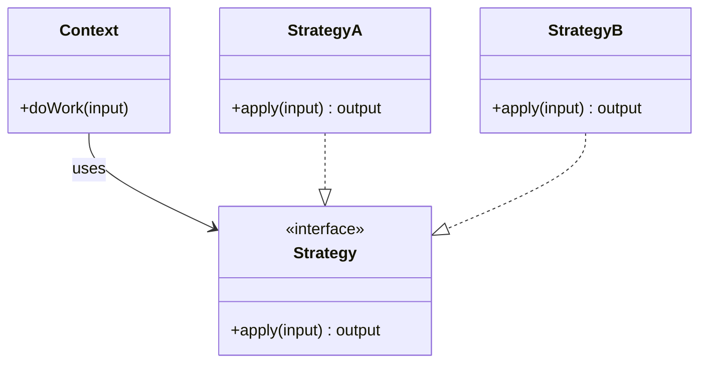
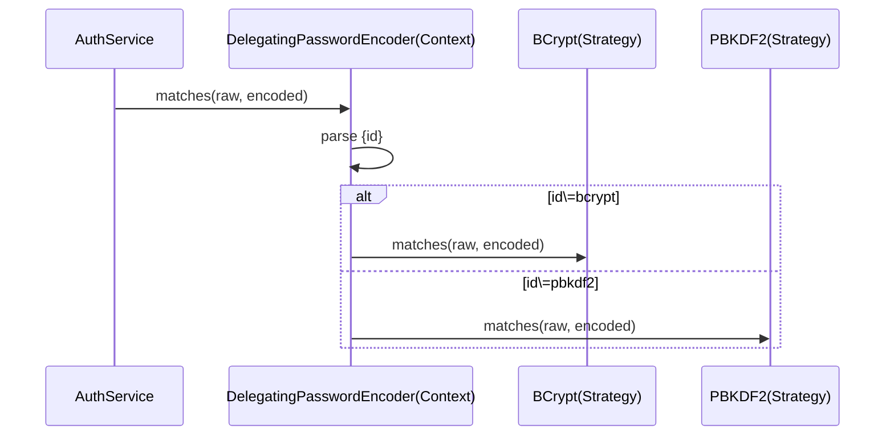
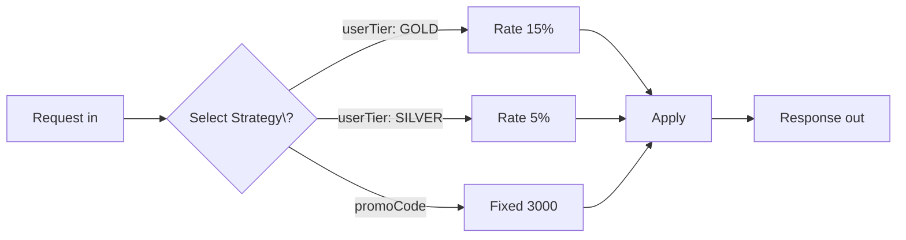

# 03-9. 전략 (Strategy)

## 03-9-1. 개념과 쓰임새

### 개요
전략(Strategy) 패턴은 알고리즘군을 정의하고, 각 알고리즘을 캡슐화하여 상호 교환 가능하게 만드는 행위 패턴입니다. 클라이언트(혹은 컨텍스트)는 동일한 인터페이스(Strategy)에만 의존하며, 구체 전략을 런타임에 선택/교체할 수 있습니다. 조건 분기(if-else/switch)의 난립을 줄이고, 새로운 알고리즘 추가를 개방-폐쇄 원칙(OCP)에 맞게 확장할 수 있습니다.

학습 목표
- Strategy, ConcreteStrategy, Context의 구조와 역할을 이해한다.
- 스프링/웹에서 전략 교체가 흔한 지점(정책, 인코딩/암호화, 직렬화, 정렬/비교)을 파악한다.
- 런타임 프로필/설정/헤더/도메인 규칙에 따라 전략을 선택하는 실전 흐름을 설계한다.

### 핵심 구조 (Mermaid Class Diagram)



- Context는 Strategy 인터페이스에만 의존하고, 실제 알고리즘은 ConcreteStrategy가 제공합니다.
- 전략은 상태를 가질 수 있으나, 보통 무상태(stateless)로 설계해 재사용성을 높입니다.

### 간단 예시 (Java 최소 코드)

```java
// Strategy 계약
public interface DiscountPolicy {
    int discount(int price); // 반환: 할인 금액
}

// 구체 전략 1: 비율 할인
public final class RateDiscountPolicy implements DiscountPolicy {
    private final int rate; // percent
    public RateDiscountPolicy(int rate) { this.rate = rate; }
    @Override public int discount(int price) { return price * rate / 100; }
}

// 구체 전략 2: 고정액 할인
public final class FixedDiscountPolicy implements DiscountPolicy {
    private final int amount;
    public FixedDiscountPolicy(int amount) { this.amount = amount; }
    @Override public int discount(int price) { return Math.min(amount, price); }
}

// 컨텍스트
public final class CheckoutService {
    private DiscountPolicy policy; // 주입 또는 런타임 선택
    public CheckoutService(DiscountPolicy policy) { this.policy = policy; }
    public void setPolicy(DiscountPolicy p) { this.policy = p; }
    public int pay(int price) {
        int dc = policy.discount(price);
        return price - dc;
    }
}

// 사용 예시
CheckoutService svc = new CheckoutService(new RateDiscountPolicy(10));
int pay1 = svc.pay(20000); // 18000
svc.setPolicy(new FixedDiscountPolicy(3000));
int pay2 = svc.pay(20000); // 17000
```

- 컨텍스트는 동일 계약(DiscountPolicy)만 의존하므로, 다양한 할인 정책을 손쉽게 교체할 수 있습니다.


## 03-9-2. 스프링에서의 적용 사례

### 개요
스프링은 다형성을 기반으로 전략을 주입/선택하는 구조가 자연스럽습니다. 또한 여러 전략 빈을 컬렉션(Map/List)으로 주입받아 키로 선택하는 방식이 흔합니다.

### 예시 1: PasswordEncoder 전략 교체
- Spring Security의 PasswordEncoder는 인터페이스이며, BCryptPasswordEncoder, Pbkdf2PasswordEncoder 등 다양한 구현을 전략으로 교체합니다.
- DelegatingPasswordEncoder는 저장된 해시의 접두어({id})에 따라 적절한 인코더 전략을 위임합니다.



### 예시 2: HttpMessageConverter 선택(전략군)
- Spring MVC는 요청/응답의 Content\-Type/Accept 헤더에 따라 적절한 HttpMessageConverter(JSON/XML 등)를 선택합니다.
- Converter는 공통 계약을 구현한 전략군으로, MediaType을 기준으로 런타임에 선택됩니다.

### 예시 3: Bean 컬렉션 주입을 활용한 전략 선택
- 특정 정책 코드(policyCode)로 Map<String, Strategy>를 주입받아 키로 전략을 선택하는 패턴이 일반적입니다.

```java
@Component
public final class PricingService {
    private final Map<String, DiscountPolicy> policies; // policyCode -> strategy
    public PricingService(Map<String, DiscountPolicy> policies) { this.policies = policies; }
    public int price(String policyCode, int origin) {
        DiscountPolicy p = policies.getOrDefault(policyCode, policies.get("default"));
        return origin - p.discount(origin);
    }
}
```


## 03-9-3. 웹 애플리케이션에서의 실전 적용

### 개요
요금제/결제/배송비/정렬 순서/추천 알고리즘처럼 조건에 따라 알고리즘을 바꿔야 하는 곳에서 전략 패턴이 효과적입니다. 요청 파라미터, 사용자 등급, A/B 테스트 버전, 테넌트 설정 등으로 전략을 선택합니다.

### 실전 구조 (Mermaid Flowchart)



- Select Strategy\?의 물음표는 ASCII로 이스케이프했습니다.
- 선택 기준(헤더/파라미터/설정)에 따라 전략을 분기하고, 공통 인터페이스로 계산 로직을 일관되게 적용합니다.


## 03-9-4. 장단점과 사용 시점

### 장점
- 분기 제거: if-else/switch 난립을 줄이고 알고리즘을 캡슐화한다.
- 교체 용이: 런타임/설정에 따라 전략을 손쉽게 교체한다.
- 테스트 용이: 전략을 목/스텁으로 바꿔 단위 테스트가 쉽다.

### 단점
- 클래스 증가: 전략별 클래스로 수가 늘어날 수 있다.
- 선택 비용: 전략 선택 로직(팩토리/레지스트리)이 필요하다.
- 과용 위험: 간단한 분기까지 클래스 분할하면 오히려 복잡해진다.

### 사용 시점
- 알고리즘을 상황/설정에 따라 교체해야 할 때(가격/정렬/암호화/직렬화).
- 새로운 알고리즘 추가가 빈번하고, 클라이언트 변경 없이 확장하고 싶을 때.
- 런타임 플래그/테넌트/프로필에 따라 동작을 바꿔야 할 때.


## 03-9-5. 5가지 키워드로 정리하는 핵심 포인트
1. 공통 인터페이스: Context는 Strategy 계약에만 의존한다.
2. 교체 가능성: 알고리즘을 런타임/설정으로 전환 가능.
3. 컬렉션 주입: Map<String, Strategy>로 손쉬운 선택.
4. OCP 확장: 새 전략 추가 시 기존 코드 최소 변경.
5. 과용 경계: 단순 분기까지 분리하지 않도록 균형 유지.


## 확인 문제
1. 전략 패턴의 핵심 의도로 가장 적절한 것은?
    - [ ] 요청을 객체로 캡슐화해 호출자와 수신자의 결합을 느슨하게 한다.
    - [ ] 알고리즘군을 정의하고 캡슐화하여 상호 교환 가능하게 만든다.
    - [ ] 호환되지 않는 인터페이스를 변환하여 재사용 가능하게 한다.
    - [ ] 객체의 내부 상태를 캡슐화한 스냅샷으로 저장하고 복구한다.

2. 다음 중 스프링에서 "전략" 교체의 대표적 사례로 가장 적절한 것은?
    - [ ] @Transactional AOP 프록시
    - [ ] PasswordEncoder의 구현 교체 및 DelegatingPasswordEncoder 위임
    - [ ] ApplicationEventPublisher의 이벤트 브로드캐스트
    - [ ] HandlerInterceptor 체인의 전/후 훅 처리

3. [복수 응답] 전략 패턴을 적용하기 좋은 상황을 모두 고르시오.
    - [ ] 사용자 등급/프로모션에 따라 다른 할인 정책을 적용해야 할 때
    - [ ] 동일한 트리 구조를 동일 인터페이스로 다뤄야 할 때
    - [ ] Content-Type/Accept에 따라 다른 직렬화 방식을 선택해야 할 때
    - [ ] 도메인 규칙을 DSL로 해석해 평가해야 할 때
    - [ ] 정렬 기준을 파라미터로 받아 Comparator를 바꿔야 할 때

> [정답 및 해설 보기](../answers_and_explanations.md#03-9-전략-strategy)
